# Frida Skills Knowledge-Base Expansion Implementation Plan

> **For agentic workers:** REQUIRED SUB-SKILL: `superpowers:subagent-driven-development`
> Steps use checkbox (`- [ ]`) syntax.

**Goal:** 扩展 `skills/frida/` 知识库——为现有文档注入技术深度并增加 mermaid 图表示意，补齐覆盖全部场景的横切面/汇总文档，使其成为 AI Agent 接入时完整可用的 Frida 知识库。

**Architecture:** 文档即知识库 → 在现有两级渐进式披露 IA（SKILL → 领域 index → 叶子）之上，新增 2 个领域（`playbooks/` 端到端剧本、`reference/` 对照表与速查），并在 concepts/core-api/guides 现有领域内新增深度叶子与横切面叶子；同时给关键现有文档补 mermaid 图。Task 1 统一改写骨架（AUTHORING 放宽图解长度 + mermaid 规范、SKILL 路由增 2 行、8 个 index 全部登记新叶子），后续 Task 2-8 各写一个领域的叶子（互不重叠、可并行），Task 8 给现有文档加图，Task 9 校验。复用已验证 Frida 16/17 API 事实表（AUTHORING.md），所有新叶子强制遵循"可运行代码块 + frontmatter + 链接兄弟文档"三铁律。

**Tech Stack:** Markdown（GitHub-flavored, 支持 mermaid 原生渲染）, Frida 16/17 GumJS API（已实测 17.15.3）, Python `frida` 绑定（host 驱动示例）, Node `frida`/`frida-compile`（TS agent 示例）。

**Risks:**
- mermaid 语法错误导致渲染失败 → 缓解：Task 1 的 AUTHORING 规定只用 GitHub 支持子集（flowchart / sequenceDiagram / stateDiagram-v2 / classDiagram），每类图给出最小可渲染示例；Task 9 用脚本扫描未闭合图块。
- 放宽长度上限可能被未来 agent 误用于普通叶子 → 缓解：AUTHORING 明确"仅 `图解型` 与 `汇总型` 文档放宽到 120–200 行，普通叶子仍守 40–140"，并在 frontmatter `type` 字段标记。
- 并行改 index.md 会冲突 → 缓解：全部 index.md 由 Task 1 独占写，Task 2-8 只写叶子，不碰 index。
- 跨任务命名不一致 → 缓解：Task 1 在本 Plan 中固定全部新文件名清单，后续 Task 照搬。
- mermaid 节点含特殊字符（`()`、`:`、`&`）破坏语法 → 缓解：AUTHORING 规定节点文本用引号包裹、节点 id 用纯字母数字。

---

### Task 1: 更新骨架 — AUTHORING 放宽图解长度 + mermaid 规范、SKILL 路由增 2 领域、8 个 index 登记新叶子

**Depends on:** None
**Files:**
- Modify: `skills/frida/AUTHORING.md:10-12`（放宽图解/汇总型长度）+ 末尾追加 mermaid 规范段落
- Modify: `skills/frida/SKILL.md:46-55`（决策路由表新增 playbooks、reference 两行）
- Modify: 8 个 `references/<domain>/index.md`（登记各领域新叶子）
- Create: `references/playbooks/index.md`
- Create: `references/reference/index.md`

- [ ] **Step 1: 修改 AUTHORING 长度规则 — 区分叶子型与图解/汇总型**
文件: `skills/frida/AUTHORING.md:11`

```markdown
- **Length:**
  - 普通叶子文档：40–140 行，一个聚焦主题。
  - **图解型文档**（以 mermaid 图为主体）：80–200 行，图占主体、文字仅解释图。
  - **汇总型文档**（对照表/速查/glossary/playbook）：120–220 行，表格与清单为主。
  - 判定方式：在 frontmatter 加 `type: leaf | diagram | summary`，缺省为 `leaf`。
```

- [ ] **Step 2: 在 AUTHORING 末尾追加 mermaid 写作规范段落**

文件: `skills/frida/AUTHORING.md`（文末追加，在 `## Authorization line` 之前）

```markdown
## Mermaid 图写作规范

图解型文档与需要流程示意的叶子可嵌入 mermaid 图块。规则：

- **只用 GitHub 原生支持的图类型**：`flowchart`、`sequenceDiagram`、`stateDiagram-v2`、
  `classDiagram`。不用 GitHub 不渲染的 `journey`/`pie`（仅在 mermaid-live 渲染）。
- **节点 id 用纯字母数字**（`A`, `Host`, `Ag`），**显示文本用引号包裹**：
  `A["open(path, flags)"]`。避免 `()`、`:`、`&`、`"` 裸写破坏语法。
- **每个图块前先一句话说明**这张图回答什么问题，便于 agent 决定是否需要读图。
- **图解必须自洽**：图里出现的步骤要在正文有对应解释段落，不能图归图、文归文。
- mermaid 不支持 `//` 注释；箭头标签用 `-->|"返回 fd"|` 形式。
- 图解型文档（`type: diagram`）可放宽到 200 行；普通叶子图块不超过 2 张，且每张配一句说明。

最小可渲染示例（用作新图模板）：

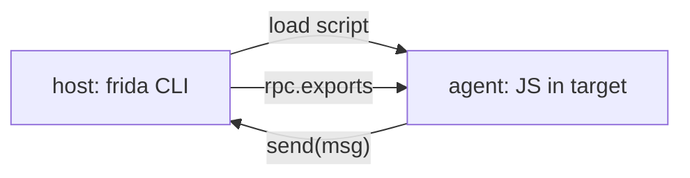
```

- [ ] **Step 3: 修改 SKILL 决策路由表 — 新增 playbooks 与 reference 两行**
文件: `skills/frida/SKILL.md:46-55`

```markdown
| The task is about… | Start at |
| --- | --- |
| How Frida works — architecture, injection, server/gadget, protocols | [`references/concepts/index.md`](references/concepts/index.md) |
| Agent JS API — Interceptor, NativeFunction, Memory, Module, Stalker, rpc… | [`references/core-api/index.md`](references/core-api/index.md) |
| Running the CLIs — `frida`, `frida-trace`, `frida-ps`, spawn vs attach… | [`references/cli/index.md`](references/cli/index.md) |
| Android / Java — hooking, spawn gating, pinning & root-detection bypass | [`references/android/index.md`](references/android/index.md) |
| iOS / Objective-C — method hooks, jailbreak-detection bypass, gadget | [`references/ios/index.md`](references/ios/index.md) |
| Copy-paste working scripts for a concrete goal | [`references/recipes/index.md`](references/recipes/index.md) |
| End-to-end workflows & host-side scripting (Python/Node/TypeScript) | [`references/guides/index.md`](references/guides/index.md) |
| Walk-through playbooks for a complete engagement (recon → hook → verify) | [`references/playbooks/index.md`](references/playbooks/index.md) |
| Reference tables — platform matrix, API changes, env globals, glossary | [`references/reference/index.md`](references/reference/index.md) |
| Something fails (no server, arch mismatch, timing, anti-debug, stale API) | [`references/troubleshooting/index.md`](references/troubleshooting/index.md) |
```

- [ ] **Step 4: 在 concepts/index.md 登记 2 篇新深度叶子**
文件: `skills/frida/references/concepts/index.md`

在现有表格末尾追加两行（保持其余内容不变）：

```markdown
| [agent-lifecycle-deepdive.md](agent-lifecycle-deepdive.md) | Agent 加载→就绪→卸载全生命周期，含 eternalize 与异常退出语义。 |
| [transport-internals.md](transport-internals.md) | USB/TCP 传输层内部：握手、消息分帧、断线与重连。 |
```

- [ ] **Step 5: 在 core-api/index.md 登记 2 篇新深度叶子**
文件: `skills/frida/references/core-api/index.md`

在 "Advanced & I/O" 表后追加一个新小节：

```markdown
## Deep dives
| Doc | Covers |
| --- | --- |
| [hooking-internals-stages.md](hooking-internals-stages.md) | Interceptor 一次 attach 的内部阶段：trampoline、onEnter/onLeave 调度、reentrancy。 |
| [stalker-transform-deepdive.md](stalker-transform-deepdive.md) | Stalker transform 管线：每条指令的回调时序与热补丁注入点。 |
```

- [ ] **Step 6: 在 guides/index.md 登记 4 篇横切面叶子**
文件: `skills/frida/references/guides/index.md`

在 "Automation" 表后追加：

```markdown
## Cross-cutting concerns
| Doc | Covers |
| --- | --- |
| [session-management.md](session-management.md) | 多进程会话：attach/spawn 池化、detach 与脚本生命周期、并发会话锁。 |
| [performance-and-memory.md](performance-and-memory.md) | 热路径开销、`onEnter` 瘦身、Stalker 配额、内存与 GC 策略。 |
| [security-hardening.md](security-hardening.md) | 加固 agent、最小权限 server、防泄漏 send() 数据、隔离敏感操作。 |
| [version-migration-16-to-17.md](version-migration-16-to-17.md) | 16→17 迁移：被移除 API 全表、自动改写规则、兼容 shim。 |
```

- [ ] **Step 7: 在 recipes/index.md 登记 4 篇新场景叶子**
文件: `skills/frida/references/recipes/index.md`

在 "Host-driven" 表后追加一个新小节：

```markdown
## Advanced scenarios
| Doc | Covers |
| --- | --- |
| [recipe-multi-process-correlate.md](recipe-multi-process-correlate.md) | 同时 hook 多进程并按时间线关联事件。 |
| [recipe-eternalize-persistent.md](recipe-eternalize-persistent.md) | `Script.eternalize()` 让 agent 在断开后存活。 |
| [recipe-remote-cluster.md](recipe-remote-cluster.md) | 经 `-H` 远程连多台设备组成的工作集群批量注入。 |
| [recipe-ci-reproducible.md](recipe-ci-reproducible.md) | 在 CI 中确定性运行 agent：固定版本、固定 seed、断言输出。 |
```

- [ ] **Step 8: 创建 playbooks/index.md — 端到端剧本领域入口**
文件: `skills/frida/references/playbooks/index.md`（新建）

```markdown
---
name: playbooks-index
description: Index of end-to-end Frida playbooks — full engagements from recon through hook to verify, per platform and goal (native, Android Java, SSL bypass, root bypass, iOS ObjC, iOS pinning, crypto key extraction).
---

# Playbooks — end-to-end engagements

A playbook walks the **entire loop** for one concrete goal: reach the target →
recon → write the precise hook → verify → clean up. Read a playbook when you
need to *complete a task*, not just learn one API. Each playbook links the
leaf docs it depends on rather than restating them.

| Doc | Goal |
| --- | --- |
| [pb-native-recon-to-hook.md](pb-native-recon-to-hook.md) | On a desktop binary: find a native function, hook it, dump args + retval. |
| [pb-android-java-hooking.md](pb-android-java-hooking.md) | On Android: spawn an app, hook a Java method by class name, log calls. |
| [pb-android-ssl-bypass.md](pb-android-ssl-bypass.md) | On Android: defeat SSL pinning (OkHttp + TrustManager + native) end-to-end. |
| [pb-android-root-bypass.md](pb-android-root-bypass.md) | On Android: defeat root + Frida detection so the app runs under instrumentation. |
| [pb-ios-objc-hooking.md](pb-ios-objc-hooking.md) | On iOS: hook an Objective-C selector, read `self`/args, replace return. |
| [pb-ios-pinning-bypass.md](pb-ios-pinning-bypass.md) | On iOS: defeat NSURLSession/AFNetworking pinning end-to-end. |
| [pb-crypto-key-extraction.md](pb-crypto-key-extraction.md) | Extract a symmetric key by hooking key-spec construction on Android/iOS. |
```

- [ ] **Step 9: 创建 reference/index.md — 对照表与速查领域入口**
文件: `skills/frida/references/reference/index.md`（新建）

```markdown
---
name: reference-index
description: Index of Frida reference tables — platform differences matrix, Frida 16→17 API changes, environment globals cheatsheet, error messages glossary, and terminology glossary.
---

# Reference — tables & cheatsheets

Lookups, not tutorials. Open these when you need to *compare* or *recall*, not
learn. Each file is dense and table-driven.

| Doc | Covers |
| --- | --- |
| [platform-differences-matrix.md](platform-differences-matrix.md) | Side-by-side: what works on Linux/macOS/Windows/Android/iOS. |
| [api-changes-16-17.md](api-changes-16-17.md) | Every API removed/renamed/moved between Frida 16 and 17, with replacement. |
| [env-globals-cheatsheet.md](env-globals-cheatsheet.md) | The complete agent global inventory, one row each. |
| [error-messages-glossary.md](error-messages-glossary.md) | Frida runtime/CLI error strings → cause → doc link. |
| [glossary.md](glossary.md) | Terms: Gum, GumJS, gadget, stalker, trampoline, ART, dispatch queue, … |
```

- [ ] **Step 10: 验证骨架完整性与链接零缺失**
Run: `bash -c 'cd skills/frida && for d in concepts core-api cli android ios recipes guides troubleshooting playbooks reference; do for tgt in $(grep -oE "\]\([a-z0-9-]+\.md\)" references/$d/index.md 2>/dev/null | sed -E "s/\]\(([a-z0-9-]+\.md)\)/\1/"); do [ -f "references/$d/$tgt" ] && true || echo "MISSING references/$d/$tgt (will be created in later tasks)"; done; done; echo "---"; ls references/playbooks references/reference'`
Expected:
  - Exit code: 0
  - "MISSING" 行只来自后续 Task 才创建的文件（playbooks/*、reference/*、各领域新深度叶子），这是预期
  - `references/playbooks` 与 `references/reference` 目录已存在（由本 Task 的 index 创建带出）

> 注：本 Task 创建的 index.md 会引用后续 Task 才创建的叶子，因此本步"MISSING"是预期的；最终零缺失校验在 Task 9。

- [ ] **Step 11: 提交**
Run: `git add skills/frida/AUTHORING.md skills/frida/SKILL.md skills/frida/references/*/index.md skills/frida/references/playbooks/index.md skills/frida/references/reference/index.md && git commit -m "docs(skills): extend IA with playbooks+reference domains, mermaid rules, register new leaves"`

---

### Task 2: 编写 concepts 深度叶子 + mermaid 图解

**Depends on:** Task 1
**Files:**
- Create: `skills/frida/references/concepts/agent-lifecycle-deepdive.md`
- Create: `skills/frida/references/concepts/transport-internals.md`

- [ ] **Step 1: 创建 agent-lifecycle-deepdive.md — agent 全生命周期图解**
文件: `skills/frida/references/concepts/agent-lifecycle-deepdive.md`

```markdown
---
name: agent-lifecycle-deepdive
description: Deep dive on the Frida agent lifecycle — load, ready, unload, and the eternalize escape hatch; with a state diagram and load-time pitfalls.
type: diagram
---

# Agent lifecycle — a deep dive

When does your agent actually start running? When does it stop? `eternalize`
breaks the normal rule. This doc maps the states.

## State diagram

这张图回答："我的脚本在什么时刻活着、什么时刻被卸载？"

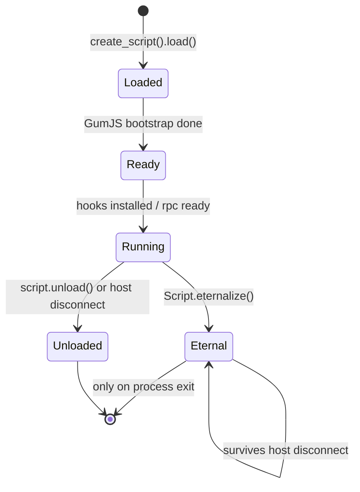

## What happens at each transition

- **Loaded → Ready:** the JS engine boots (QJS by default), your top-level code
  runs, but the process is *paused* if you spawned (`-f`) — you must `resume()`.
- **Ready → Running:** your `Interceptor.attach` / `Java.perform` / `rpc.exports`
  are live. Messages can flow both ways.
- **Running → Unloaded:** triggered by `script.unload()` on the host, or the host
  process exiting. All hooks are reverted, the engine is torn down.
- **Running → Eternal:** `Script.eternalize()` detaches the agent's lifetime from
  the host — the agent keeps running after the host disconnects. Used for
  fire-and-forget instrumentation. See [recipe-eternalize-persistent.md](../recipes/recipe-eternalize-persistent.md).

## Pitfalls

- Top-level code runs **once** at load. Hooks installed in a `setTimeout(fn, 0)`
  may miss early calls if you `resume()` first.
- `eternalize` does **not** survive a process restart — it lives only as long as
  the target process.
- Unloading a script whose `onEnter` is mid-flight on another thread can crash;
  call `Interceptor.flush()` before `unload()` on hot paths.
```

- [ ] **Step 2: 创建 transport-internals.md — 传输层内部图解**
文件: `skills/frida/references/concepts/transport-internals.md`

```markdown
---
name: transport-internals
description: How the Frida transport layer works — USB/TCP framing, the handshake, message ordering, and reconnect behavior; with a sequence diagram.
type: diagram
---

# Transport internals

The host and agent exchange JSON-ish messages over a transport. Knowing the
framing explains version-skew errors and why `send` is async.

## Sequence: attach and first message

这张图回答："attach 之后第一条 send 是怎么回来的？"

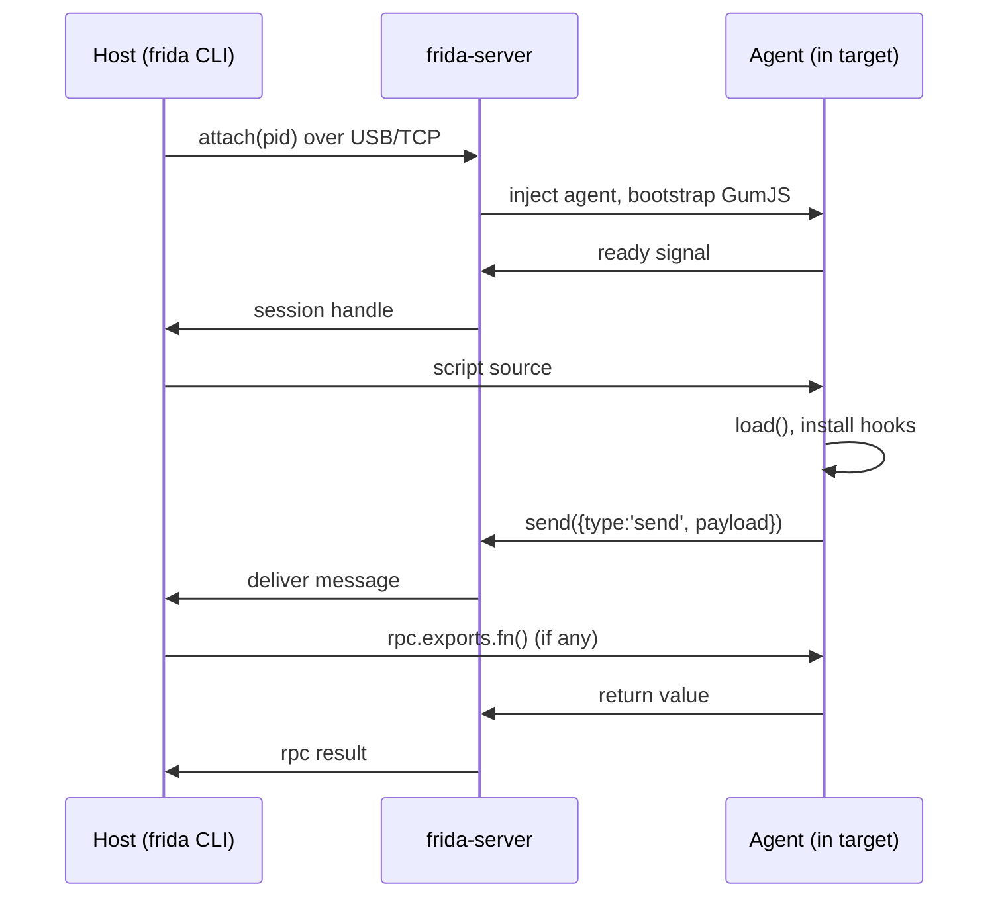

## Framing & ordering

- Messages are length-prefixed; a `send(payload, arrayBuffer)` ships JSON text
  plus an optional binary blob in one frame.
- **Ordering is preserved per session** but `send` is fire-and-forget from the
  agent's view — there is no ack. For request/response use `rpc.exports`
  (see [../core-api/rpc-exports.md](../core-api/rpc-exports.md)).
- The transport is **version-locked**: host `frida` and device `frida-server`
  must match major+minor. A mismatch surfaces as a handshake failure, not a
  clean error — see [../troubleshooting/version-skew.md](../troubleshooting/version-skew.md).

## Reconnect

There is no auto-reconnect. If the transport drops, the session is gone.
Eternalized agents survive (they no longer need the transport); normal agents
must be re-`attach`ed and re-loaded.
```

- [ ] **Step 3: 验证两文件存在且含合法 mermaid**
Run: `bash -c 'cd skills/frida/references/concepts && for f in agent-lifecycle-deepdive.md transport-internals.md; do [ -f "$f" ] && grep -q "^---$" "$f" && grep -q "```mermaid" "$f" && echo "OK $f"; done'`
Expected:
  - Exit code: 0
  - Output contains: "OK agent-lifecycle-deepdive.md" and "OK transport-internals.md"

- [ ] **Step 4: 提交**
Run: `git add skills/frida/references/concepts/agent-lifecycle-deepdive.md skills/frida/references/concepts/transport-internals.md && git commit -m "docs(concepts): add agent lifecycle + transport internals deep dives with mermaid"`

---

### Task 3: 编写 core-api 深度叶子 + mermaid 图解

**Depends on:** Task 1
**Files:**
- Create: `skills/frida/references/core-api/hooking-internals-stages.md`
- Create: `skills/frida/references/core-api/stalker-transform-deepdive.md`

- [ ] **Step 1: 创建 hooking-internals-stages.md — Interceptor 阶段图解**
文件: `skills/frida/references/core-api/hooking-internals-stages.md`

```markdown
---
name: hooking-internals-stages
description: What happens inside one Interceptor.attach — trampoline install, onEnter/onLeave dispatch, reentrancy and flush semantics; with a flowchart.
type: diagram
---

# Hooking internals — the stages of one attach

`Interceptor.attach` is not magic — it's a trampoline plus a dispatcher. Knowing
the stages explains reentrancy bugs and why `flush()` matters.

## The stages

这张图回答："一次被 hook 的函数调用，从进 trampoline 到返回要经过哪些阶段？"

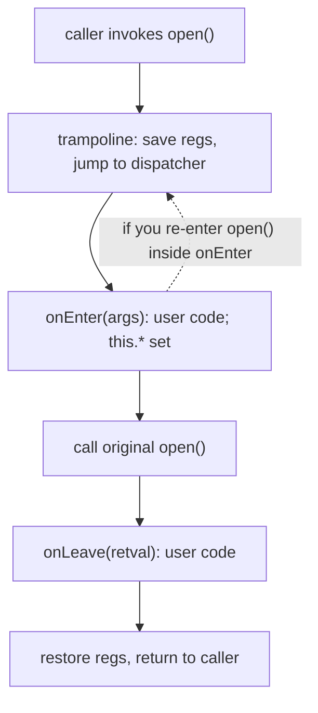

## Stage-by-stage

- **Trampoline install** happens at `attach` time: Frida writes a small code
  stub at the target (or relocates the prologue) so calls detour to the
  dispatcher. `Memory.patchCode` flushes the code cache — see
  [memory-protect-patchcode.md](memory-protect-patchcode.md).
- **onEnter** runs on the *calling thread*. `args[i]` are NativePointers into
  the caller's registers/stack; `this.returnAddress`, `this.context`,
  `this.threadId`, `this.errno` are available. Mutate `args[i]` to change what
  the original sees.
- **Original call** executes with whatever `args` now hold.
- **onLeave** runs on the same thread after the original returns. `retval` is a
  NativePointer; `.toInt32()` for int returns, or `.replace(ptr)` to forge a
  return value. See [interceptor-attach.md](interceptor-attach.md).

## Pitfalls

- **Reentrancy:** if your `onEnter` itself calls the hooked function, you
  re-enter the trampoline. Frida suppresses nested `onEnter` for the *same*
  interceptor on the same thread to avoid infinite recursion, but your original
  call still runs — guard with a `this.depth` flag if you must recurse.
- **`flush()`:** writes from `attach`/`replace` are buffered; on a hot path,
  call `Interceptor.flush()` before assuming the hook is live. See
  [interceptor-revert-flush.md](interceptor-revert-flush.md).
- **Hot-path cost:** every call pays the trampoline + two JS callbacks. For
  millions of calls/sec, use `CModule` (see [cmodule.md](cmodule.md)) or
  `Stalker` with a transform instead.
```

- [ ] **Step 2: 创建 stalker-transform-deepdive.md — Stalker transform 管线图解**
文件: `skills/frida/references/core-api/stalker-transform-deepdive.md`

```markdown
---
name: stalker-transform-deepdive
description: Stalker transform pipeline — per-instruction callback timing, where to inject callout/replace, and the hot-patch injection points; with a flowchart.
type: diagram
---

# Stalker transform — per-instruction pipeline

`Stalker.follow` with a `transform` callback lets you rewrite the instruction
stream as it's executed. This doc shows *when* your callback sees each
instruction, which is the part most people get wrong.

## Pipeline

这张图回答："transform 的 callback 在每条指令的什么时机被调用、我能往哪插 callout？"

```mermaid
flowchart LR
  F["Stalker.follow(tid, {transform})"] --> G["iterator = Stalker regenerate"]
  G --> N["nextInstruction()"]
  N -->|"call transform(iter, ins, out)| T["your transform"]
  T -->|"keep"| K["emit ins to out"]
  T -->|"putCallout(cb)"| P["emit callout stub"]
  T -->|"replace(target)"| Re["emit branch to target"]
  K --> N
  P --> N
  Re --> N
  N -->|"end of block"| E["emit block, link"]
```

## Timing rules

- `transform(iterator, instruction, output)` is called **once per executed
  instruction** during block regeneration, not at runtime — you're building a
  *new* block, not tracing the original. The new block is what actually runs.
- `output.putCallout(callback)` injects a call to a JS/C function at that
  position; the callout receives the *current CPU context*.
- `output.replace(target)` swaps the instruction for a branch — use for
  instruction-level patching without `Memory.patchCode`.
- Blocks are cached per thread; `Stalker.unfollow(tid)` flushes them.

## Pitfalls

- Transform runs on a **code-generation thread**, not the target thread — don't
  touch live process state from inside `transform`; do it from `putCallout`.
- `Stalker` is **arch-specific** in its relocator/writer backends; not all
  modes exist on all arches. See [stalker.md](stalker.md) for the surface.
- Unfollow before `unload()` or you leak trampolines in the target.
```

- [ ] **Step 3: 验证两文件含合法 mermaid 与 frontmatter**
Run: `bash -c 'cd skills/frida/references/core-api && for f in hooking-internals-stages.md stalker-transform-deepdive.md; do [ -f "$f" ] && grep -q "type: diagram" "$f" && grep -q "```mermaid" "$f" && echo "OK $f"; done'`
Expected:
  - Exit code: 0
  - Output contains both "OK" lines

- [ ] **Step 4: 提交**
Run: `git add skills/frida/references/core-api/hooking-internals-stages.md skills/frida/references/core-api/stalker-transform-deepdive.md && git commit -m "docs(core-api): add hooking-internals and stalker-transform deep dives with mermaid"`

---

### Task 4: 编写 guides 横切面叶子

**Depends on:** Task 1
**Files:**
- Create: `skills/frida/references/guides/session-management.md`
- Create: `skills/frida/references/guides/performance-and-memory.md`
- Create: `skills/frida/references/guides/security-hardening.md`
- Create: `skills/frida/references/guides/version-migration-16-to-17.md`

- [ ] **Step 1: 创建 session-management.md — 多进程会话图解**
文件: `skills/frida/references/guides/session-management.md`

```markdown
---
name: session-management
description: Managing multiple Frida sessions — attach/spawn pooling, script lifecycle vs session lifecycle, detach, and concurrency locks for parallel targets.
type: summary
---

# Session management

A *session* is a connection to one process; a *script* runs inside a session.
Mixing their lifecycles is the #1 source of "why did my hook stop" bugs.

## Lifecycle map

这张图回答："session、script、agent 三者谁的生死绑着谁？"

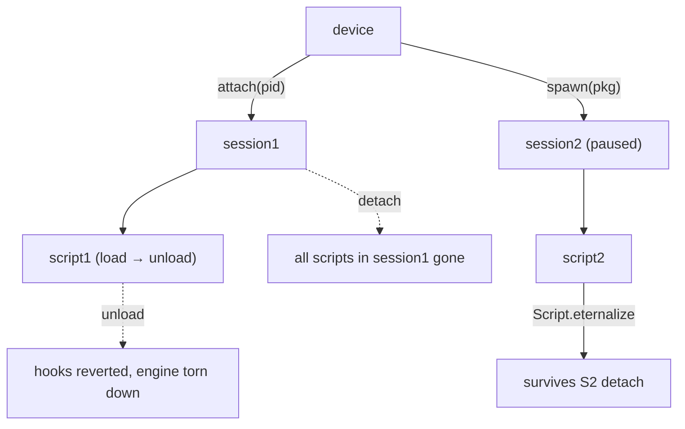

## Rules

- One session ⇒ zero or more scripts. Detaching a session unloads all its
  scripts; unloading one script leaves the session alive.
- `spawn()` returns a paused session — call `device.resume(pid)` only after
  your script is loaded, or early hooks miss.
- For many targets, hold a `dict[pid → session]` and a `dict[script_id →
  script]`; never share a script across sessions.
- Concurrency: Frida delivers messages on its **reactor thread**. If your host
  mutates shared state in the message callback, guard with a lock — the
  `frida-mcp/server.py` uses a `threading.Lock` over its `_sessions`/`_scripts`
  registries for exactly this. See [python-binding.md](python-binding.md).

## Pitfalls

- Forgetting `resume()` after spawn → app hangs, hooks look dead.
- `attach` after the target already finished init → use spawn + spawn gating
  ([../android/spawn-gating.md](../android/spawn-gating.md)).
- Leaking scripts across a long-running host → call `script.unload()` in a
  `finally:` block.
```

- [ ] **Step 2: 创建 performance-and-memory.md — 性能与内存图解**
文件: `skills/frida/references/guides/performance-and-memory.md`

```markdown
---
name: performance-and-memory
description: Frida performance and memory — hot-path cost in onEnter/onLeave, Stalker quotas, send() back-pressure, and GC/weak-ref strategy for long runs.
type: summary
---

# Performance & memory

Every hook has a cost. This doc is the budget you should keep in mind.

## Where time goes

这张图回答："一次被 hook 的调用，开销花在哪？"


## Budget rules of thumb

- A bare `Interceptor.attach` with empty `onEnter`/`onLeave` adds single-digit
  µs per call. Filling them with `hexdump` + `send` pushes it to tens of µs.
- At >10k calls/sec, **batch in agent memory** and `send` a summary, not one
  message per call. See [../recipes/count-and-time-calls.md](../recipes/count-and-time-calls.md).
- `Stalker.follow` is far heavier than `Interceptor` (it traces every
  instruction); cap with `Stalker.exclude` for libraries you don't care about,
  and `unfollow` ASAP.
- `send` has no flow control; if the host is slow, messages queue in the agent
  and balloon memory. Drop or sample on the agent side under load.

## Memory & GC

- `NativePointer` reads allocate JS `ArrayBuffer`s (`readByteArray`) — free
  references or they pile up. Use `Script.bindWeak` for caches you want
  GC-friendly ([../core-api/gc-weakref-script.md](../core-api/gc-weakref-script.md)).
- `CModule` keeps C state in a flat buffer, no per-call JS allocation — the
  right tool for tight loops ([../core-api/cmodule.md](../core-api/cmodule.md)).
- Long-running agents: avoid closures capturing large `this.*` across
  onEnter/onLeave; copy what you need.

## Pitfalls

- `console.log` in `onEnter` on a hot path can deadlock the reactor — `send`
  and aggregate instead.
- `Memory.scan` over a huge region blocks; use the async callback form and
  `return 'stop'` early ([../core-api/memory-scan.md](../core-api/memory-scan.md)).
```

- [ ] **Step 3: 创建 security-hardening.md — 加固图解**
文件: `skills/frida/references/guides/security-hardening.md`

```markdown
---
name: security-hardening
description: Hardening a Frida deployment — least-privilege server, isolating sensitive send() data, agent self-protection, and not leaking secrets into logs.
type: summary
---

# Security hardening

Frida gives full read/write to the target. That power cuts both ways — this doc
is about not turning your agent into a leak or an attack surface.

## Trust boundaries

这张图回答："agent 能碰的东西里，哪些是敏感面？"

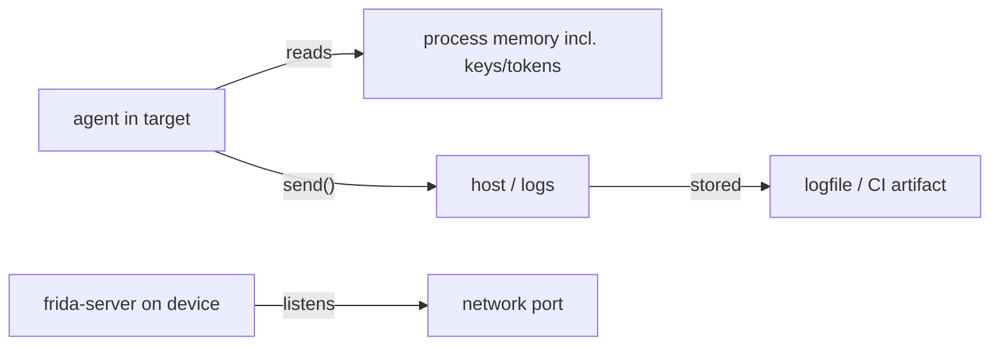

## Rules

- **Least-privilege server:** run `frida-server` on a non-default port
  (`-l 0.0.0.0:PORT`) and behind a firewall or `adb forward`; never expose it
  to the open internet. Pair with `--token`/`--certificate` on remote links.
- **Don't `send` secrets by default:** keys, tokens, PII flow through `send`
  into host logs. Redact in the agent before `send`, or pull only via
  `rpc.exports` into a controlled host path. See
  [../recipes/rpc-pull-data.md](../recipes/rpc-pull-data.md).
- **Agent self-protection:** if the target is hostile, an unprotected agent
  can be unmapped. For production, prefer `frida-gadget` over `frida-server`
  (no listening port) — [../concepts/frida-gadget.md](../concepts/frida-gadget.md).
- **Log hygiene:** `frida ... -o run.log` writes everything `send` emits;
  scrub secrets before committing logs.
- **Authorization:** only instrument software you're authorized to analyze —
  your apps, permissioned engagements, CTFs, research. See
  [../concepts/security-and-authorization.md](../concepts/security-and-authorization.md).

## Pitfalls

- A `send({token: jwt})` in a hot hook fills a logfile with live tokens.
- `frida-server` on the default port `27042` is the first thing anti-Frida
  scans — see [../android/frida-detection.md](../android/frida-detection.md).
```

- [ ] **Step 4: 创建 version-migration-16-to-17.md — 迁移图解**
文件: `skills/frida/references/guides/version-migration-16-to-17.md`

```markdown
---
name: version-migration-16-to-17
description: Migrating Frida 16 agents to 17 — the full removed/renamed API table, automatic rewrite rules, and a compatibility shim for code you can't change.
type: summary
---

# Frida 16 → 17 migration

Frida 17 removed several static helpers and changed return mappings. This is
the migration map. Full per-API detail in
[../reference/api-changes-16-17.md](../reference/api-changes-16-17.md).

## What changed

这张图回答："一段 16 时代的 agent 改到 17，要走的判断路径？"

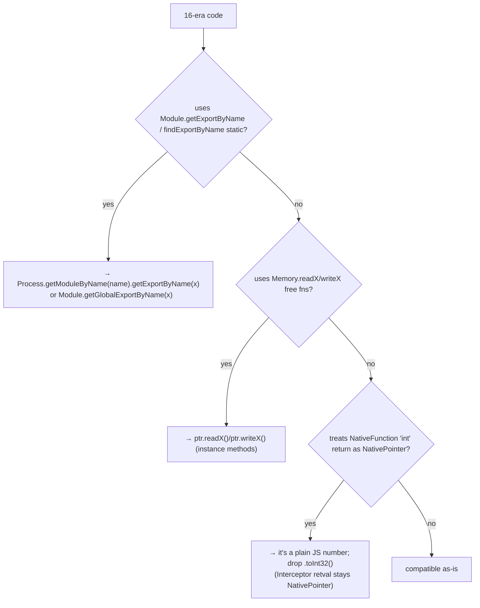

## Rewrite table (most common)

| 16 (removed) | 17 replacement |
| --- | --- |
| `Module.getExportByName('libc.so.6','open')` | `Process.getModuleByName('libc.so.6').getExportByName('open')` |
| `Module.findExportByName(...)` | `Process.getModuleByName(name).findExportByName(x)` or `Module.getGlobalExportByName(x)` |
| `Memory.readUtf8String(ptr)` | `ptr.readUtf8String()` |
| `Memory.writeU32(ptr, v)` | `ptr.writeU32(v)` |
| assuming `new NativeFunction(p,'int',[])(...)` is a NativePointer | it's a plain `number`; compare directly |

## Compatibility shim (for code you can't edit)

If you must run un-modified 16-era agents on 17, prepend this shim at the top
of the script — it re-exports the static helpers as thin wrappers:

```javascript
// 16→17 compat shim — re-adds removed static Module helpers
Module.getExportByName = function (modName, exp) {
  return Process.getModuleByName(modName).getExportByName(exp);
};
Module.findExportByName = function (modName, exp) {
  const m = Process.findModuleByName(modName);
  return m ? m.findExportByName(exp) : null;
};
// Memory.read*/write* free functions have NO shim — rewrite to ptr methods.
```

## Pitfalls

- The shim covers `Module.*` statics but **not** `Memory.readX/writeX` — those
  must be rewritten to pointer methods (there's no safe global to rebind).
- `retval.toInt32()` is still valid on `Interceptor` retvals; don't "fix" it.
- See [../troubleshooting/stale-removed-api.md](../troubleshooting/stale-removed-api.md)
  and [../troubleshooting/nativefunction-return.md](../troubleshooting/nativefunction-return.md).
```

- [ ] **Step 5: 验证 4 文件含 frontmatter type 字段**
Run: `bash -c 'cd skills/frida/references/guides && for f in session-management.md performance-and-memory.md security-hardening.md version-migration-16-to-17.md; do grep -q "^type: summary" "$f" && grep -q "```mermaid" "$f" && echo "OK $f"; done'`
Expected:
  - Exit code: 0
  - Output contains all 4 "OK" lines

- [ ] **Step 6: 提交**
Run: `git add skills/frida/references/guides/session-management.md skills/frida/references/guides/performance-and-memory.md skills/frida/references/guides/security-hardening.md skills/frida/references/guides/version-migration-16-to-17.md && git commit -m "docs(guides): add session-management, performance, security, migration cross-cutting docs"`

---

### Task 5: 编写新场景 recipes

**Depends on:** Task 1
**Files:**
- Create: `skills/frida/references/recipes/recipe-multi-process-correlate.md`
- Create: `skills/frida/references/recipes/recipe-eternalize-persistent.md`
- Create: `skills/frida/references/recipes/recipe-remote-cluster.md`
- Create: `skills/frida/references/recipes/recipe-ci-reproducible.md`

- [ ] **Step 1: 创建 recipe-multi-process-correlate.md — 多进程关联**
文件: `skills/frida/references/recipes/recipe-multi-process-correlate.md`

```markdown
---
name: recipe-multi-process-correlate
description: Hook several processes at once from one Python driver and correlate events by wall-clock time into a single ordered timeline.
---

# Multi-process event correlation

**When:** you're tracing a flow that crosses process boundaries (e.g. an app
and a helper daemon), and need one ordered timeline.

```python
# driver.py — attach to several PIDs, install the same agent, merge messages
import frida, json, threading, time

TARGETS = {1234: 'app', 2345: 'daemon'}
events = []
lock = threading.Lock()

def make_handler(role):
    def on_message(message, data):
        if message['type'] == 'send':
            with lock:
                events.append((time.time(), role, message['payload']))
    return on_message

device = frida.get_local_device()
scripts = []
for pid, role in TARGETS.items():
    session = device.attach(pid)
    script = session.create_script(open('agent.js').read())
    script.on('message', make_handler(role))
    script.load()
    scripts.append(script)

input('enter to stop> ')   # let it run
for s in scripts: s.unload()

events.sort()
for t, role, payload in events:
    print(f'{t:.3f} [{role}] {payload}')
```

`agent.js` is the same simple hook you'd write for one process — the
correlation happens on the host by sorting on `time.time()`.

```sh
python3 driver.py
```

**Tweak:** swap `frida.get_local_device()` for `frida.get_usb_device()` to do
this across on-device processes; use `frida-ps -U` to find PIDs.
```

- [ ] **Step 2: 创建 recipe-eternalize-persistent.md — 持久化 agent**
文件: `skills/frida/references/recipes/recipe-eternalize-persistent.md`

```markdown
---
name: recipe-eternalize-persistent
description: Use Script.eternalize() to keep an agent running after the host disconnects — fire-and-forget instrumentation with a state diagram of the escape hatch.
---

# Eternalize — survive host disconnect

**When:** you want to drop an agent and leave it logging into a file/queue
without holding the host open. See
[../concepts/agent-lifecycle-deepdive.md](../concepts/agent-lifecycle-deepdive.md)
for the state transition.

这张图回答："eternalize 把 agent 从哪个约束里解放出来？"

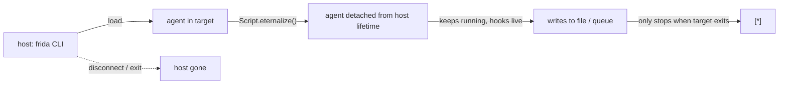

```javascript
// agent.js — install hook, then live forever writing to a file
const f = new File('/data/local/tmp/watch.log', 'w');
Interceptor.attach(Process.getModuleByName('libc.so.6').getExportByName('open'), {
  onEnter(args) { this.path = args[0].readUtf8String(); },
  onLeave(retval) {
    f.write(new Date().toISOString() + ' open ' + this.path + '\n');
    f.flush();
  }
});
// detach from host — keep running after `frida` exits
Script.eternalize();
```

```sh
frida -U -f com.example.app -l agent.js   # spawn, load, eternalize, then quit
```

**Tweak:** `eternalize` is irreversible for that script — you can't get
messages back over the transport afterward, so write to a file/queue, not
`send`. The agent dies when the target process dies.
```

- [ ] **Step 3: 创建 recipe-remote-cluster.md — 远程集群**
文件: `skills/frida/references/recipes/recipe-remote-cluster.md`

```markdown
---
name: recipe-remote-cluster
description: Drive a cluster of remote frida-server instances over -H, install the same agent on each, and fan-in results to one host.
---

# Remote cluster injection

**When:** you have several devices/servers reachable over TCP and want the
same agent on all of them.

```python
# cluster.py
import frida, threading

NODES = ['10.0.0.5:27042', '10.0.0.6:27042']
TARGET = 'com.example.app'   # or a PID
results = []

def run_on(host):
    device = frida.get_device_manager().add_remote_device(host)
    session = device.attach(TARGET)
    script = session.create_script(open('agent.js').read())
    script.on('message', lambda m, d: results.append((host, m)))
    script.load()
    # leave it running; gather later
    return script

scripts = [run_on(h) for h in NODES]
input('enter to stop> ')
for s in scripts: s.unload()
for host, m in results: print(host, m)
```

```sh
# on each node: frida-server listening on the network, matching host version
frida-server -l 0.0.0.0:27042
python3 cluster.py
```

**Tweak:** version skew across nodes fails silently-ish — pin the same
`frida-server` build on every node. For USB-over-TCP, `adb forward
tcp:27042 tcp:27042` then treat as `127.0.0.1:27042`. See
[../troubleshooting/remote-connect.md](../troubleshooting/remote-connect.md).
```

- [ ] **Step 4: 创建 recipe-ci-reproducible.md — CI 确定性**
文件: `skills/frida/references/recipes/recipe-ci-reproducible.md`

```markdown
---
name: recipe-ci-reproducible
description: Run a Frida agent deterministically in CI — pin host+server versions, make the agent assert its own output, exit nonzero on mismatch.
---

# Reproducible CI runs

**When:** an agent is part of a test pipeline and must give a pass/fail you
can rely on across runs.

```sh
# ci job essentials
pip install frida==17.15.3          # pin host version EXACTLY
adb push frida-server-17.15.3-android-arm64 /data/local/tmp/frida-server
adb shell "su -c '/data/local/tmp/frida-server -l 0.0.0.0:27042 &'"
frida -U -f com.example.app -l agent.js -q -t 30 -o run.log
grep -q "ASSERT_PASS" run.log       # agent writes this on success
```

```javascript
// agent.js — self-asserting: writes a deterministic marker, then quits
Java.perform(() => {
  const C = Java.use('com.example.KeyStore');
  C.getToken.implementation = function () {
    const t = this.getToken();
    if (t === 'expected-token') send('ASSERT_PASS');     // deterministic
    else send({ ASSERT_FAIL: t });
    return t;
  };
});
```

**Tweak:** `-t 30` caps wall time so a hung hook fails the job instead of
hanging CI. Use `-q` (quiet, no REPL) so the job exits on timeout. Compare
host and server versions in a pre-step to fail fast on skew — see
[../troubleshooting/version-skew.md](../troubleshooting/version-skew.md).
```

- [ ] **Step 5: 验证 4 recipes 含可运行命令与 frontmatter**
Run: `bash -c 'cd skills/frida/references/recipes && for f in recipe-multi-process-correlate.md recipe-eternalize-persistent.md recipe-remote-cluster.md recipe-ci-reproducible.md; do grep -q "^name: recipe" "$f" && grep -q "```sh" "$f" && echo "OK $f"; done'`
Expected:
  - Exit code: 0
  - Output contains all 4 "OK" lines

- [ ] **Step 6: 提交**
Run: `git add skills/frida/references/recipes/recipe-multi-process-correlate.md skills/frida/references/recipes/recipe-eternalize-persistent.md skills/frida/references/recipes/recipe-remote-cluster.md skills/frida/references/recipes/recipe-ci-reproducible.md && git commit -m "docs(recipes): add multi-process, eternalize, remote-cluster, ci recipes"`

---

### Task 6: 编写 playbooks 新领域（端到端剧本）

**Depends on:** Task 1
**Files:**
- Create: `skills/frida/references/playbooks/pb-native-recon-to-hook.md`
- Create: `skills/frida/references/playbooks/pb-android-java-hooking.md`
- Create: `skills/frida/references/playbooks/pb-android-ssl-bypass.md`
- Create: `skills/frida/references/playbooks/pb-android-root-bypass.md`
- Create: `skills/frida/references/playbooks/pb-ios-objc-hooking.md`
- Create: `skills/frida/references/playbooks/pb-ios-pinning-bypass.md`
- Create: `skills/frida/references/playbooks/pb-crypto-key-extraction.md`

> 每个 playbook 复用既有叶子（链接而非重述），结构统一为：Goal → Reachability check → Recon → Write hook → Verify → Clean up，且必须含一张 mermaid 流程图。bypass 类 playbook 必须含授权说明行。

- [ ] **Step 1: 创建 pb-native-recon-to-hook.md**
文件: `skills/frida/references/playbooks/pb-native-recon-to-hook.md`

```markdown
---
name: pb-native-recon-to-hook
description: End-to-end playbook for hooking a native function in a desktop binary — recon with frida-trace, write an Interceptor hook, dump args and return, verify, clean up.
type: summary
---

# Playbook: native recon → hook

**Goal:** on a Linux binary, find a native function, hook it, log its args and
return value.

这张图回答："从零到一条有效 native hook 的完整路径？"

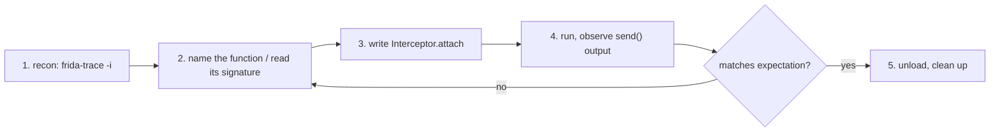

## Steps

1. **Reachability:** `frida-ls-devices`; for a local binary just `frida -n <name>`.
2. **Recon:** `frida-trace -n <name> -i "*open*"` to see what's called; read
   the `__handlers__` stubs to confirm the symbol. See
   [../cli/frida-trace.md](../cli/frida-trace.md).
3. **Name + signature:** confirm the export with
   `Process.getModuleByName('libc.so.6').getExportByName('open')` and look up
   the C signature (`man 2 open`). See [../core-api/module.md](../core-api/module.md).
4. **Write hook:** the recipe in
   [../recipes/trace-native-call.md](../recipes/trace-native-call.md) is the
   starting point — adjust the export name and arg reads.
5. **Verify:** run `frida -n <name> -l hook.js`, trigger the function, check
   the `send` payload matches the real call. See
   [../guides/error-handling.md](../guides/error-handling.md) for failure modes.
6. **Clean up:** `.exit` the REPL (unloads the script and reverts hooks); or
   `script.unload()` from a driver.

## Pitfalls

- Attached after init → hooks miss early calls; spawn with `-f` instead.
- Wrong arg index → cross-check with the C signature, not guessing.
```

- [ ] **Step 2: 创建 pb-android-java-hooking.md**
文件: `skills/frida/references/playbooks/pb-android-java-hooking.md`

```markdown
---
name: pb-android-java-hooking
description: End-to-end playbook for hooking an Android Java method — spawn-gate the app, find the class, replace the implementation, log calls, verify, clean up.
type: summary
---

# Playbook: Android Java hooking

**Goal:** hook a Java method in an Android app and log every call + args.

这张图回答："在 Android 上从启动到拿到第一条 Java 方法调用日志的全流程？"


## Steps

1. **Reachability:** `frida-ls-devices` then `frida-ps -Uai` — see
   [../android/enumerate-app.md](../android/enumerate-app.md).
2. **Spawn-gate:** `frida -U -f com.example.app -l agent.js` holds the app
   paused so your hook lands before app code. See
   [../android/spawn-gating.md](../android/spawn-gating.md).
3. **Find the class:** `Java.enumerateLoadedClasses` regex search —
   [../android/java-enumerate.md](../android/java-enumerate.md).
4. **Hook:** the agent from [../recipes/android-find-class.md](../recipes/android-find-class.md),
   refined to a specific method via `Java.use` + `.implementation` —
   [../android/java-use-hook.md](../android/java-use-hook.md).
5. **Resume:** in the REPL, `%resume` (or the driver calls `device.resume(pid)`).
6. **Verify:** trigger the method in the UI, watch `send`.
7. **Clean up:** `.exit` / `script.unload()`.

## Pitfalls

- Class not loaded yet → hook the classloader or `Application.onCreate`;
  see [../android/early-instrumentation.md](../android/early-instrumentation.md).
- Overload ambiguity → resolve with `.overload(sig)`,
  [../android/java-overloads.md](../android/java-overloads.md).
```

- [ ] **Step 3: 创建 pb-android-ssl-bypass.md**
文件: `skills/frida/references/playbooks/pb-android-ssl-bypass.md`

```markdown
---
name: pb-android-ssl-bypass
description: End-to-end playbook for defeating Android SSL pinning across OkHttp, TrustManager, and native pinning paths; spawn-gate, install bypass, verify TLS works, clean up. Authorization required.
type: summary
---

# Playbook: Android SSL pinning bypass

> **Authorization:** Frida is for software you're authorized to analyze — your
> own apps, permissioned engagements, CTFs, research. Confirm authority before
> defeating a pinning protection.

**Goal:** make a pinned Android app accept a TLS intercepting proxy so you can
inspect its traffic.

这张图回答："Android pinning 有几条路径、要逐一打掉哪些？"

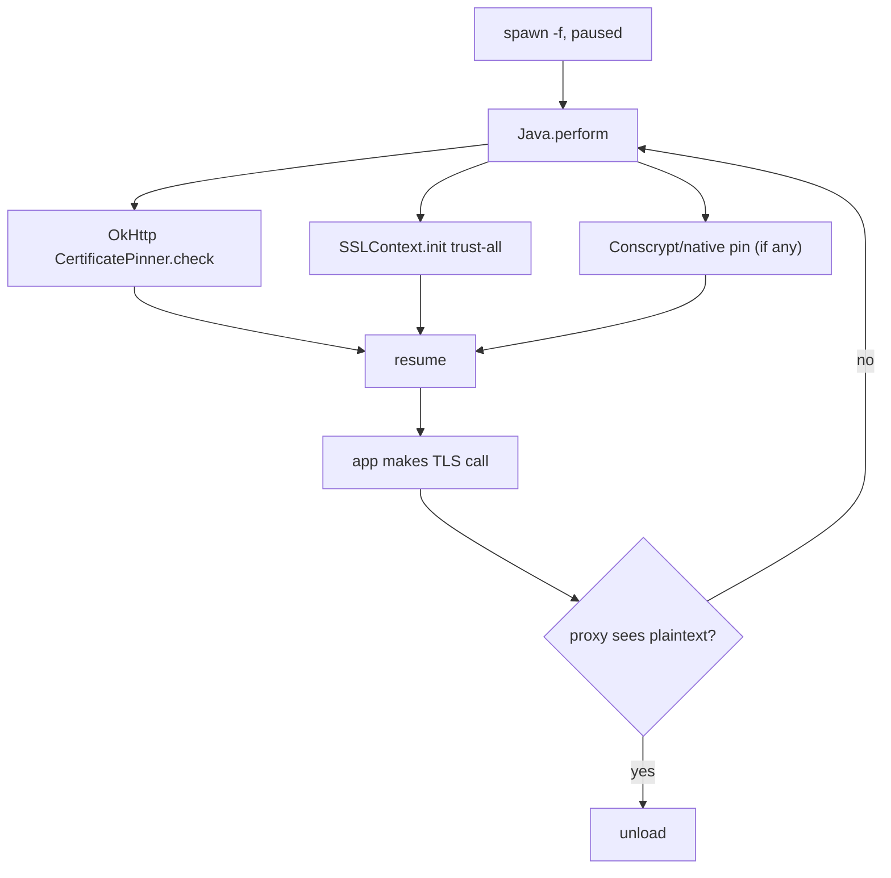

## Steps

1. **Spawn-gate:** `frida -U -f com.example.app -l bypass.js` — see
   [../android/spawn-gating.md](../android/spawn-gating.md).
2. **OkHttp path:** neuter `okhttp3.CertificatePinner.check` —
   [../android/ssl-pinning-okhttp.md](../android/ssl-pinning-okhttp.md).
3. **TrustManager path:** install a trust-all `X509TrustManager` —
   [../android/ssl-pinning-trustmanager.md](../android/ssl-pinning-trustmanager.md).
4. **Native/Conscrypt path (if 2&3 insufficient):** hook BoringSSL —
   [../android/ssl-pinning-native.md](../android/ssl-pinning-native.md).
5. **Resume + verify:** point the app at your proxy, trigger a request, confirm
   the proxy decrypts.
6. **Clean up:** `.exit` reverts all `implementation` rewrites.

## Pitfalls

- Modern apps pin in **multiple** layers; missing one leaves TLS broken with no
  error — start a combined script from
  [../recipes/android-ssl-pinning.md](../recipes/android-ssl-pinning.md).
- Network security config pinning needs the trust-manager path, not OkHttp.
```

- [ ] **Step 4: 创建 pb-android-root-bypass.md**
文件: `skills/frida/references/playbooks/pb-android-root-bypass.md`

```markdown
---
name: pb-android-root-bypass
description: End-to-end playbook for defeating Android root + Frida detection so an app runs under instrumentation — enumerate checks, neuter them, spawn-gate, verify the app doesn't exit. Authorization required.
type: summary
---

# Playbook: Android root + Frida detection bypass

> **Authorization:** only instrument software you're authorized to analyze.

**Goal:** keep a root/Frida-aware app alive long enough to hook its logic.

这张图回答："app 一启动就检测 root/Frida 并退出，怎么在检测运行前就让它失效？"

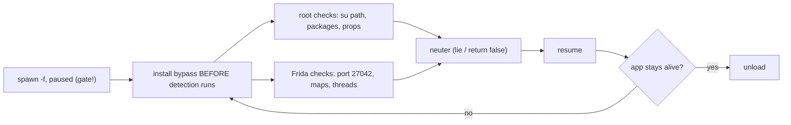

## Steps

1. **Spawn-gate first** — detection often runs in `Application.onCreate`, so
   you must hook before resume. See [../android/spawn-gating.md](../android/spawn-gating.md).
2. **Root checks:** neuter su-path/package/prop/mount reads —
   [../android/root-detection.md](../android/root-detection.md).
3. **Frida checks:** run server on a non-default port or use gadget; hook
   maps/thread scans — [../android/frida-detection.md](../android/frida-detection.md).
4. **Resume + verify:** the app should reach its main screen instead of exiting.
5. **Clean up:** unload reverts hooks; restart the app to confirm it still
   detects without you (sanity).

## Pitfalls

- Some checks run **native** (not Java) — also hook `fopen`/`strstr` on
  `/proc/self/maps`; see [../android/frida-detection.md](../android/frida-detection.md).
- A check you missed → silent exit, no stack. Add a canary `send` at the end of
  each bypass to see how far the app got.
```

- [ ] **Step 5: 创建 pb-ios-objc-hooking.md**
文件: `skills/frida/references/playbooks/pb-ios-objc-hooking.md`

```markdown
---
name: pb-ios-objc-hooking
description: End-to-end playbook for hooking an Objective-C selector on iOS — find the class, attach to the method's implementation, read self/args, replace the return, verify, clean up.
type: summary
---

# Playbook: iOS Objective-C hooking

**Goal:** hook an ObjC method on iOS, log `self`/args, and optionally forge a
return value.

这张图回答："在 iOS 上定位一个 ObjC 方法并 hook 它的完整流程？"

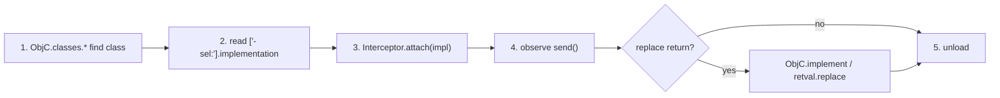

## Steps

1. **Reachability:** jailbreak `frida-server` or re-signed gadget; `-U` —
   see [../ios/objc-classes.md](../ios/objc-classes.md) and
   [../concepts/frida-server.md](../concepts/frida-server.md).
2. **Find class + method:** `ObjC.classes.YourClass['- yourMethod:arg:']` —
   see [../ios/objc-method-hook.md](../ios/objc-method-hook.md).
3. **Attach:** `Interceptor.attach(impl, { onEnter, onLeave })`; read `args[2..]`
   as the selector args (`args[0]`=self, `args[1]`=_cmd). See
   [../ios/objc-args-types.md](../ios/objc-args-types.md).
4. **Verify:** trigger the method, watch `send`.
5. **Replace return (optional):** `ObjC.implement` or `retval.replace(...)` —
   [../ios/objc-replace-implement.md](../ios/objc-replace-implement.md).
6. **Clean up:** `.exit` reverts.

## Pitfalls

- Method key must include the full selector with `:` per arg.
- `ObjC.Object(ptr)` for reading NSString/NSData args — raw ptr isn't readable.
```

- [ ] **Step 6: 创建 pb-ios-pinning-bypass.md**
文件: `skills/frida/references/playbooks/pb-ios-pinning-bypass.md`

```markdown
---
name: pb-ios-pinning-bypass
description: End-to-end playbook for defeating iOS SSL pinning across NSURLSession, AFNetworking, and SecTrustEvaluate paths; spawn-gate, install, verify, clean up. Authorization required.
type: summary
---

# Playbook: iOS SSL pinning bypass

> **Authorization:** only instrument software you're authorized to analyze.

**Goal:** let a pinned iOS app talk to your TLS proxy.

这张图回答："iOS pinning 通常落在哪几个 API 上？"

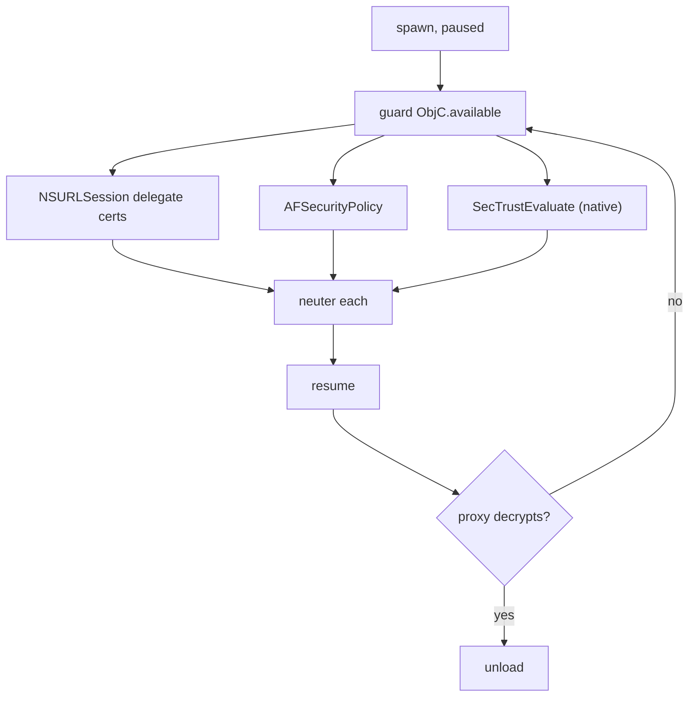

## Steps

1. **Spawn-gate:** `frida -U -f bundle.id -l bypass.js`.
2. **Install bypass:** the combined script in
   [../ios/ssl-pinning-ios.md](../ios/ssl-pinning-ios.md) covers NSURLSession,
   AFNetworking, and `SecTrustEvaluate`.
3. **Resume + verify:** point the app at the proxy, trigger a request, confirm
   plaintext in the proxy.
4. **Clean up:** unload reverts.

## Pitfalls

- `SecTrustEvaluate` is native — the ObjC-only scripts miss it; use the
  combined script that hooks at the C level too.
- Apps using `URLSession:didReceiveChallenge:` need the delegate path, not the
  trust-eval path.
```

- [ ] **Step 7: 创建 pb-crypto-key-extraction.md**
文件: `skills/frida/references/playbooks/pb-crypto-key-extraction.md`

```markdown
---
name: pb-crypto-key-extraction
description: End-to-end playbook for extracting a symmetric crypto key by hooking key-spec construction on Android (SecretKeySpec) and iOS (CommonCrypto), logging the key and plaintext, verify, clean up. Authorization required.
type: summary
---

# Playbook: crypto key extraction

> **Authorization:** only instrument software you're authorized to analyze.

**Goal:** recover a symmetric key the app uses to encrypt traffic/storage, by
hooking where the key enters the cipher, not by breaking the cipher.

这张图回答："为什么不去破密码学，而是 hook '密钥进入算法' 这个瞬间？"

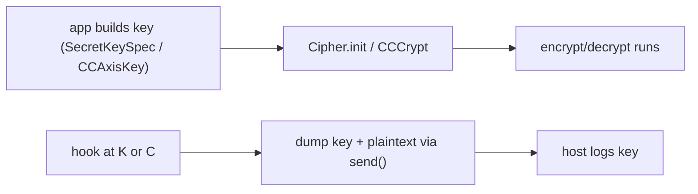

## Steps (Android)

1. **Spawn-gate** the app. 2. Hook `javax.crypto.spec.SecretKeySpec.$init` and
   `Cipher.doFinal` — the agent in
   [../recipes/android-crypto-capture.md](../recipes/android-crypto-capture.md).
   3. Resume, trigger an encrypt/decrypt, capture keyHex + plaintext. 4. Unload.

## Steps (iOS)

1. Spawn-gate. 2. Hook `CCCrypt`/`CCKeyDerivationPBKDF` —
   [../ios/crypto-capture-ios.md](../ios/crypto-capture-ios.md). 3. Resume,
   capture. 4. Unload.

## Why this works

You don't attack the algorithm; you read the key at the only moment it exists
in cleartext — when it's handed to the cipher. That's the design pressure point
no amount of strong crypto removes.

## Pitfalls

- Keys may be derived (PBKDF2) — hook the derivation, not just `SecretKeySpec`.
- Redact keys in logs unless you're in a private engagement — see
  [../guides/security-hardening.md](../guides/security-hardening.md).
```

- [ ] **Step 8: 验证 7 playbooks 均含 frontmatter + mermaid + bypass 类含授权行**
Run: `bash -c 'cd skills/frida/references/playbooks && for f in pb-*.md; do grep -q "^type: summary" "$f" && grep -q "```mermaid" "$f" && echo "OK $f"; done; echo "---bypass auth---"; for f in pb-android-ssl-bypass.md pb-android-root-bypass.md pb-ios-pinning-bypass.md pb-crypto-key-extraction.md; do grep -qi "Authorization" "$f" && echo "OK $f"; done'`
Expected:
  - Exit code: 0
  - 7 个 "OK" + 4 个 bypass "OK"

- [ ] **Step 9: 提交**
Run: `git add skills/frida/references/playbooks/pb-*.md && git commit -m "docs(playbooks): add 7 end-to-end engagement playbooks with mermaid flows"`

---

### Task 7: 编写 reference 新领域（对照表与速查）

**Depends on:** Task 1
**Files:**
- Create: `skills/frida/references/reference/platform-differences-matrix.md`
- Create: `skills/frida/references/reference/api-changes-16-17.md`
- Create: `skills/frida/references/reference/env-globals-cheatsheet.md`
- Create: `skills/frida/references/reference/error-messages-glossary.md`
- Create: `skills/frida/references/reference/glossary.md`

> 全部 `type: summary`，表格驱动，密度高。`api-changes-16-17.md` 必须与 AUTHORING.md 事实表一致。

- [ ] **Step 1: 创建 platform-differences-matrix.md — 平台差异矩阵**
文件: `skills/frida/references/reference/platform-differences-matrix.md`

```markdown
---
name: platform-differences-matrix
description: Side-by-side matrix of what Frida supports on each platform — Linux, macOS, Windows, Android, iOS — across server/gadget, runtimes, bridges, and notable limits.
type: summary
---

# Platform differences matrix

What you can and can't do, per platform. "✓" = supported, "✗" = not, "≈" = partial.

| Capability | Linux | macOS | Windows | Android | iOS |
| --- | --- | --- | --- | --- | --- |
| Attach to local process | ✓ | ✓¹ | ✓ | via server | via server |
| Spawn local | ✓ | ✓¹ | ✓ | `-f pkg` | `-f bundle` |
| `frida-server` | ✓ | ✓ | ✓ | ✓ (root) | ✓ (jailbreak) |
| `frida-gadget` embed | ✓ | ✓ | ✓ | ✓ (repack) | ✓ (resign) |
| Java bridge (`Java.*`) | ✗ | ✗ | ✗ | ✓ | ✗ |
| ObjC bridge (`ObjC.*`) | ✗ | ✓ | ✗ | ✗ | ✓ |
| Default runtime | QJS | QJS | QJS | QJS | QJS |
| `--runtime=v8` | ✓ | ✓ | ✓ | ✓ | ≈² |
| Code signing concerns | ✗ | SIP³ | ✗ | ✗ | ✓⁴ |
| Transport | local | local | local | USB | USB |

¹ macOS SIP-protected/system binaries can't be attached without disabling SIP or codesigning with `get-task-allow`.
² V8 may bloat; QJS preferred on mobile.
³ See [../troubleshooting/permission-ptrace.md](../troubleshooting/permission-ptrace.md).
⁴ iOS requires re-signed gadget; see [../ios/gadget-ios.md](../ios/gadget-ios.md).
```

- [ ] **Step 2: 创建 api-changes-16-17.md — API 变更全表**
文件: `skills/frida/references/reference/api-changes-16-17.md`

```markdown
---
name: api-changes-16-17
description: Complete table of Frida API removed/renamed/moved between 16 and 17 with the exact replacement call, cross-linked to troubleshooting and migration docs.
type: summary
---

# Frida 16 → 17 API changes

Verified against 17.15.3. Each row: what was removed → the 17 replacement.

| Removed (16) | Replacement (17) | Notes |
| --- | --- | --- |
| `Module.getExportByName(mod, exp)` | `Process.getModuleByName(mod).getExportByName(exp)` | throws if module absent |
| `Module.findExportByName(mod, exp)` | `Process.getModuleByName(mod).findExportByName(exp)` or `Module.getGlobalExportByName(exp)` | latter searches all modules |
| `Memory.readUtf8String(ptr)` | `ptr.readUtf8String()` | instance method on NativePointer |
| `Memory.writeU32(ptr, v)` | `ptr.writeU32(v)` | same for all read/write families |
| NativeFunction `'int'` return treated as NativePointer | plain JS **number** | no `.toInt32()` on it; Interceptor `retval` stays NativePointer |
| (assumption) default runtime V8 | default **QuickJS** | `--runtime=v8` to switch |

## Cross-links

- Migration walkthrough: [../guides/version-migration-16-to-17.md](../guides/version-migration-16-to-17.md)
- Symptom fix: [../troubleshooting/stale-removed-api.md](../troubleshooting/stale-removed-api.md),
  [../troubleshooting/nativefunction-return.md](../troubleshooting/nativefunction-return.md)
- Authoritative facts: `skills/frida/AUTHORING.md` ("Frida 16/17 API facts" section)
```

- [ ] **Step 3: 创建 env-globals-cheatsheet.md — 全局速查**
文件: `skills/frida/references/reference/env-globals-cheatsheet.md`

```markdown
---
name: env-globals-cheatsheet
description: One-row-per-global cheatsheet of every agent global verified present in Frida 17 — Interceptor, NativeFunction, Memory, Module, Process, Stalker, CModule, Java, ObjC, File, Socket, SqliteDatabase, Checksum, Instruction, Thread, DebugSymbol, ApiResolver, Script.
type: summary
---

# Agent globals cheatsheet

Every global your agent can reach, one row each. Verified on 17.15.3.

| Global | Key members / notes | Leaf doc |
| --- | --- | --- |
| `Interceptor` | `.attach`, `.replace`, `.revert`, `.flush` | [../core-api/interceptor-attach.md](../core-api/interceptor-attach.md) |
| `NativeFunction` | `new NativeFunction(ptr, ret, args[, abi])` | [../core-api/nativefunction.md](../core-api/nativefunction.md) |
| `NativeCallback` | `new NativeCallback(fn, ret, args)` | [../core-api/nativecallback.md](../core-api/nativecallback.md) |
| `SystemFunction` | like NativeFunction + `{value, errno}` | [../core-api/system-functions-errno.md](../core-api/system-functions-errno.md) |
| `NativePointer` | `ptr(x)`, `NULL`; read/write/arithmetic methods | [../core-api/nativepointer-read.md](../core-api/nativepointer-read.md) |
| `Int64`/`UInt64` | `int64(x)`, `uint64(x)` | [../core-api/int64-uint64.md](../core-api/int64-uint64.md) |
| `Memory` | `.alloc`, `.allocUtf8String`, `.protect`, `.patchCode`, `.scan`/`.scanSync`, `.copy`, `.dup` | [../core-api/memory-alloc.md](../core-api/memory-alloc.md) |
| `Module` | `.getGlobalExportByName`, `.load`, `.enumerateExports` (instance) | [../core-api/module.md](../core-api/module.md) |
| `ModuleMap` | `new ModuleMap()`, `.find(addr)` | [../core-api/module-map.md](../core-api/module-map.md) |
| `Process` | `.id/.arch/.platform/.pageSize/.pointerSize`, `.enumerateModules`, `.getModuleByName`, `.enumerateRanges` | [../core-api/process.md](../core-api/process.md) |
| `Stalker` | `.follow`, `.unfollow`, `.parse`, `.addCallProbe` | [../core-api/stalker.md](../core-api/stalker.md) |
| `CModule` | compile C in-process | [../core-api/cmodule.md](../core-api/cmodule.md) |
| `Java` | `.perform`, `.use`, `.choose`, `.enumerateLoadedClasses`, `.registerClass`, `.cast`, `.array` | [../android/java-perform.md](../android/java-perform.md) |
| `ObjC` | `.classes`, `.Object`, `.choose`, `.available`, `.implement`, `.schedule`, `.Block` | [../ios/objc-classes.md](../ios/objc-classes.md) |
| `File` | `new File(path, mode)` | [../core-api/file-io.md](../core-api/file-io.md) |
| `Socket`/`SocketListener` | connect out / accept | [../core-api/socket-io.md](../core-api/socket-io.md) |
| `SqliteDatabase` | open + query app DBs | [../core-api/sqlite.md](../core-api/sqlite.md) |
| `Checksum` | hash buffers/strings | [../core-api/checksum-crc.md](../core-api/checksum-crc.md) |
| `Instruction` | `.parse(addr)` disassemble | [../core-api/instruction-disasm.md](../core-api/instruction-disasm.md) |
| `Thread` | `.backtrace(ctx, Backtracer.ACCURATE)`, `.sleep` | [../core-api/thread-backtrace.md](../core-api/thread-backtrace.md) |
| `DebugSymbol` | `.fromAddress`, `.fromName` | [../core-api/debugsymbol.md](../core-api/debugsymbol.md) |
| `ApiResolver` | `new ApiResolver('module'\|'objc'\|'swift')` | [../core-api/apiresolver.md](../core-api/apiresolver.md) |
| `Script` | `.runtime`, `.bindWeak`, `.eternalize` | [../core-api/gc-weakref-script.md](../core-api/gc-weakref-script.md) |
| `send`/`recv`/`rpc` | host↔agent messaging | [../core-api/send-recv.md](../core-api/send-recv.md) |
```

- [ ] **Step 4: 创建 error-messages-glossary.md — 错误信息词典**
文件: `skills/frida/references/reference/error-messages-glossary.md`

```markdown
---
name: error-messages-glossary
description: Frida runtime and CLI error strings mapped to root cause and the troubleshooting doc that fixes each, so an agent can go from error text to fix in one jump.
type: summary
---

# Error messages glossary

See the error → jump to the fix.

| Error text (or fragment) | Root cause | Fix doc |
| --- | --- | --- |
| `Failed to enumerate processes` | server not running / wrong ABI / version | [../troubleshooting/no-device-no-server.md](../troubleshooting/no-device-no-server.md) |
| `unable to access process with pid N` / `not permitted` | ptrace scope / perms | [../troubleshooting/permission-ptrace.md](../troubleshooting/permission-ptrace.md) |
| `TypeError: Module.getExportByName is not a function` | Frida 17 removed static helper | [../troubleshooting/stale-removed-api.md](../troubleshooting/stale-removed-api.md) |
| `TypeError: ... toInt32 is not a function` | NativeFunction `'int'` return is a plain number | [../troubleshooting/nativefunction-return.md](../troubleshooting/nativefunction-return.md) |
| `unable to connect to remote frida-server` | firewall / binding / TLS | [../troubleshooting/remote-connect.md](../troubleshooting/remote-connect.md) |
| (silent) hooks never fire | attach-too-late / wrong name / no `Java.perform` | [../troubleshooting/hooks-never-fire.md](../troubleshooting/hooks-never-fire.md) |
| (silent) app exits right after hook | anti-Frida detection | [../troubleshooting/anti-frida-exit.md](../troubleshooting/anti-frida-exit.md) |
| (crash) right after hook | bad arg types / hot path / code cache | [../troubleshooting/crash-after-hook.md](../troubleshooting/crash-after-hook.md) |
| weird protocol/handshake error | host vs server version skew | [../troubleshooting/version-skew.md](../troubleshooting/version-skew.md) |
| server binary won't start on device | ABI mismatch (arm64/arm/x86_64) | [../troubleshooting/abi-mismatch.md](../troubleshooting/abi-mismatch.md) |
```

- [ ] **Step 5: 创建 glossary.md — 术语表**
文件: `skills/frida/references/reference/glossary.md`

```markdown
---
name: glossary
description: Frida terminology glossary — Gum, GumJS, gadget, server, agent, host, trampoline, stalker, interceptor, ART, dispatch queue, eternalize, QJS/V8, and other terms an agent needs to disambiguate.
type: summary
---

# Glossary

| Term | Meaning |
| --- | --- |
| **Gum** | The low-level C instrumentation library underlying everything. |
| **GumJS** | The JS engine + bindings that run your agent inside the target. |
| **agent** | Your JavaScript, running inside the target process via GumJS. |
| **host** | The CLI / Python / Node / MCP client that loads the agent and receives messages. |
| **frida-server** | A daemon run on a device that accepts host connections and injects agents. |
| **frida-gadget** | A shared library embedded into an app (no separate server); for non-rooted/re-signed targets. |
| **trampoline** | The code stub Frida writes at a hook target to detour calls to the dispatcher. |
| **Interceptor** | The hooking API: `attach`/`replace`/`revert`/`flush`. |
| **Stalker** | Per-thread code tracer that rewrites the instruction stream as it runs. |
| **CModule** | In-process compiled C for fast, inline instrumentation. |
| **NativePointer** | The JS handle for a native address; all memory read/write goes through it. |
| **QJS / V8** | The two JS runtimes; QuickJS is default, V8 is opt-in (`--runtime=v8`). |
| **ART** | Android Runtime — the VM executing dex bytecode; the Java bridge talks to it. |
| **dispatch queue** | The GCD queue ObjC code runs on; `ObjC.schedule` targets one. |
| **eternalize** | `Script.eternalize()` — detach the agent's lifetime from the host so it survives disconnect. |
| **spawn gating** | Spawn the app paused, install hooks, then resume — so early code is caught. |
| **version skew** | Host `frida` and device `frida-server` being different versions; the top failure cause. |
```

- [ ] **Step 6: 验证 5 reference 文件均为 type: summary 且 api-changes 与 AUTHORING 一致**
Run: `bash -c 'cd skills/frida/references/reference && for f in platform-differences-matrix.md api-changes-16-17.md env-globals-cheatsheet.md error-messages-glossary.md glossary.md; do grep -q "^type: summary" "$f" && echo "OK $f"; done; echo "---consistency---"; grep -c "Process.getModuleByName" api-changes-16-17.md skills/frida/AUTHORING.md 2>/dev/null || true; grep -q "Process.getModuleByName(name).getExportByName" api-changes-16-17.md && echo "API table matches AUTHORING form"'`
Expected:
  - Exit code: 0
  - 5 个 "OK"
  - "API table matches AUTHORING form"

- [ ] **Step 7: 提交**
Run: `git add skills/frida/references/reference/*.md && git commit -m "docs(reference): add platform matrix, API changes, globals cheatsheet, error glossary, glossary"`

---

### Task 8: 给关键现有文档补 mermaid 图

**Depends on:** Task 1
**Files:**
- Modify: `skills/frida/references/concepts/architecture.md`（加架构图，置于 "##" 章节后第一段后）
- Modify: `skills/frida/references/concepts/injection-model.md`（加注入时序图）
- Modify: `skills/frida/references/concepts/message-protocol.md`（加消息时序图）
- Modify: `skills/frida/references/concepts/spawn-attach-gating.md`（加门控状态图）
- Modify: `skills/frida/references/concepts/host-vs-agent.md`（加职责对照图）
- Modify: `skills/frida/references/core-api/interceptor-attach.md`（加 hook 阶段图）
- Modify: `skills/frida/references/core-api/stalker.md`（加 stalk 流程图）
- Modify: `skills/frida/references/core-api/rpc-exports.md`（加 RPC 时序图）
- Modify: `skills/frida/references/core-api/send-recv.md`（加收发握手图）
- Modify: `skills/frida/references/android/spawn-gating.md`（加 Java 启动时序图）
- Modify: `skills/frida/references/android/early-instrumentation.md`（加 classloader 时序图）
- Modify: `skills/frida/references/guides/workflow-recon-to-hook.md`（加侦察→hook 流程图）

> 每个 Step：读取文件 → 在指定章节后插入一张 mermaid 图块 + 一句说明 → 保留原文不动。每张图遵守 AUTHORING 的 mermaid 规范（节点 id 纯字母数字、显示文本引号包裹、图前一句说明）。

- [ ] **Step 1: 修改 concepts/architecture.md — 加架构图**
文件: `skills/frida/references/concepts/architecture.md`

在第一个 `##` 章节标题之后、其第一段正文之后，插入：

```markdown
这张图回答："Frida 的几层各自负责什么、边界在哪？"

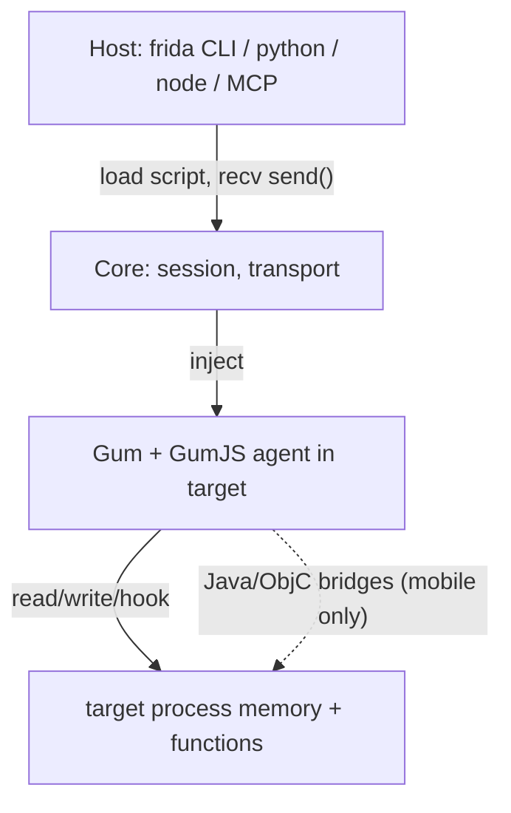
```

- [ ] **Step 2: 修改 concepts/injection-model.md — 加注入时序图**
文件: `skills/frida/references/concepts/injection-model.md`

在 "##" 第一个章节后插入：

```markdown
这张图回答："从 host 发起 attach 到 agent 开始执行，中间的注入步骤顺序？"

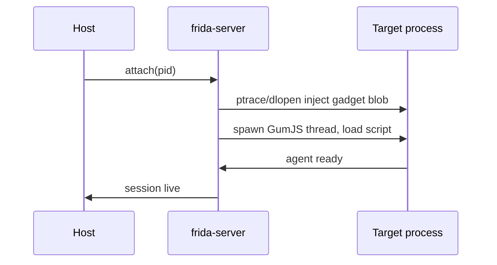
```

- [ ] **Step 3: 修改 concepts/message-protocol.md — 加消息时序图**
文件: `skills/frida/references/concepts/message-protocol.md`

插入：

```markdown
这张图回答："send 与 rpc 各自的消息方向与何时阻塞？"

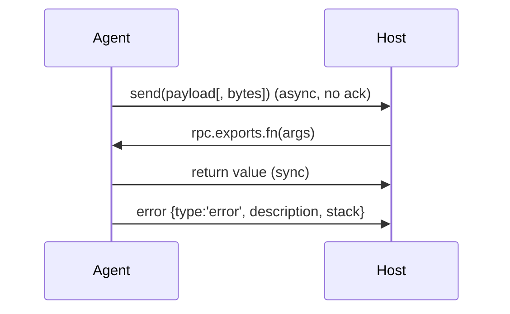
```

- [ ] **Step 4: 修改 concepts/spawn-attach-gating.md — 加门控状态图**
文件: `skills/frida/references/concepts/spawn-attach-gating.md`

插入：

```markdown
这张图回答："spawn 之后 app 处于什么状态、resume 的时机？"

```mermaid
stateDiagram-v2
  [*] --> Spawned: device.spawn(pkg)
  Spawned --> Paused: awaiting resume
  Paused --> Hooked: load script, install hooks
  Hooked --> Running: device.resume(pid)
  Running --> [*]: exit
```
```

- [ ] **Step 5: 修改 concepts/host-vs-agent.md — 加职责对照图**
文件: `skills/frida/references/concepts/host-vs-agent.md`

插入：

```markdown
这张图回答："一件事该在 host 做还是在 agent 做？"

```mermaid
flowchart LR
  H["HOST can: load/unload, drive rpc, log, script orchestration"] --> A["AGENT can: read/write memory, hook, call native, Java/ObjC"]
  A -.->|"cannot: touch host fs/network directly except via File/Socket"| H
```
```

- [ ] **Step 6: 修改 core-api/interceptor-attach.md — 加 hook 阶段图**
文件: `skills/frida/references/core-api/interceptor-attach.md`

在文档靠前处插入（与 hooking-internals-stages.md 互补、更简版）：

```markdown
这张图回答："一次被 hook 的调用经过哪两步回调？"

```mermaid
flowchart LR
  C["caller"] --> T["trampoline"]
  T --> E["onEnter(args)"]
  E --> O["original"]
  O --> L["onLeave(retval)"]
  L --> R["return to caller"]
```
```

- [ ] **Step 7: 修改 core-api/stalker.md — 加 stalk 流程图**
文件: `skills/frida/references/core-api/stalker.md`

插入：

```markdown
这张图回答："follow 之后指令怎么被改写并执行？"

```mermaid
flowchart LR
  F["Stalker.follow(tid)"] --> R["regenerate block"]
  R --> Tr["transform(iter, ins, out)"]
  Tr --> Emit["emit (possibly rewritten) block"]
  Emit --> Run["target executes new block"]
  Run --> R
```
```

- [ ] **Step 8: 修改 core-api/rpc-exports.md — 加 RPC 时序图**
文件: `skills/frida/references/core-api/rpc-exports.md`

插入：

```markdown
这张图回答："host 调 agent 的 rpc.exports 函数，往返顺序？"

```mermaid
sequenceDiagram
  participant H as Host (python)
  participant A as Agent
  H->>A: script.exports_sync.fnName(args)
  A->>A: run rpc.exports.fnName
  A->>H: return value
  Note over H,A: JS camelCase fnName -> python snake_case fn_name
```
```

- [ ] **Step 9: 修改 core-api/send-recv.md — 加收发握手图**
文件: `skills/frida/references/core-api/send-recv.md`

插入：

```markdown
这张图回答："send 是单向，怎么用 recv 做一次握手拿回应答？"

```mermaid
sequenceDiagram
  participant A as Agent
  participant H as Host
  A->>H: send({type:'ask', q:'x'})
  H->>A: recv('answer', cb) -> post({type:'answer', a:'y'})
  A->>A: cb fires, recvOperation.wait() returns
```
```

- [ ] **Step 10: 修改 android/spawn-gating.md — 加 Java 启动时序图**
文件: `skills/frida/references/android/spawn-gating.md`

插入：

```markdown
这张图回答："spawn 暂停的是哪个阶段、hook 要在 resume 前装好？"

```mermaid
sequenceDiagram
  participant H as Host
  participant D as Device
  participant App as App process
  H->>D: spawn(pkg)
  D->>App: fork+exec, Zygote-class loaded, PAUSED before Application.onCreate
  H->>App: load agent, Java.perform install hooks
  H->>D: resume(pid)
  App->>App: Application.onCreate runs WITH hooks live
```
```

- [ ] **Step 11: 修改 android/early-instrumentation.md — 加 classloader 时序图**
文件: `skills/frida/references/android/early-instrumentation.md`

插入：

```markdown
这张图回答："目标类还没加载时，怎么在 classloader 路径上截到它？"

```mermaid
flowchart LR
  A["Application.onCreate hook"] --> CL["catch first classloader"]
  CL --> E["enumerateLoadedClasses / findClass"]
  E --> Hk["install method hook once class visible"]
```
```

- [ ] **Step 12: 修改 guides/workflow-recon-to-hook.md — 加侦察→hook 流程图**
文件: `skills/frida/references/guides/workflow-recon-to-hook.md`

插入：

```markdown
这张图回答："侦察到精确 hook 的迭代闭环？"

```mermaid
flowchart LR
  T["frida-trace recon"] --> I["identify symbol/class"]
  I --> W["write precise Interceptor/impl hook"]
  W --> V["run + verify send()"]
  V --> OK{"matches?"}
  OK -->|"no"| I
  OK -->|"yes"| D["done"]
```
```

- [ ] **Step 13: 验证 12 文件各含至少一个 mermaid 块且原文未损坏**
Run: `bash -c 'cd skills/frida/references && files="concepts/architecture.md concepts/injection-model.md concepts/message-protocol.md concepts/spawn-attach-gating.md concepts/host-vs-agent.md core-api/interceptor-attach.md core-api/stalker.md core-api/rpc-exports.md core-api/send-recv.md android/spawn-gating.md android/early-instrumentation.md guides/workflow-recon-to-hook.md"; for f in $files; do c=$(grep -c "```mermaid" "$f"); [ "$c" -ge 1 ] && echo "OK $f ($c)"; done'`
Expected:
  - Exit code: 0
  - 12 个 "OK" 行

- [ ] **Step 14: 提交**
Run: `git add skills/frida/references/concepts/*.md skills/frida/references/core-api/*.md skills/frida/references/android/*.md skills/frida/references/guides/*.md && git commit -m "docs: add mermaid diagrams to 12 key existing docs (architecture, injection, protocol, gating, hooks, stalker, rpc, recon flow)"`

---

### Task 9: 全库校验 — 链接零缺失、frontmatter 合规、API 正确性、mermaid 语法

**Depends on:** Task 1, Task 2, Task 3, Task 4, Task 5, Task 6, Task 7, Task 8
**Files:**
- Modify: 仅校验，不创建文件（必要时修复个别笔误）

- [ ] **Step 1: 校验索引链接零缺失（含新领域）**
Run: `bash -c 'cd skills/frida && missing=0; for idx in references/*/index.md; do dir=$(dirname "$idx"); for tgt in $(grep -oE "\]\([a-z0-9-]+\.md\)" "$idx" | sed -E "s/\]\(([a-z0-9-]+\.md)\)/\1/"); do [ -f "$dir/$tgt" ] || { echo "MISSING $idx -> $tgt"; missing=$((missing+1)); }; done; done; echo "missing=$missing"'`
Expected:
  - Exit code: 0
  - Output: "missing=0"

- [ ] **Step 2: 校验全部 md 以 frontmatter 起始且 name 与文件名一致**
Run: `bash -c 'cd skills/frida && bad=0; for f in $(find references -name "*.md"); do head -1 "$f" | grep -q "^---$" || { echo "NO-FM $f"; bad=$((bad+1)); }; nm=$(grep -m1 "^name:" "$f" | sed "s/^name: //"); [ "$nm.md" = "$(basename $f)" ] || { echo "NAME-MISMATCH $f (name:$nm)"; bad=$((bad+1)); }; done; echo "bad=$bad"'`
Expected:
  - Exit code: 0
  - Output: "bad=0"

- [ ] **Step 3: 校验无裸调用被移除 API（仅告警语境可出现）**
Run: `bash -c 'cd skills/frida && hits=$(grep -rEn "(^|[^.a-zA-Z])Module\.(get|find)ExportByName\(" references | grep -vE "REMOVED|removed|[Nn]ever|不要|gone|静态|no longer|instance|16|shim" || true); [ -z "$hits" ] && echo "CLEAN: no bare static calls" || { echo "$hits"; exit 1; }'`
Expected:
  - Exit code: 0
  - Output: "CLEAN: no bare static calls"

- [ ] **Step 4: 校验 mermaid 块成对闭合**
Run: `bash -c 'cd skills/frida && bad=0; for f in $(grep -rl "```mermaid" references); do o=$(grep -c "```mermaid" "$f"); c=$(grep -c "```$" "$f"); [ $((o*2)) -le $c ] || { echo "UNBALANCED $f mermaid=$o fences=$c"; bad=$((bad+1)); }; done; echo "bad=$bad"'`
Expected:
  - Exit code: 0
  - Output: "bad=0"

- [ ] **Step 5: 统计最终规模**
Run: `bash -c 'cd skills/frida && echo "叶子=$(find references -name "*.md" ! -name "index.md" | wc -l) 索引=$(find references -name "index.md" | wc -l) 总=$(find . -name "*.md" | wc -l) mermaid块=$(grep -r "```mermaid" references | wc -l)"'`
Expected:
  - Exit code: 0
  - Output: 叶子 ≥ 161, 索引 = 10, 总 ≥ 172, mermaid 块 ≥ 16

- [ ] **Step 6: 提交校验结论（如无修复则空提交记录）**
Run: `git add -A && git commit -m "docs(skills): verify knowledge-base expansion — links zero-missing, frontmatter valid, API correct, mermaid balanced" --allow-empty`
