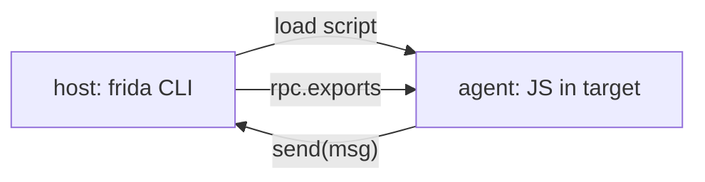

# Authoring guide for the Frida skill (read before writing any doc)

This skill teaches AI agents how to use Frida. Docs must be **accurate for Frida
16/17**, terse, and task-oriented. This file is the single source of truth for API
facts and house style. When writing or reviewing a doc, obey it.

## House style

- **Audience:** an AI agent that will act on the doc. Lead with *when to use this*
  and the *shortest working example*, then details, then pitfalls.
- **Length:**
  - 普通叶子文档：40–140 行，一个聚焦主题。
  - **图解型文档**（以 mermaid 图为主体）：80–200 行，图占主体、文字仅解释图。
  - **汇总型文档**（对照表/速查/glossary/playbook）：120–220 行，表格与清单为主。
  - 判定方式：在 frontmatter 加 `type: leaf | diagram | summary`，缺省为 `leaf`。
  Link siblings by relative path (`../core-api/interceptor-attach.md`), don't duplicate them.
- **Every code block must be runnable as written** on the stated target. No
  pseudo-code, no invented API names. If unsure an API exists, don't name it —
  describe the capability and link to the reference that covers it.
- **Frontmatter on every file:**
  ```
  ---
  name: <kebab-case, matches filename without .md>
  description: One sentence, third person, with trigger words, ≤ 220 chars.
  ---
  ```
- Prose in English (code/identifiers stay as-is). Markdown, GitHub-flavored.

## Frida 16/17 API facts (VERIFIED against 17.15.3 — do not contradict)

### Modules & exports — the #1 place stale training data is wrong
- **REMOVED in Frida 17:** the *static* helpers `Module.getExportByName()` and
  `Module.findExportByName()`. **Never write them.**
- Correct forms:
  - `Process.getModuleByName('libc.so.6')` → Module (throws if absent);
    `Process.findModuleByName(...)` → null if absent.
  - On a Module instance: `.getExportByName('open')` (throws) /
    `.findExportByName('open')` (null); also `.enumerateExports()`,
    `.enumerateImports()`, `.enumerateSymbols()`, `.base`, `.size`, `.name`, `.path`.
  - Global search across modules: `Module.getGlobalExportByName('malloc')`.
  - `Module.load('/path/lib.so')`, `new ModuleMap()`.
- `Process`: `.id`, `.arch`, `.platform`, `.pageSize`, `.pointerSize`,
  `.codeSigningPolicy`, `.enumerateModules()`, `.getModuleByName()`,
  `.getModuleByAddress()`, `.enumerateRanges(prot)`, `.enumerateMallocRanges()`,
  `.getCurrentThreadId()`, `.enumerateThreads()`, `.setExceptionHandler(cb)`.

### Pointers & memory — read/write THROUGH the NativePointer
- `ptr('0x1234')`, `NULL`, `int64(x)`/`uint64(x)`, `Int64`/`UInt64`.
- Reads: `readU8/U16/U32/U64/S8..S64`, `readPointer`, `readFloat/Double`,
  `readByteArray(n)`, `readCString`, `readUtf8String`, `readUtf16String`, `readAnsiString`.
- Writes: matching `writeU8`… `writePointer`, `writeUtf8String`, etc.
- Arithmetic: `.add/.sub/.and/.or/.xor/.shl/.shr`, `.isNull()`, `.compare()`,
  `.toString()`, `.equals()`.
- `Memory.alloc(size)`, `Memory.allocUtf8String(str)`, `Memory.allocAnsiString`,
  `Memory.protect(ptr,size,'rwx')`, `Memory.patchCode(ptr,size,cb)`,
  `Memory.scan(base,size,pattern,{onMatch,onComplete})`, `Memory.scanSync(...)`,
  `Memory.copy`, `Memory.dup`. `hexdump(ptr,{length,ansi})`.
- **Do NOT use** the removed `Memory.readUtf8String(ptr)` / `Memory.writeX(ptr,...)`
  free-function style — use the pointer methods above.

### Hooking
- `Interceptor.attach(target, { onEnter(args){}, onLeave(retval){} })` — `args[i]`
  and `retval` are **NativePointers**; `this` persists across enter/leave and holds
  `.returnAddress`, `.context`, `.threadId`, `.errno`/`.lastError`. `retval.replace(x)`.
- `Interceptor.replace(target, new NativeCallback(fn, retType, argTypes))`,
  `Interceptor.revert(target)`, `Interceptor.flush()`.
- `new NativeFunction(ptr, retType, argTypes[, abi])`. **Return mapping:** `'int'`/
  `'uint'` → plain JS **number** (no `.toInt32()`); `'pointer'` → NativePointer;
  `'int64'`/`'uint64'` → Int64/UInt64. Types: `'void','pointer','int','uint','long',
  'ulong','size_t','int64','uint64','float','double','bool','char*'` etc.
- `new NativeCallback(jsFn, retType, argTypes)`, `new SystemFunction(...)` (returns
  `{value, errno}` / `{value, lastError}`).

### Host↔agent
- `send(payload[, arrayBuffer])` — async, one-way, agent→host. `recv(type, cb)`
  returns a `RecvOperation` with `.wait()`. `rpc.exports = { fnName(){...} }`; host
  calls via `script.exports_sync` (Python) — JS `camelCase` → Python `snake_case`.
- Host message callback: `msg.type` is `'send'` (`msg.payload`) or `'error'`
  (`msg.description`, `msg.stack`, `msg.fileName`, `msg.lineNumber`).

### Mobile bridges (only exist on-device; guard with `Java.available`/`ObjC.available`)
- **Java (Android):** `Java.perform(cb)`, `Java.use('a.b.C')`, `Java.choose(cls,{onMatch,onComplete})`,
  `Java.enumerateLoadedClasses`, `Java.enumerateClassLoaders`, `Java.cast`,
  `Java.array('byte',[...])`, `Java.registerClass({...})`, `.overload(sig...)`,
  `.implementation = function(){}`, `$new`, `$init`, `Field.value`.
- **ObjC (iOS/macOS):** `ObjC.classes.NSString`, `ObjC.Object(ptr)`, method keys
  `'- selWith:arg:'`, `.implementation = ObjC.implement(m, fn)`, `ObjC.choose`,
  `ObjC.available`, `ObjC.schedule(queue, fn)`, `new ObjC.Block(...)`.

### Runtime & misc globals (all verified present)
- Default runtime is **QuickJS (QJS)**, not V8 (`--runtime=v8` to switch).
- Globals: `Stalker` (follow/unfollow/parse/addCallProbe), `CModule`, `File`,
  `Socket`/`SocketListener`, `SqliteDatabase`, `Checksum`, `Instruction`,
  `Thread.backtrace(context, Backtracer.ACCURATE)`, `Thread.sleep`, `DebugSymbol`,
  `ApiResolver('module'|'objc'|'swift')`, `Script.bindWeak`, `Script.runtime`.
- Code writers are **arch-specific**: `X86Writer`/`X86Relocator` on x86/64,
  `Arm64Writer`/`ThumbWriter` etc. on ARM. Don't imply one exists everywhere.

## Reachability preconditions to restate where relevant
- Android → `frida-server` (root, matching ABI+version) or `frida-gadget`; connect `-U`.
- iOS → jailbreak `frida-server` or re-signed gadget; connect `-U`.
- Version skew between host `frida` and device `frida-server` is the top failure.

## Mermaid 图写作规范

图解型文档与需要流程示意的叶子可嵌入 mermaid 图块。规则：

- **只用 GitHub 原生支持的图类型**：`flowchart`、`sequenceDiagram`、
  `stateDiagram-v2`、`classDiagram`。不用 GitHub 不渲染的 `journey`/`pie`。
- **节点 id 用纯字母数字**（`A`, `Host`, `Ag`），**显示文本用引号包裹**：
  `A["open(path, flags)"]`。避免 `()`、`:`、`&`、`"` 裸写破坏语法。
- **每个图块前先一句话说明**这张图回答什么问题，便于 agent 决定是否读图。
- **图解必须自洽**：图里出现的步骤要在正文有对应解释段落。
- mermaid 不支持 `//` 注释；箭头标签用 `-->|"返回 fd"|` 形式。
- 图解型文档（`type: diagram`）可放宽到 200 行；普通叶子图块不超过 2 张。

最小可渲染示例（用作新图模板）：



## Authorization line (include in any bypass/anti-detection doc)
Frida is for software you're authorized to analyze (your apps, permissioned
engagements, CTFs, research). Note this in docs that defeat a protection.
