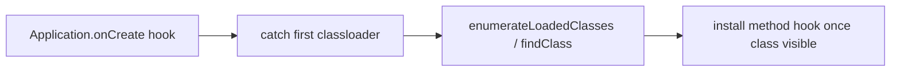

# Early instrumentation: catch the app before it acts

**When to use:** you must be active before *any* app logic — before anti-tamper
SDKs initialize, before a splash-screen license check, before a child classloader
finishes. Spawn-gating (see [spawn-gating.md](spawn-gating.md)) gives you the
window; this doc is *what to hook* inside it.

这张图回答："目标类还没加载时，怎么在 classloader 路径上截到它？"



## Earliest reliable Java hook: attachBaseContext / onCreate

`Application.attachBaseContext(Context)` runs before `onCreate` and is the first
app-controlled Java to execute. Hook it to run setup at the earliest moment the
`Application` class exists:

```js
Java.perform(() => {
  const App = Java.use('android.app.Application');
  App.attachBaseContext.overload('android.content.Context').implementation =
    function (base) {
      console.log('[*] attachBaseContext — earliest app hook point');
      this.attachBaseContext(base);
      // install later hooks here, now that base context/classloaders exist
    };
});
```

Hooking the framework `android.app.Application` catches subclasses too, since the
subclass calls up to it.

## Catch classes as their loader appears

Child classloaders (dynamic DEX, packers) don't exist at spawn. Hook the loader
constructors to run code the instant a new loader is created, then resolve your
target — see [java-classloaders.md](java-classloaders.md):

```js
Java.perform(() => {
  const DexClassLoader = Java.use('dalvik.system.DexClassLoader');
  DexClassLoader.$init.implementation = function () {
    const r = this.$init.apply(this, arguments);
    console.log('[*] new DexClassLoader — child classes now loadable');
    return r;
  };
});
```

## Catch a native library as it loads

Anti-tamper often lives in a `.so` loaded early. Hook the load call to instrument
the moment its exports exist — details in
[system-loadlibrary.md](system-loadlibrary.md):

```js
Java.perform(() => {
  const System = Java.use('java.lang.System');
  System.loadLibrary.overload('java.lang.String').implementation = function (name) {
    console.log('[*] System.loadLibrary(' + name + ')');
    const r = this.loadLibrary(name);
    // now Process.getModuleByName('lib' + name + '.so') is available
    return r;
  };
});
```

## Pitfalls

- **Attaching, not spawning.** Early hooks are pointless if the app already ran;
  you must spawn-gate. See [spawn-gating.md](spawn-gating.md).
- **Hooking your own target class too early.** If it lives in a not-yet-created
  loader, `Java.use` throws. Hook a class that exists early (framework
  `Application`, the loader `$init`) and defer the rest until it's loaded.
- **Not calling the original.** In `attachBaseContext`/`$init` hooks always invoke
  the original, or the app breaks before it starts.
- **SDK initialized in a static block** may run at class-load, before your method
  hook. In that case hook the classloader or the native load, not a late method.
- **Reachability.** Spawn needs a matching `frida-server` (root) or gadget; `-U`.
