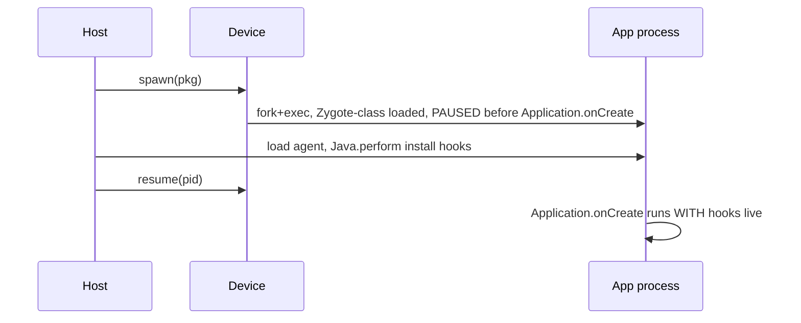

# Spawn and gate: hook before the app runs

**When to use:** the behavior you must intercept happens at **startup** — a root
or Frida check in `Application.onCreate`, SSL setup, a one-time license
validation. If you *attach* to a running app, that code already executed and your
hook is too late. Spawning starts the process **suspended**, lets you install
hooks, then resumes.

这张图回答："spawn 暂停的是哪个阶段、hook 要在 resume 前装好？"



## From the CLI (simplest)

`-f <package>` spawns and holds until your agent has loaded:

```sh
frida -U -f com.example.app -l agent.js
```

Frida spawns the app frozen, loads `agent.js`, then auto-resumes when the script
finishes loading. To resume manually in the REPL: type `%resume`. To keep it
frozen longer, add `--no-pause`'s opposite — by default `-f` pauses until load.

`frida-trace` gates the same way:

```sh
frida-trace -U -f com.example.app -j 'com.example.*!*'
```

## From Python — the explicit gate

```python
import frida, sys

device = frida.get_usb_device()
pid = device.spawn(["com.example.app"])          # starts suspended
session = device.attach(pid)
script = session.create_script(open("agent.js").read())
script.on("message", lambda msg, data: print(msg))
script.load()                                     # install hooks NOW
device.resume(pid)                                # let the app run
sys.stdin.read()
```

The order is the whole point: **spawn → attach → load hooks → resume.**

## Agent side

Your agent's top-level `Java.perform` runs during the gated window, so hooks are in
place before `Application.onCreate`:

```js
Java.perform(() => {
  const App = Java.use('com.example.app.MyApplication');
  App.onCreate.implementation = function () {
    console.log('[*] onCreate — hooks already installed');
    return this.onCreate();
  };
});
```

## Pitfalls

- **Attaching instead of spawning** is the classic "my hook never fires" cause for
  startup logic. Use `-f` / `device.spawn`.
- **Forgetting to resume** in Python leaves the app frozen at a black screen.
  Always `device.resume(pid)` after `script.load()`.
- **Class not loaded yet at spawn time.** Very early, target classes (especially in
  child loaders) may not exist. Hook a class that *is* loaded early (e.g.
  `Application`/classloader) and defer the rest — see
  [early-instrumentation.md](early-instrumentation.md).
- **Wrong package name.** Use the exact package id; list with `frida-ps -Uai` —
  see [enumerate-app.md](enumerate-app.md).
- **Reachability.** Spawn needs a working `frida-server` (root, matching ABI +
  version) or a gadget; connect `-U`. Version skew is the top failure.
