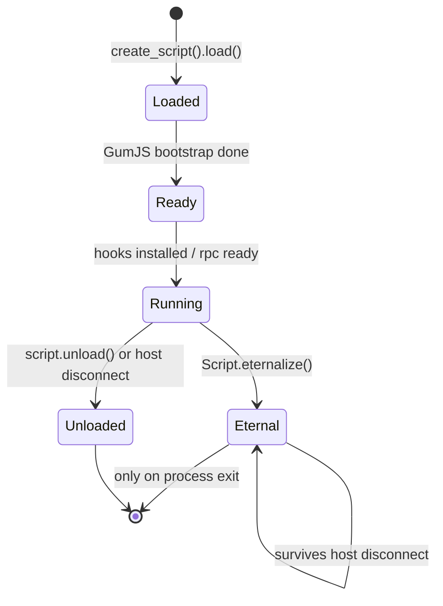

# Agent lifecycle — a deep dive

When does your agent actually start running? When does it stop? `eternalize`
breaks the normal rule. This doc maps the states.

## State diagram

这张图回答："我的脚本在什么时刻活着、什么时刻被卸载？"

## What happens at each transition

- **Loaded → Ready:** the JS engine boots (QJS by default), your top-level code
  runs, but the process is *paused* if you spawned (`-f`) — you must `resume()`.
- **Ready → Running:** your `Interceptor.attach` / `Java.perform` / `rpc.exports`
  are live. Messages can flow both ways.
- **Running → Unloaded:** triggered by `script.unload()` on the host, or the host
  process exiting. All hooks are reverted, the engine is torn down.
- **Running → Eternal:** `Script.eternalize()` detaches the agent's lifetime from
  the host — the agent keeps running after the host disconnects. Used for
  fire-and-forget instrumentation. See [recipe-eternalize-persistent.md](../recipes/recipe-eternalize-persistent.md).

## Pitfalls

- Top-level code runs **once** at load. Hooks installed in a `setTimeout(fn, 0)`
  may miss early calls if you `resume()` first.
- `eternalize` does **not** survive a process restart — it lives only as long as
  the target process.
- Unloading a script whose `onEnter` is mid-flight on another thread can crash;
  call `Interceptor.flush()` before `unload()` on hot paths.

## Lifecycle failures — what you actually see

| Symptom you see | State you're stuck in | Fix |
| --- | --- | --- |
| Hooks never fire, app runs normally | stuck in **Ready**, never `Running` (attach-too-late, or wrong symbol) | spawn-gate: see [../android/spawn-gating.md](../android/spawn-gating.md) |
| App hangs at first frame after `-f` | stuck in **Loaded/Ready**, nobody called `resume()` | call `dev.resume(pid)` / `Process.resume()`, or drop `--pause` |
| Agent dies the instant CLI exits | **Running → Unloaded** on host disconnect | `Script.eternalize()` for fire-and-forget |
| Agent silently gone mid-run | transport dropped (no auto-reconnect) | re-attach + re-load; see [transport-internals.md](transport-internals.md) |
| Data races after heavy hooks | still `Running`, hooks racing threads | `Interceptor.flush()` before mutate/unload |

## The one rule that explains all of it

**Your agent is a passenger on the target's threads.** The state diagram is
about when it's *allowed to run*, but once `Running` every callback executes on
a target thread (or, for `Java.perform`/`ObjC.schedule`, on the VM's own
queue). That's why `resume()` timing, `flush()` before teardown, and
`eternalize()` for longevity are the three load-bearing levers — everything
else follows from "passenger on target threads."
