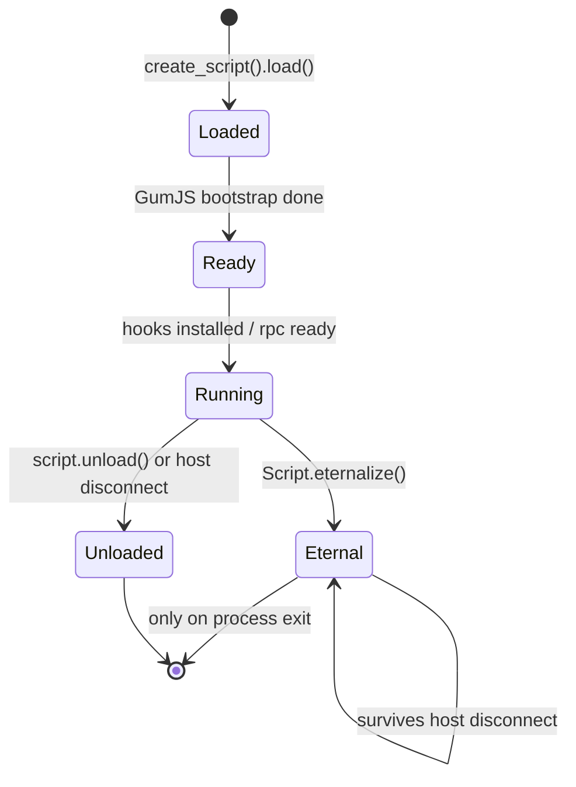

# Agent lifecycle — a deep dive

When does your agent actually start running? When does it stop? `eternalize`
breaks the normal rule. This doc maps the states.

## State diagram

这张图回答："我的脚本在什么时刻活着、什么时刻被卸载？"

## What happens at each transition

- **Loaded → Ready:** the JS engine boots (QJS by default), your top-level code
  runs, but the process is *paused* if you spawned (`-f`) — you must `resume()`.
- **Ready → Running:** your `Interceptor.attach` / `Java.perform` / `rpc.exports`
  are live. Messages can flow both ways.
- **Running → Unloaded:** triggered by `script.unload()` on the host, or the host
  process exiting. All hooks are reverted, the engine is torn down.
- **Running → Eternal:** `Script.eternalize()` detaches the agent's lifetime from
  the host — the agent keeps running after the host disconnects. Used for
  fire-and-forget instrumentation. See [recipe-eternalize-persistent.md](../recipes/recipe-eternalize-persistent.md).

## Pitfalls

- Top-level code runs **once** at load. Hooks installed in a `setTimeout(fn, 0)`
  may miss early calls if you `resume()` first.
- `eternalize` does **not** survive a process restart — it lives only as long as
  the target process.
- Unloading a script whose `onEnter` is mid-flight on another thread can crash;
  call `Interceptor.flush()` before `unload()` on hot paths.
