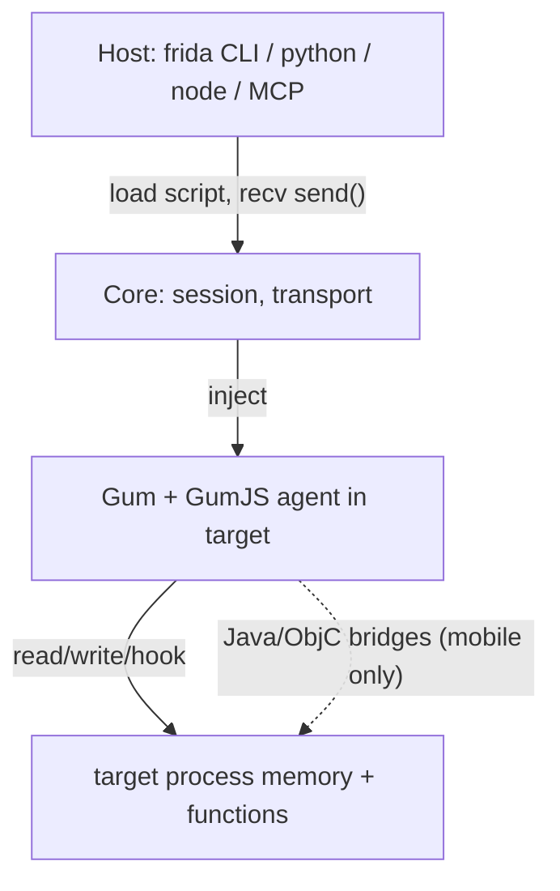

# Frida architecture: the big picture

Frida is a stack of layers. Knowing which layer a symptom belongs to tells you
where to fix it: a hook that never fires is an *agent* problem; an empty device
list is a *host/transport* problem.

这张图回答："Frida 的几层各自负责什么、边界在哪？"



```
  ┌─ host process (your machine) ────────────┐
  │  frida CLI / Python / Node / MCP client  │   controls sessions, loads scripts,
  │  frida-core (session & device mgmt)      │   receives messages
  └──────────────┬───────────────────────────┘
                 │  injects & talks to
  ┌──────────────▼─── target process ────────┐
  │  agent = your JS  ← runs on GumJS         │   hooks, reads memory
  │  GumJS (QuickJS/V8 bindings to Gum)       │
  │  Gum (C instrumentation engine)           │   Interceptor, Stalker, Memory
  └───────────────────────────────────────────┘
```

## The layers, bottom to top

- **Gum** (`frida-gum`) — the C instrumentation library. It implements the real
  machinery: code hooking (`Interceptor`), code tracing (`Stalker`), memory
  scanning/patching, module and symbol enumeration. Everything else is a
  presentation of Gum.
- **GumJS** — a JavaScript engine (QuickJS by default, V8 optional) embedded next
  to Gum, exposing Gum's C API as the JS globals you write against: `Interceptor`,
  `Module`, `Process`, `Memory`, `NativeFunction`, `Stalker`, `send`/`recv`.
- **The agent** — *your* JavaScript, loaded into GumJS. It runs **inside the
  target process** with that process's privileges and address space. This is why
  `ptr.readUtf8String()` just works: the pointer is a real address in the same
  process.
- **frida-core** — the host-side C library (with Python/Node/Swift/etc. bindings)
  that finds devices, spawns/attaches to processes, injects GumJS, ships your
  script over, and pumps messages back and forth.
- **Host frontends** — the `frida`/`frida-trace` CLIs, the Python/Node bindings,
  or an MCP server. All are thin drivers over frida-core.

## What runs where (and why it matters)

The single most useful mental split: **agent code runs in the target; host code
runs on your machine.** They share nothing but the message channel.

```js
// AGENT side (inside target): direct access to the process
const m = Process.getModuleByName('libc.so.6');
send({ base: m.base.toString(), exports: m.enumerateExports().length });
```

```python
# HOST side (your machine): only sees what the agent send()s back
session = frida.get_usb_device().attach("com.example.app")
script = session.create_script(open("agent.js").read())
script.on("message", lambda msg, data: print(msg["payload"]))
script.load()
```

The agent cannot touch your host filesystem; the host cannot dereference a target
pointer. Anything crossing the boundary goes through the message protocol
([message-protocol.md](message-protocol.md)) or `rpc.exports`.

## Foundation, not framework

Because GumJS bindings are a direct surface over Gum's C API, the JS you write is
close to the metal: `args[i]` in an `Interceptor.attach` callback is a real
`NativePointer`, not a copy. That power is also the danger — a bad write crashes
the target. See [memory-model.md](memory-model.md) for how addresses behave.

## Where to go next

- How the engine gets *into* the process: [injection-model.md](injection-model.md).
- On-device delivery of that engine: [frida-server.md](frida-server.md) and
  [frida-gadget.md](frida-gadget.md).
- The exact host/agent contract: [host-vs-agent.md](host-vs-agent.md).
- Which JS engine you're on: [runtimes-qjs-v8.md](runtimes-qjs-v8.md).
