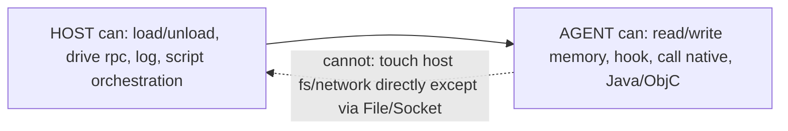

# Host vs agent: what runs where

Every Frida task has two programs running in two processes. Confusing them is the
most common source of "why can't I read that variable" bugs.

这张图回答："一件事该在 host 做还是在 agent 做？"



- **Agent** = your JavaScript, running on GumJS **inside the target process**. It
  has the target's memory, modules, threads, and (on mobile) its Java/ObjC
  runtimes.
- **Host** = the driver on **your machine**: the `frida`/`frida-trace` CLI, the
  Python/Node bindings, or an MCP server. It manages devices and sessions, loads
  the agent, and receives messages.

They share **no variables and no memory** — only a message channel.

## Capability split

| Capability | Agent (in target) | Host (your machine) |
| --- | --- | --- |
| Read/write target memory & registers | Yes (direct) | No (only via agent) |
| Hook functions / methods (`Interceptor`) | Yes | No |
| Enumerate target modules/threads | Yes | Via `rpc`/`send` from agent |
| Access *your* filesystem, network, DB | No (it's a different process) | Yes |
| Spawn/attach/kill processes, pick device | No | Yes (frida-core) |
| Persist results, orchestrate multiple runs | No | Yes |

Rule of thumb: **inspection and modification live in the agent; orchestration and
persistence live in the host.**

## The only bridge: messages and rpc

The agent talks to the host with `send()` (async, one-way) and the host replies
with `recv()`. For host→agent *calls that return a value*, expose `rpc.exports`.

```js
// AGENT (agent.js) — runs inside the target
rpc.exports = {
  readString(addr) {                 // camelCase here…
    return ptr(addr).readUtf8String();
  }
};
send({ event: 'ready', pid: Process.id });
```

```python
# HOST — runs on your machine
import frida
session = frida.get_usb_device().attach("com.example.app")
script = session.create_script(open("agent.js").read())
script.on("message", lambda msg, data: print("from agent:", msg))
script.load()
# …becomes snake_case on the host:
print(script.exports_sync.read_string("0x7fff00001234"))
```

Note the naming convention: JS `readString` → Python `read_string`. Full message
shapes and binary payloads are in [message-protocol.md](message-protocol.md).

## Why this split explains failures

- **"My host variable is undefined in the agent."** It has to be — different
  process. Pass it in when creating the script, or send it over.
- **"The agent can't write my results to a file."** Correct; `send()` the data and
  let the host write it.
- **"Console.log from the agent shows on the host."** GumJS routes agent
  `console.log` back over the channel as a convenience; it is not the agent
  touching your terminal directly.

## Data that must cross the boundary

Only JSON-serializable values travel in `send()`/`rpc` results, plus an optional
raw `ArrayBuffer` for binary. A `NativePointer` is meaningful **only inside the
agent** — send it as a string (`ptr.toString()`) and re-wrap with `ptr(...)` if
needed. See [memory-model.md](memory-model.md) for why pointers are process-local.
