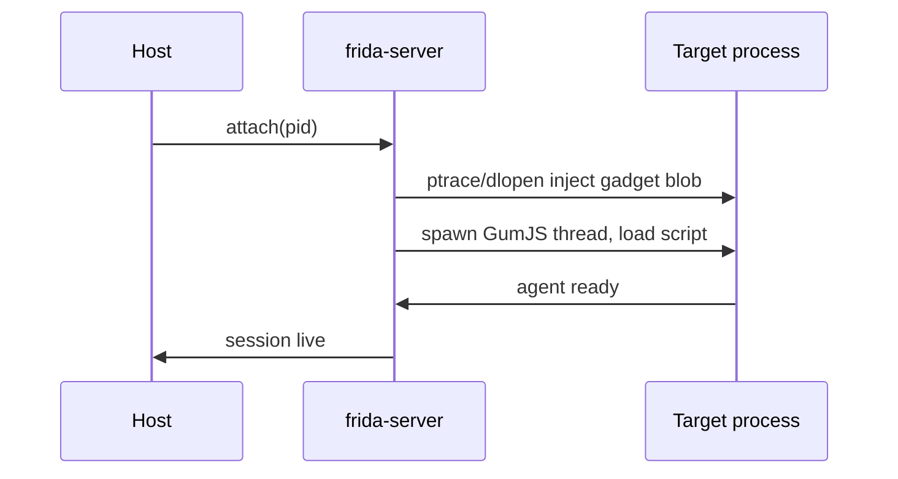

# Injection model: getting the engine into a process

To instrument a process, Frida must load GumJS *inside* it. There are two broad
delivery strategies; which one applies determines what can go wrong.

这张图回答："从 host 发起 attach 到 agent 开始执行，中间的注入步骤顺序？"



## 1. External injection (frida-server / local)

When you `attach` or `spawn` via `frida-server` (or run locally with privileges),
frida-core injects its agent library into an already-running or newly-created
process **from the outside**. On Linux/Android this uses `ptrace`; on other OSes
the platform-specific equivalent. The high-level sequence:

1. Attach to the target (ptrace on Linux/Android; task ports on macOS; debug APIs
   on Windows).
2. Allocate memory in the target and write a small bootstrapper.
3. Hijack a thread to make the target `dlopen`/map Frida's agent shared library.
4. The agent spins up GumJS, opens a communication channel back to the host, and
   the hijacked thread is restored.
5. Your script is sent over that channel and `load()`ed.

This is why external injection needs **privilege**: `ptrace` on another process
requires root (Android), matching UID plus permissive `ptrace_scope` (Linux), or
appropriate entitlements (macOS/iOS). "Failed to attach: unable to access
process" almost always means insufficient privilege, not a Frida bug.

```sh
# Linux: this may fail under a restrictive ptrace_scope
frida -n firefox -q -e "console.log(Process.id)"
# One-shot relaxation (host, needs root):
#   echo 0 | sudo tee /proc/sys/kernel/yama/ptrace_scope
```

## 2. Embedded injection (frida-gadget)

When you cannot inject from outside (a non-rooted phone, an App Store sandbox),
you instead **ship the engine inside the app**: `frida-gadget` is a shared
library added to the app so that it loads GumJS itself at startup — no ptrace, no
root. The "injection" already happened by being linked/loaded. See
[frida-gadget.md](frida-gadget.md) for config modes. This trades convenience for
having to modify or re-sign the app.

## Timing: why the moment of injection matters

Injection into an *already-running* process (`attach`) means initialization code
has already executed — you cannot hook what already ran. To hook early
constructors, class loads, or anti-debug checks in `main`, you must **spawn** the
process suspended and install hooks before it runs. That is spawn gating, covered
in [spawn-attach-gating.md](spawn-attach-gating.md).

```sh
frida -U -f com.example.app -l early-hooks.js   # spawn: hooks land before app code runs
frida -U -n com.example.app -l late-hooks.js    # attach: app already initialized
```

## Common injection failures and their layer

| Symptom | Likely cause |
| --- | --- |
| "unable to access process" / EPERM | Privilege: root/ptrace_scope/entitlements. |
| "unable to find process with name" | Wrong device (`-U` vs local) or app not running. |
| Attach works but hooks miss init code | Attached too late — spawn instead. |
| Non-rooted phone, nothing to attach to | No server privilege — use the gadget. |
| Version/ABI errors on attach | Host `frida` vs device `frida-server` skew. |

Injection is a host-side operation; once it succeeds, everything else is the
agent's job. For the runtime that comes up inside the process, see
[runtimes-qjs-v8.md](runtimes-qjs-v8.md).
