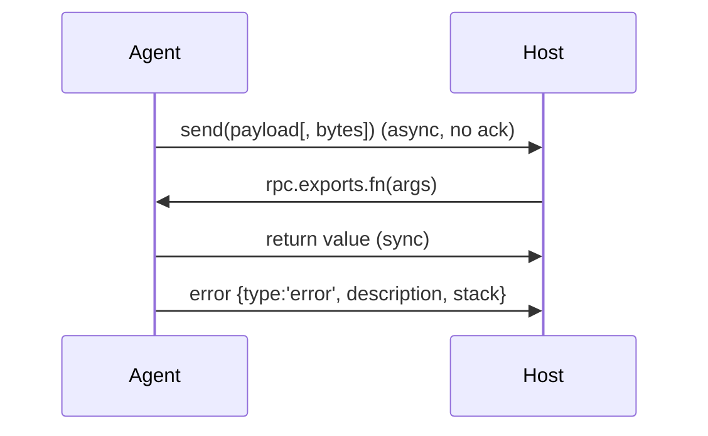

# The message protocol: send, recv, rpc

The agent and host share nothing but a message channel
([host-vs-agent.md](host-vs-agent.md)). This doc is the exact contract.

这张图回答："send 与 rpc 各自的消息方向与何时阻塞？"



## Agent → host: `send()`

`send(payload[, data])` is **asynchronous and one-way**. `payload` is any
JSON-serializable value; the optional second argument is an `ArrayBuffer` sent as
a raw binary blob alongside it.

```js
// AGENT
send({ type: 'open', path: '/etc/hosts' });
const bytes = ptr('0x1000').readByteArray(64);
send({ type: 'dump', len: 64 }, bytes);      // JSON + binary together
```

On the host, every message arrives at the `message` callback with two arguments:
the message object and the binary `data` (or `None`/`null`).

```python
# HOST (Python)
def on_message(message, data):
    if message["type"] == "send":
        print("payload:", message["payload"])
        if data is not None:
            print("binary bytes:", len(data))
    elif message["type"] == "error":
        print("agent error:", message["description"])

script.on("message", on_message)
```

## Message shapes

Every message the host receives has a `type`:

- **`send`** — `{ "type": "send", "payload": <your value> }`. Your `send()` payload
  is under `payload`; binary rides in the separate `data` argument.
- **`error`** — an uncaught exception in the agent:
  `{ "type": "error", "description": "...", "stack": "...", "fileName": "...",
  "lineNumber": <n>, "columnNumber": <n> }`. Always handle this branch; a silent
  agent is usually a swallowed `error`.

## Host → agent: `recv()`

The agent registers a one-shot handler for a message *type* the host posts back.
`recv` returns a `RecvOperation` whose `.wait()` blocks the agent until a message
of that type arrives — useful to pause until the host says "go".

```js
// AGENT: wait for the host to send { type: 'config', ... }
recv('config', (msg) => {
  console.log('threshold =', msg.threshold);
}).wait();
```

```python
# HOST: post it
script.post({ "type": "config", "threshold": 10 })
```

`recv` handles **one** message per call; re-register inside the callback for a
stream. Do not `.wait()` inside an `Interceptor` callback — it can deadlock the
target thread.

## Host ⇄ agent calls that return a value: `rpc.exports`

`send`/`recv` is fire-and-forget. When the host needs a **return value**, expose
functions via `rpc.exports`. Host calls them and gets the result (a Promise in
Node; sync/async variants in Python).

```js
// AGENT
rpc.exports = {
  listModules() { return Process.enumerateModules().map(m => m.name); },
  async readAt(addr, n) { return ptr(addr).readByteArray(n); }   // returns binary
};
```

```python
# HOST — JS camelCase becomes Python snake_case
print(script.exports_sync.list_modules())
buf = script.exports_sync.read_at("0x400000", 16)
```

Return values must be JSON-serializable (or an `ArrayBuffer` for binary).

## Practical rules

- Handle the `error` branch on the host — it's where crashed agents report.
- `send()` never blocks and never returns a value; use `rpc` when you need one.
- Keep payloads JSON-friendly; a `NativePointer` must be stringified
  (`ptr.toString()`) to cross the channel — see [memory-model.md](memory-model.md).
- Messages are ordered per script but delivered on the host's reactor thread, so
  host handlers may run concurrently with your main flow.
