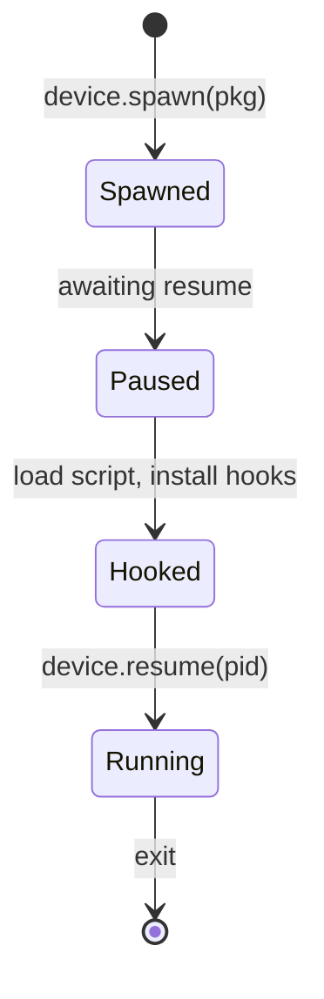

# Spawn vs attach, and spawn gating

The choice between *spawning* and *attaching* decides **whether your hooks are in
place before the code you care about runs**. Getting this wrong is why a correct
hook "never fires."

这张图回答："spawn 之后 app 处于什么状态、resume 的时机？"



## Attach: instrument an already-running process

`attach` injects into a process that is **already up**. Everything that ran during
startup — static initializers, `main`, early anti-debug or pinning setup, class
loads — has *already executed*. You cannot hook what already ran.

```sh
frida -U -n com.example.app -l agent.js     # attach: good for steady-state hooks
```

Use attach when the target is long-lived and the behavior you want happens
repeatedly (network calls, button handlers, crypto in a loop).

## Spawn: start the process suspended, hook, then let it run

`spawn` launches the process **suspended before its first instruction**, injects
the agent, lets you install hooks, and only then resumes. This is how you catch
initialization-time behavior.

```sh
frida -U -f com.example.app -l agent.js     # spawn: hooks land before app code runs
```

The `-f` flag means spawn-by-file/identifier. In the interactive prompt the process
is paused until you type `%resume` (the CLI auto-resumes after loading `-l` unless
told otherwise). From Python you control resume explicitly:

```python
import frida
device = frida.get_usb_device()
pid = device.spawn(["com.example.app"])     # suspended
session = device.attach(pid)
script = session.create_script(open("agent.js").read())
script.load()                                # install hooks while still suspended
device.resume(pid)                           # NOW let the app run
```

The ordering — `spawn` → `attach` → `load` → `resume` — is the whole point:
your hooks exist before any app code executes.

## Spawn gating: catch children the target launches

Some targets fork/exec helper processes, or an Android app is (re)started by the
system rather than by you. **Spawn gating** tells the device to hold *every* newly
spawned process suspended and notify the host, so you can instrument children you
didn't launch directly.

```python
device = frida.get_usb_device()
device.enable_spawn_gating()

def on_spawn(spawn):
    print("gated:", spawn.pid, spawn.identifier)
    session = device.attach(spawn.pid)
    session.create_script(open("agent.js").read()).load()
    device.resume(spawn.pid)                 # release this child

device.on("spawn-added", on_spawn)
# pending ones are also available via device.enumerate_pending_spawn()
```

Without gating, a child races ahead and finishes its startup before you can attach.

## Deciding quickly

| You need to hook… | Use |
| --- | --- |
| Behavior that repeats after startup | attach (`-n`) |
| Static initializers / `main` / early anti-debug | spawn (`-f`) |
| Native constructors before `libc` init runs | spawn, and hook early |
| A process the target launches itself | spawn gating |
| Android app restarted by the framework | spawn gating |

## Related

- Why "attached too late" is a *timing* failure, not a code bug:
  [injection-model.md](injection-model.md).
- On non-rooted devices you get early hooks via the gadget's `script` mode instead
  of spawn gating: [frida-gadget.md](frida-gadget.md).
- Resume is a host-side operation; the agent only decides *what* to hook, not
  *when* the process runs — see [host-vs-agent.md](host-vs-agent.md).
