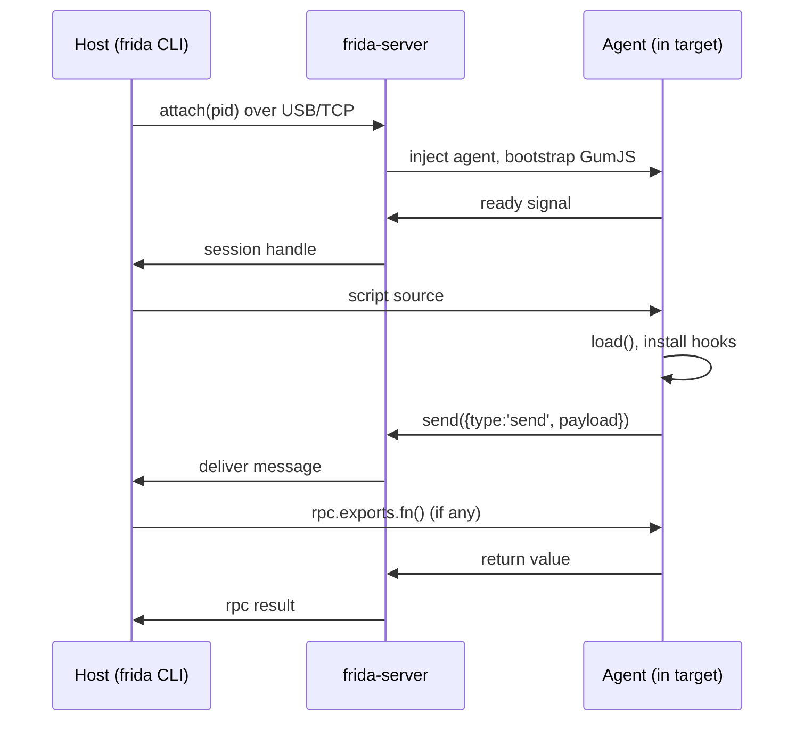

# Transport internals

The host and agent exchange JSON-ish messages over a transport. Knowing the
framing explains version-skew errors and why `send` is async.

## Sequence: attach and first message

这张图回答："attach 之后第一条 send 是怎么回来的？"

## Framing & ordering

- Messages are length-prefixed; a `send(payload, arrayBuffer)` ships JSON text
  plus an optional binary blob in one frame.
- **Ordering is preserved per session** but `send` is fire-and-forget from the
  agent's view — there is no ack. For request/response use `rpc.exports`
  (see [../core-api/rpc-exports.md](../core-api/rpc-exports.md)).
- The transport is **version-locked**: host `frida` and device `frida-server`
  must match major+minor. A mismatch surfaces as a handshake failure, not a
  clean error — see [../troubleshooting/version-skew.md](../troubleshooting/version-skew.md).

## Reconnect

There is no auto-reconnect. If the transport drops, the session is gone.
Eternalized agents survive (they no longer need the transport); normal agents
must be re-`attach`ed and re-loaded.

## Diagnosing transport problems

Version-skew and handshake failures produce confusing, non-specific errors —
but they sit at opposite ends of the sequence above:

- **Handshake fails before `S->>A`:** host and server disagree on protocol
  version. Fix [../troubleshooting/version-skew.md](../troubleshooting/version-skew.md).
  `frida-ls-devices` may still *list* the device while attach fails.
- **`send` payload never arrives at the host:** the agent-side `send` is
  fire-and-forget; a misnamed script that throws before the send line, or a
  `recv` mismatch, looks identical to a transport drop. Differentiate by
  watching stderr: an uncaught JS error prints there even when the message is
  lost.
- **A `send(payload, arrayBuffer)` with a huge blob stalls:** the binary
  payload is sent in-band after the JSON frame; a multi-MB buffer can block
  later messages on slow USB. Prefer small `send` payloads and pull bulk data
  via a second channel (file, socket), or chunk the buffer.
- **`rpc.exports.fn()` returns `undefined` for a clearly-returning fn:** the
  agent-side `rpc.exports` object is created at load; if a throw happened before
  that line, the export is absent and the host call resolves to `undefined`
  instead of throwing. Check the agent's stderr, not just the return value.
