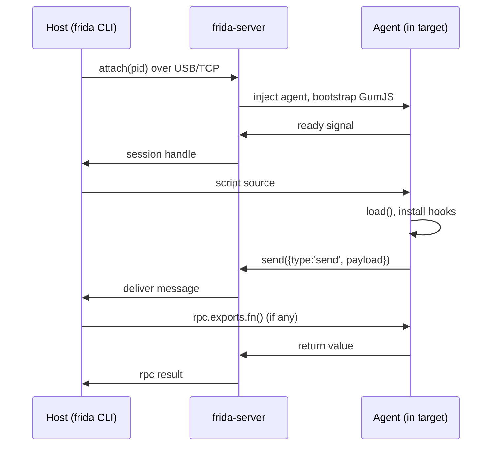

# Transport internals

The host and agent exchange JSON-ish messages over a transport. Knowing the
framing explains version-skew errors and why `send` is async.

## Sequence: attach and first message

这张图回答："attach 之后第一条 send 是怎么回来的？"

## Framing & ordering

- Messages are length-prefixed; a `send(payload, arrayBuffer)` ships JSON text
  plus an optional binary blob in one frame.
- **Ordering is preserved per session** but `send` is fire-and-forget from the
  agent's view — there is no ack. For request/response use `rpc.exports`
  (see [../core-api/rpc-exports.md](../core-api/rpc-exports.md)).
- The transport is **version-locked**: host `frida` and device `frida-server`
  must match major+minor. A mismatch surfaces as a handshake failure, not a
  clean error — see [../troubleshooting/version-skew.md](../troubleshooting/version-skew.md).

## Reconnect

There is no auto-reconnect. If the transport drops, the session is gone.
Eternalized agents survive (they no longer need the transport); normal agents
must be re-`attach`ed and re-loaded.
