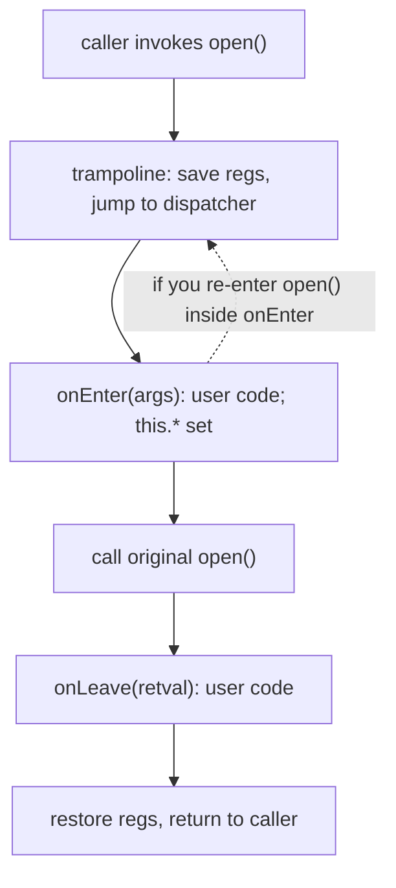

# Hooking internals — the stages of one attach

`Interceptor.attach` is not magic — it's a trampoline plus a dispatcher. Knowing
the stages explains reentrancy bugs and why `flush()` matters.

## The stages

这张图回答："一次被 hook 的函数调用，从进 trampoline 到返回要经过哪些阶段？"

## Stage-by-stage

- **Trampoline install** happens at `attach` time: Frida writes a small code
  stub at the target (or relocates the prologue) so calls detour to the
  dispatcher. `Memory.patchCode` flushes the code cache — see
  [memory-protect-patchcode.md](memory-protect-patchcode.md).
- **onEnter** runs on the *calling thread*. `args[i]` are NativePointers into
  the caller's registers/stack; `this.returnAddress`, `this.context`,
  `this.threadId`, `this.errno` are available. Mutate `args[i]` to change what
  the original sees.
- **Original call** executes with whatever `args` now hold.
- **onLeave** runs on the same thread after the original returns. `retval` is a
  NativePointer; `.toInt32()` for int returns, or `.replace(ptr)` to forge a
  return value. See [interceptor-attach.md](interceptor-attach.md).

## Pitfalls

- **Reentrancy:** if your `onEnter` itself calls the hooked function, you
  re-enter the trampoline. Frida suppresses nested `onEnter` for the *same*
  interceptor on the same thread to avoid infinite recursion, but your original
  call still runs — guard with a `this.depth` flag if you must recurse.
- **`flush()`:** writes from `attach`/`replace` are buffered; on a hot path,
  call `Interceptor.flush()` before assuming the hook is live. See
  [interceptor-revert-flush.md](interceptor-revert-flush.md).
- **Hot-path cost:** every call pays the trampoline + two JS callbacks. For
  millions of calls/sec, use `CModule` (see [cmodule.md](cmodule.md)) or
  `Stalker` with a transform instead.
