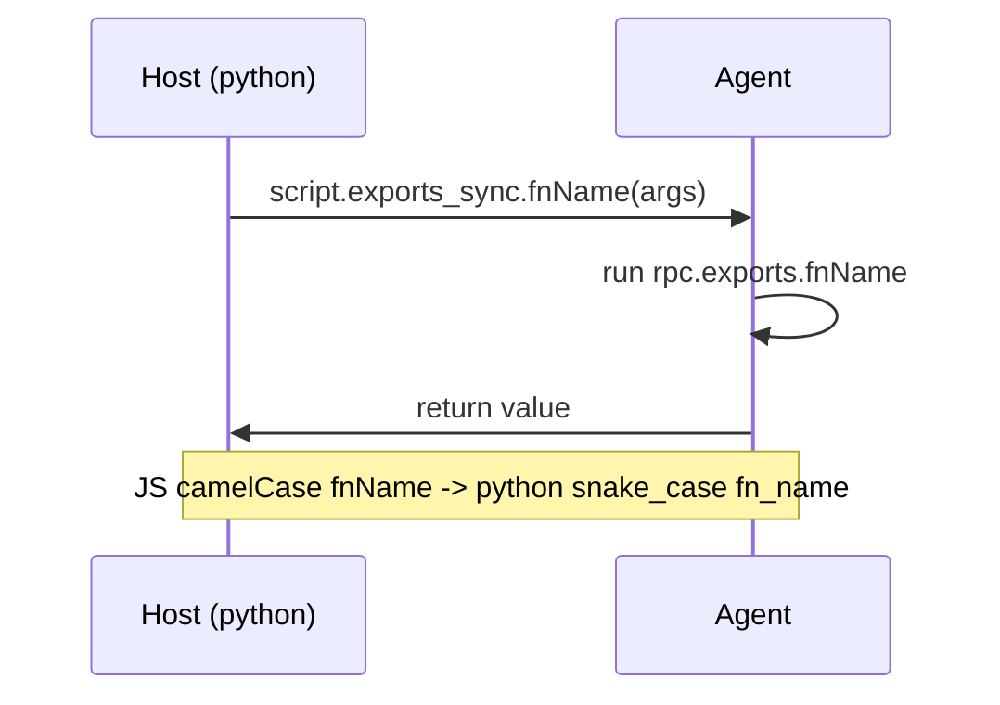

# rpc.exports: host calls into the agent

**When:** the host (Python/Node) needs to *call* the agent and get a **return
value** — pull data on demand, drive the agent step by step — instead of the
one-way, fire-and-forget [send-recv.md](send-recv.md).

这张图回答："host 调 agent 的 rpc.exports 函数，往返顺序？"



## Agent side (JS)

```js
// agent.js — runs inside the target
rpc.exports = {
  readCString(addrStr) {
    return ptr(addrStr).readCString();        // return any JSON-serializable value
  },
  listModules() {
    return Process.enumerateModules().map(m => ({ name: m.name, base: m.base.toString() }));
  },
  async openCount() {                          // async fns are awaited on the host
    return 42;
  }
};
```

Exported functions may return a value, a Promise, or nothing. Return only
JSON-serializable data — wrap NativePointers with `.toString()`.

## Host side (Python)

```python
import frida
session = frida.get_usb_device().attach("com.example.app")
script = session.create_script(open("agent.js").read())
script.load()

# JS camelCase  ->  Python snake_case, on the .exports_sync proxy:
mods = script.exports_sync.list_modules()          # listModules()
s    = script.exports_sync.read_c_string("0x...")  # readCString(addrStr)
n    = script.exports_sync.open_count()            # openCount()  (async → awaited)
print(n, len(mods))
```

Key mapping rule: JS `readCString` is called as `read_c_string`, `listModules` as
`list_modules`. Use `script.exports_sync` for blocking calls; `script.exports`
(async) is available when driving from an asyncio loop.

## Node host (for reference)

```js
const api = await script.exports;      // Node keeps camelCase
console.log(await api.listModules());
```

## Pitfalls

- **snake_case only on the Python proxy.** Calling `exports_sync.listModules()`
  (camelCase) raises `AttributeError` — Python converts names for you, so you must
  use the snake_case form.
- The script must be **loaded** (`script.load()`) before exports resolve, and the
  session must still be alive.
- Return values cross a JSON boundary: NativePointers, big Int64s, and binary must
  be converted (`.toString()`, or send bytes via `send(payload, arrayBuffer)`).
- An exception thrown in an exported function propagates to the host call as an
  error — wrap risky work and return a status object if you want graceful handling.
- For streaming/unsolicited messages agent→host, use `send()` instead; RPC is
  request/response initiated by the host.
