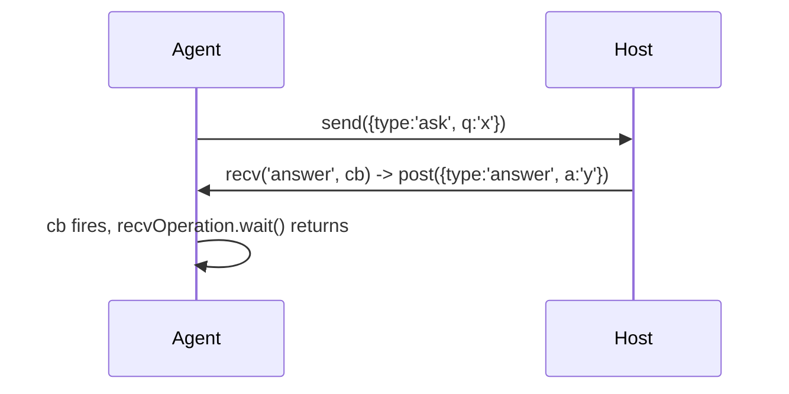

# send / recv: the message channel

**When:** the agent needs to stream events to the host (`send`), or wait for the
host to hand it a value (`recv`). For host-initiated calls that return values,
prefer [rpc-exports.md](rpc-exports.md).

这张图回答："send 是单向，怎么用 recv 做一次握手拿回应答？"



## Agent → host with send

```js
// agent.js
send({ event: 'open', path: '/etc/hosts' });          // JSON payload, async, one-way
const bytes = ptr('0x...').readByteArray(64);
send({ event: 'dump' }, bytes);                        // optional binary second arg
```

Host receives it:

```python
def on_message(message, data):
    if message['type'] == 'send':
        print(message['payload'])      # the JSON object
        if data is not None:
            print(len(data), 'bytes')  # the ArrayBuffer, as Python bytes
    elif message['type'] == 'error':
        print('agent error:', message['description'])

script.on('message', on_message)
```

`message['type']` is `'send'` (with `payload`) or `'error'` (with `description`,
`stack`, `fileName`, `lineNumber`).

## Host → agent with recv

```js
// agent.js — block this logical flow until the host answers
recv('config', function (msg) {
  console.log('host said', msg.value);
}).wait();                                 // .wait() blocks until the message arrives
```

```python
script.post({ 'type': 'config', 'value': 123 })   # from the host
```

`recv(type, cb)` returns a `RecvOperation`; `.wait()` blocks the current agent
call until a message of that `type` arrives. Omit the type to match any message.

## Back-pressure

`send` is asynchronous and buffered. Flooding it from a hot hook (one `send` per
call) can outrun the host and balloon memory. Batch events into arrays, sample, or
switch the hot path to native ([cmodule.md](cmodule.md)) and only `send`
summaries.

## Pitfalls

- `send` is **one-way and returns nothing** — you cannot read a result from it. Use
  `recv().wait()` or `rpc.exports` to get data back.
- Payloads are JSON: convert NativePointers with `.toString()`, and pass raw bytes
  as the second `arrayBuffer` argument rather than stuffing them into JSON.
- `.wait()` blocks only the calling agent flow, not the whole runtime, but a
  `recv` that never gets its message hangs that flow forever — always post the
  reply, or add host-side logic to.
- On the host, register `script.on('message', ...)` **before** `script.load()` so
  early messages aren't missed.
