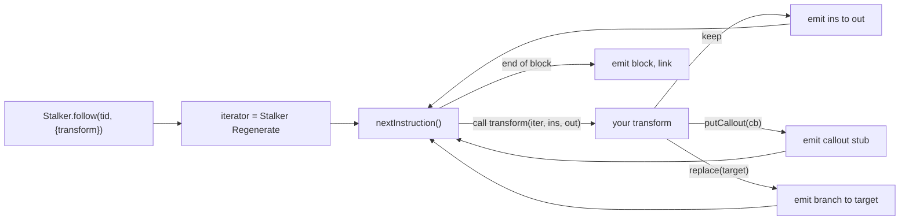

# Stalker transform — per-instruction pipeline

`Stalker.follow` with a `transform` callback lets you rewrite the instruction
stream as it's executed. This doc shows *when* your callback sees each
instruction, which is the part most people get wrong.

## Pipeline

这张图回答："transform 的 callback 在每条指令的什么时机被调用、我能往哪插 callout？"

## Timing rules

- `transform(iterator, instruction, output)` is called **once per executed
  instruction** during block regeneration, not at runtime — you're building a
  *new* block, not tracing the original. The new block is what actually runs.
- `output.putCallout(callback)` injects a call to a JS/C function at that
  position; the callout receives the *current CPU context*.
- `output.replace(target)` swaps the instruction for a branch — use for
  instruction-level patching without `Memory.patchCode`.
- Blocks are cached per thread; `Stalker.unfollow(tid)` flushes them.

## Pitfalls

- Transform runs on a **code-generation thread**, not the target thread — don't
  touch live process state from inside `transform`; do it from `putCallout`.
- `Stalker` is **arch-specific** in its relocator/writer backends; not all
  modes exist on all arches. See [stalker.md](stalker.md) for the surface.
- Unfollow before `unload()` or you leak trampolines in the target.
