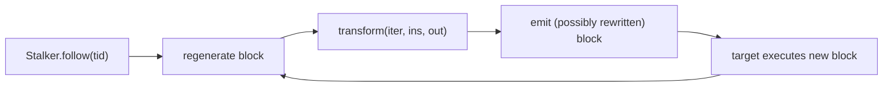

# Stalker: instruction-level tracing

**When:** you need to see *everything* a thread runs — code coverage, call graphs,
finding where an unknown check happens — beyond what per-function
[interceptor-attach.md](interceptor-attach.md) can show. Stalker dynamically
recompiles the thread's code as it runs and hands you each block.

这张图回答："follow 之后指令怎么被改写并执行？"



## Shortest working example (count blocks a call executes)

```js
const tid = Process.getCurrentThreadId();
let calls = 0;
Stalker.follow(tid, {
  events: { call: true },
  onReceive(events) {
    calls += Stalker.parse(events).length;
  }
});
// ... trigger the work you want to trace ...
Stalker.unfollow(tid);
Stalker.flush();
console.log('call events:', calls);
```

## Following & events

```js
Stalker.follow(threadId, {
  events: { call: true, ret: false, exec: false, block: false, compile: false },
  onReceive(events) { /* raw binary blob; decode with Stalker.parse(events) */ },
  // OR onCallSummary(summary) { /* { targetAddr: count, ... } — cheap coverage */ }
});
Stalker.unfollow(threadId);
Stalker.flush();        // force out buffered events after unfollow
```

`onCallSummary` is much cheaper than `onReceive` when you only need call counts.

## Transform: rewrite/inspect each block

```js
Stalker.follow(tid, {
  transform(iterator) {
    let insn;
    while ((insn = iterator.next()) !== null) {
      // inspect insn.address / insn.mnemonic here
      iterator.keep();                 // emit the original instruction
    }
  }
});
```

`iterator.putCallout(fn)` injects a JS callback per instruction — powerful but slow.
The code the iterator emits uses the **arch-specific** writer under the hood
(`Arm64Writer`/`X86Writer`/…); anything you emit manually must match `Process.arch`.

## Performance & arch caveats

- Stalker is **orders of magnitude slower** than the raw code and can massively
  inflate memory. Follow the **narrowest** scope: a single thread, only while the
  interesting work runs, then `unfollow` + `flush` immediately.
- `onReceive` with `exec: true` produces enormous event volume; prefer
  `onCallSummary` or `{ call: true }` unless you truly need every instruction.
- Per-instruction `putCallout`/`addCallProbe` callbacks bounce into JS and dominate
  runtime — use sparingly and keep them tiny.
- Recompilation is arch-specific (arm64, arm/thumb, x86/x64). Behavior and limits
  differ per architecture; test on the real target ABI.
- Tune with `Stalker.trustThreshold`, `queueCapacity`, `queueDrainInterval` if you
  drop events or want back-to-back blocks re-optimized.

## Pitfalls

- Always `Stalker.unfollow(tid)` — a forgotten follow keeps recompiling forever.
- `Stalker.flush()` after unfollow, or you lose the tail of buffered events.
- Don't `follow` many threads at once on a busy app; it can hang the target.
