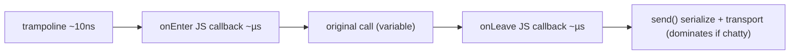

# Performance & memory

Every hook has a cost. This doc is the budget you should keep in mind.

## Where time goes

这张图回答："一次被 hook 的调用，开销花在哪？"

## Budget rules of thumb

- A bare `Interceptor.attach` with empty `onEnter`/`onLeave` adds single-digit
  µs per call. Filling them with `hexdump` + `send` pushes it to tens of µs.
- At >10k calls/sec, **batch in agent memory** and `send` a summary, not one
  message per call. See [../recipes/count-and-time-calls.md](../recipes/count-and-time-calls.md).
- `Stalker.follow` is far heavier than `Interceptor` (it traces every
  instruction); cap with `Stalker.exclude` for libraries you don't care about,
  and `unfollow` ASAP.
- `send` has no flow control; if the host is slow, messages queue in the agent
  and balloon memory. Drop or sample on the agent side under load.

## Memory & GC

- `NativePointer` reads allocate JS `ArrayBuffer`s (`readByteArray`) — free
  references or they pile up. Use `Script.bindWeak` for caches you want
  GC-friendly ([../core-api/gc-weakref-script.md](../core-api/gc-weakref-script.md)).
- `CModule` keeps C state in a flat buffer, no per-call JS allocation — the
  right tool for tight loops ([../core-api/cmodule.md](../core-api/cmodule.md)).
- Long-running agents: avoid closures capturing large `this.*` across
  onEnter/onLeave; copy what you need.

## Pitfalls

- `console.log` in `onEnter` on a hot path can deadlock the reactor — `send`
  and aggregate instead.
- `Memory.scan` over a huge region blocks; use the async callback form and
  `return 'stop'` early ([../core-api/memory-scan.md](../core-api/memory-scan.md)).
