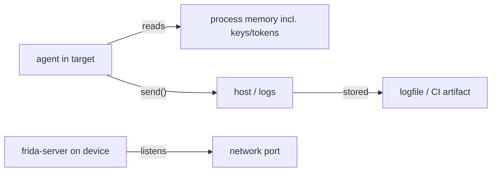

# Security hardening

Frida gives full read/write to the target. That power cuts both ways — this doc
is about not turning your agent into a leak or an attack surface.

## Trust boundaries

这张图回答："agent 能碰的东西里，哪些是敏感面？"

## Rules

- **Least-privilege server:** run `frida-server` on a non-default port
  (`-l 0.0.0.0:PORT`) and behind a firewall or `adb forward`; never expose it
  to the open internet. Pair with `--token`/`--certificate` on remote links.
- **Don't `send` secrets by default:** keys, tokens, PII flow through `send`
  into host logs. Redact in the agent before `send`, or pull only via
  `rpc.exports` into a controlled host path. See
  [../recipes/rpc-pull-data.md](../recipes/rpc-pull-data.md).
- **Agent self-protection:** if the target is hostile, an unprotected agent
  can be unmapped. For production, prefer `frida-gadget` over `frida-server`
  (no listening port) — [../concepts/frida-gadget.md](../concepts/frida-gadget.md).
- **Log hygiene:** `frida ... -o run.log` writes everything `send` emits;
  scrub secrets before committing logs.
- **Authorization:** only instrument software you're authorized to analyze —
  your apps, permissioned engagements, CTFs, research. See
  [../concepts/security-and-authorization.md](../concepts/security-and-authorization.md).

## Pitfalls

- A `send({token: jwt})` in a hot hook fills a logfile with live tokens.
- `frida-server` on the default port `27042` is the first thing anti-Frida
  scans — see [../android/frida-detection.md](../android/frida-detection.md).
