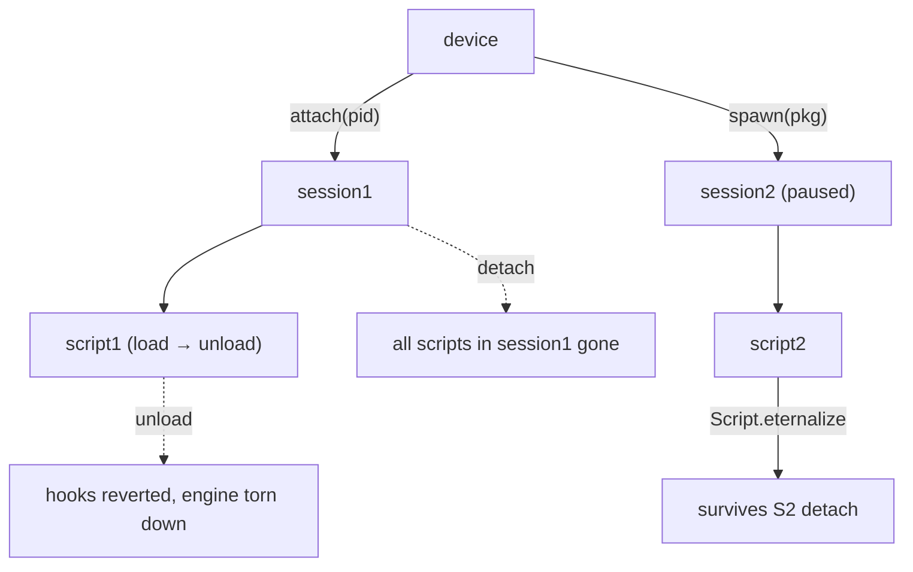

# Session management

A *session* is a connection to one process; a *script* runs inside a session.
Mixing their lifecycles is the #1 source of "why did my hook stop" bugs.

## Lifecycle map

这张图回答："session、script、agent 三者谁的生死绑着谁？"

## Rules

- One session ⇒ zero or more scripts. Detaching a session unloads all its
  scripts; unloading one script leaves the session alive.
- `spawn()` returns a paused session — call `device.resume(pid)` only after
  your script is loaded, or early hooks miss.
- For many targets, hold a `dict[pid → session]` and a `dict[script_id →
  script]`; never share a script across sessions.
- Concurrency: Frida delivers messages on its **reactor thread**. If your host
  mutates shared state in the message callback, guard with a lock — the
  `frida-mcp/server.py` uses a `threading.Lock` over its `_sessions`/`_scripts`
  registries for exactly this. See [python-binding.md](python-binding.md).

## Pitfalls

- Forgetting `resume()` after spawn → app hangs, hooks look dead.
- `attach` after the target already finished init → use spawn + spawn gating
  ([../android/spawn-gating.md](../android/spawn-gating.md)).
- Leaking scripts across a long-running host → call `script.unload()` in a
  `finally:` block.
