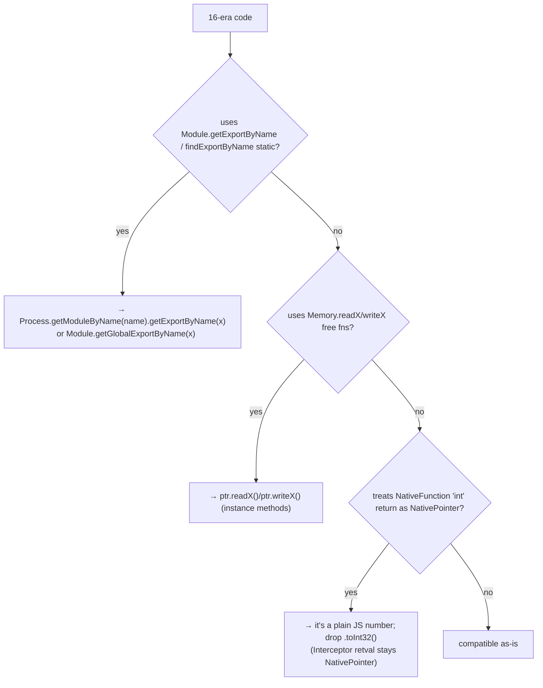

# Frida 16 → 17 migration

Frida 17 removed several static helpers and changed return mappings. This is
the migration map. Full per-API detail in
[../reference/api-changes-16-17.md](../reference/api-changes-16-17.md).

## What changed

这张图回答："一段 16 时代的 agent 改到 17，要走的判断路径？"



## Rewrite table (most common)

| 16 (removed) | 17 replacement |
| --- | --- |
| `Module.getExportByName('libc.so.6','open')` | `Process.getModuleByName('libc.so.6').getExportByName('open')` |
| `Module.findExportByName(...)` | `Process.getModuleByName(name).findExportByName(x)` or `Module.getGlobalExportByName(x)` |
| `Memory.readUtf8String(ptr)` | `ptr.readUtf8String()` |
| `Memory.writeU32(ptr, v)` | `ptr.writeU32(v)` |
| assuming `new NativeFunction(p,'int',[])(...)` is a NativePointer | it's a plain `number`; compare directly |

## Compatibility shim (for code you can't edit)

If you must run un-modified 16-era agents on 17, prepend this shim at the top
of the script — it re-exports the static helpers as thin wrappers:

```javascript
// 16→17 compat shim — re-adds removed static Module helpers
Module.getExportByName = function (modName, exp) {
  return Process.getModuleByName(modName).getExportByName(exp);
};
Module.findExportByName = function (modName, exp) {
  const m = Process.findModuleByName(modName);
  return m ? m.findExportByName(exp) : null;
};
// Memory.read*/write* free functions have NO shim — rewrite to ptr methods.
```

## Pitfalls

- The shim covers `Module.*` statics but **not** `Memory.readX/writeX` — those
  must be rewritten to pointer methods (there's no safe global to rebind).
- `retval.toInt32()` is still valid on `Interceptor` retvals; don't "fix" it.
- See [../troubleshooting/stale-removed-api.md](../troubleshooting/stale-removed-api.md)
  and [../troubleshooting/nativefunction-return.md](../troubleshooting/nativefunction-return.md).
