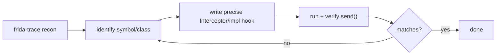

# Recon → identify → hook → verify

**When:** you have a behavior to intercept ("where does it check the license / read
the token / open that file?") but don't yet know the function. This is the core
Frida loop: **discover with tracing, pin the symbol, write a precise hook, confirm
it fires.** Each step links to the tool that owns it.

这张图回答："侦察到精确 hook 的迭代闭环？"



## Step 1 — Discover with `frida-trace`

Cast a wide net by name; let Frida generate handlers that log every match. Spawn
(`-f`) to catch startup code. See [../cli/frida-trace.md](../cli/frida-trace.md).

```sh
frida-trace -U -f com.example.app -i "*open*" -i "*SSL_*"
```

For Android Java or iOS ObjC, trace by class/method instead:

```sh
frida-trace -U -f com.example.app -j "*!*login*"        # Java methods matching *login*
frida-trace -U -f com.example.app -m "*[* URLWith*]"     # ObjC selectors
```

Watch the output while you exercise the app. Note which symbol logs at the moment the
behavior happens — that's your candidate.

## Step 2 — Identify the exact target

Confirm the candidate exists and get its full name/module before hooking:

```sh
frida -U -n com.example.app -q -e \
  "console.log(JSON.stringify(new ApiResolver('module').enumerateMatches('exports:*!SSL_read')))"
```

- Native: resolve with `Process.getModuleByName('libssl.so').getExportByName('SSL_read')`
  or `Module.getGlobalExportByName('SSL_read')` — [../core-api/module.md](../core-api/module.md),
  [../core-api/apiresolver.md](../core-api/apiresolver.md).
- Android: find the class/overload with `Java.use('com.example.Auth')` and inspect
  `.login.overloads` — [../android/index.md](../android/index.md).
- iOS: `ObjC.classes.LoginManager.$ownMethods` — [../ios/index.md](../ios/index.md).

Read the arg count and types (from the trace output, headers, or disassembly) so your
hook indexes `args[]` correctly.

## Step 3 — Write the precise hook

Now replace the generated stub with an intentional agent. Native, with a clear
target and typed reads (`args`/`retval` are **NativePointers**):

```js
// agent.js
const p = Module.getGlobalExportByName('SSL_read');
Interceptor.attach(p, {
  onEnter(args) {
    this.buf = args[1];              // char *buf
    this.cap = args[2].toInt32();    // int num
  },
  onLeave(retval) {
    const n = retval.toInt32();      // bytes actually read
    if (n > 0) {
      send({ kind: 'SSL_read', n }, this.buf.readByteArray(n));
    }
  }
});
```

Android implementation hook (replace the method, then call through):

```js
// agent.js — Android
Java.perform(() => {
  const Auth = Java.use('com.example.Auth');
  Auth.login.overload('java.lang.String', 'java.lang.String').implementation =
    function (user, pass) {
      send({ kind: 'login', user });
      const ok = this.login(user, pass);     // call original, observe result
      send({ kind: 'login-result', ok });
      return ok;                              // or `return true;` to force a bypass
    };
});
```

See [../core-api/interceptor-attach.md](../core-api/interceptor-attach.md) for native
and [../recipes/index.md](../recipes/index.md) for ready-made bodies.

## Step 4 — Verify it fires

Load the hook and confirm you see events when you trigger the behavior:

```sh
frida -U -f com.example.app -l agent.js
# %resume, then exercise the app; expect your send() output
```

Or assert programmatically with the bounded driver from
[headless-automation.md](headless-automation.md) — exit non-zero if the expected
`send` never arrives.

## Pitfalls

- **Nothing traced?** The library may not be loaded yet — spawn with `-f` and
  re-check, or widen the glob. A no-match prints nothing (not an error).
- **Hook never fires?** You probably attached after the event ran — switch to spawn
  (`-f`) so startup calls are caught ([../cli/spawn-vs-attach.md](../cli/spawn-vs-attach.md)).
- **Wrong overload/arg index** silently misbehaves — verify the signature in step 2;
  Java requires the exact `.overload(...)` when a method is overloaded.
- Reading `args[1].readByteArray(n)` before you know `n` is set — capture length in
  `onLeave` from `retval`, as above.
- Forcing a return value (`return true`) is a bypass — only on software you're
  authorized to analyze.
