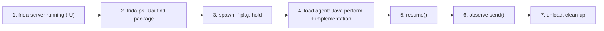

# Playbook: Android Java hooking

**Goal:** hook a Java method in an Android app and log every call + args.

这张图回答："在 Android 上从启动到拿到第一条 Java 方法调用日志的全流程？"

## Steps

1. **Reachability:** `frida-ls-devices` then `frida-ps -Uai` — see
   [../android/enumerate-app.md](../android/enumerate-app.md).
2. **Spawn-gate:** `frida -U -f com.example.app -l agent.js` holds the app
   paused so your hook lands before app code. See
   [../android/spawn-gating.md](../android/spawn-gating.md).
3. **Find the class:** `Java.enumerateLoadedClasses` regex search —
   [../android/java-enumerate.md](../android/java-enumerate.md).
4. **Hook:** the agent from [../recipes/android-find-class.md](../recipes/android-find-class.md),
   refined to a specific method via `Java.use` + `.implementation` —
   [../android/java-use-hook.md](../android/java-use-hook.md).
5. **Resume:** in the REPL, `%resume` (or the driver calls `device.resume(pid)`).
6. **Verify:** trigger the method in the UI, watch `send`.
7. **Clean up:** `.exit` / `script.unload()`.

## Pitfalls

- Class not loaded yet → hook the classloader or `Application.onCreate`;
  see [../android/early-instrumentation.md](../android/early-instrumentation.md).
- Overload ambiguity → resolve with `.overload(sig)`,
  [../android/java-overloads.md](../android/java-overloads.md).
