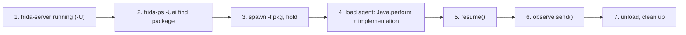

# Playbook: Android Java hooking

**Goal:** hook a Java method in an Android app and log every call + args.

这张图回答："在 Android 上从启动到拿到第一条 Java 方法调用日志的全流程？"



## Preconditions

- Rooted device/emulator with a `frida-server` whose version **exactly matches**
  your host `frida`. Check both sides before anything else
  ([../troubleshooting/version-skew.md](../troubleshooting/version-skew.md)).
- Server ABI must match the device (`android-arm64`/`android-arm`/`android-x86_64`);
  a mismatched server dies on launch — see
  [../troubleshooting/abi-mismatch.md](../troubleshooting/abi-mismatch.md).
- Target app installed and its package id known. List installed apps with
  `frida-ps -Uai` ([../android/enumerate-app.md](../android/enumerate-app.md)).
- Know (or be ready to discover) the fully-qualified class + method name. If the
  class lives in a plugin/`DexClassLoader`, it loads late — see
  [../android/java-classloaders.md](../android/java-classloaders.md).

## Steps

1. **Reachability:** `frida-ls-devices` then `frida-ps -Uai` — see
   [../android/enumerate-app.md](../android/enumerate-app.md). Empty device list?
   Fix the server first: [../troubleshooting/no-device-no-server.md](../troubleshooting/no-device-no-server.md).
2. **Spawn-gate:** `frida -U -f com.example.app -l agent.js` holds the app
   paused so your hook lands before app code. See
   [../android/spawn-gating.md](../android/spawn-gating.md). Startup logic
   (`Application.onCreate`, one-time init) only gets hooked if you **spawn**, not
   attach.
3. **Find the class:** `Java.enumerateLoadedClasses` regex search —
   [../android/java-enumerate.md](../android/java-enumerate.md). If the search is
   empty, drive the app to the feature first — lazy classes only exist once used.
4. **Hook:** the agent from [../recipes/android-find-class.md](../recipes/android-find-class.md),
   refined to a specific method via `Java.use` + `.implementation` —
   [../android/java-use-hook.md](../android/java-use-hook.md). The full runnable
   script is in the next section.
5. **Resume:** in the REPL, `%resume` (or the driver calls `device.resume(pid)`).
6. **Verify:** trigger the method in the UI, watch `send`.
7. **Clean up:** `.exit` / `script.unload()`.

## Agent script

Save this as `hook.js` and edit the two constants. It confirms the class is
loaded, prints the real method signatures (so you can fix the `overload` string),
then wraps the target and logs every call plus its return value.

```js
// hook.js — log every call to one Java method, with the original still running.
const CNAME = 'com.example.app.AuthManager';    // change me
const MNAME = 'login';                          // change me

if (Java.available) {
  Java.perform(function () {
    // 1) timing check: is the class loaded at all right now?
    const loaded = Java.enumerateLoadedClassesSync().some(n => n === CNAME);
    console.log('[*] class loaded: ' + loaded);
    if (!loaded) {
      console.log('[-] not loaded yet — spawn + drive the app to the feature');
      return;
    }

    // 2) print the declared signatures so you can build the overload string
    const C = Java.use(CNAME);
    C.class.getDeclaredMethods().forEach(m => console.log('[i] ' + m.toString()));

    // 3) wrap the target overload (copy the arg types printed above)
    const overload = C[MNAME].overload('java.lang.String', 'java.lang.String');
    overload.implementation = function (user, pass) {
      console.log('[*] ' + MNAME + '(' + user + ', ' + pass + ')');
      const ok = overload.call(this, user, pass);   // run the original method
      console.log('[*]   => ' + ok);
      return ok;                                    // match the declared return type
    };
    console.log('[+] hooked ' + CNAME + '.' + MNAME);
  });
} else {
  console.log('[-] Java runtime not available (Android only)');
}
```

If the method is overloaded and you picked the wrong signature, `Java.use(...)
.method` throws an "overload" error — resolve by exact argument types with
`.overload(...)`, see [../android/java-overloads.md](../android/java-overloads.md).

## Driver

Simplest — REPL, spawn-gated:

```sh
frida -U -f com.example.app -l hook.js
```

Frida spawns the app frozen, loads the script, and (by default) auto-resumes
once the script finishes loading. If it stays paused, type `%resume`. Then
trigger the method from the UI.

Python driver — explicit control over the spawn → load → resume order:

```python
import frida, sys

device = frida.get_usb_device()
pid = device.spawn(["com.example.app"])          # starts suspended
session = device.attach(pid)
session.on("detached", lambda reason, *a: print("detached:", reason))
script = session.create_script(open("hook.js", encoding="utf-8").read())
script.on("message", lambda msg, data: print(msg))
script.load()                                     # install hooks NOW
device.resume(pid)                                # let the app run
sys.stdin.read()                                  # keep the session alive
```

**Expected output** (from either driver, once you trigger login):

```
[*] class loaded: true
[i] public boolean com.example.app.AuthManager.login(java.lang.String, java.lang.String)
[+] hooked com.example.app.AuthManager.login
[*] login(alice, hunter2)
[*]   => true
```

## Verify

Hook effectiveness is observable three ways:

- **Calls logged:** a `[*] login(...)` line for every UI-triggered login. Wrong
  password → different return in the `=>` line.
- **Return forced:** change the end of the implementation to `return false;`
  (temporarily) — the login must now fail in the UI even with valid credentials.
  Revert to `return ok;` afterwards.
- **Calls in a session without the hook are absent:** attach (`frida -U -n
  com.example.app`) without any script and confirm no Frida output — proving the
  log lines above came from your hook, not the app.

## Troubleshooting

- **Hook never fires** — see [../troubleshooting/hooks-never-fire.md](../troubleshooting/hooks-never-fire.md):
  work outside `Java.perform`, attaching instead of spawning, or a class loaded
  only after resume are the usual causes.
- **ClassNotFoundException / empty class list** — the class isn't loaded at spawn
  time. Drive the app to the feature first, hook a classloader, or instrument
  early ([../android/early-instrumentation.md](../android/early-instrumentation.md)).
- **"overload" error** — the method has several signatures; print them via
  `getDeclaredMethods()` (step 2 of the script) and pick the exact types
  ([../android/java-overloads.md](../android/java-overloads.md)).
- **Session dies at attach/spawn** — version skew between host and server,
  ([../troubleshooting/version-skew.md](../troubleshooting/version-skew.md)).
- **App exits as soon as Frida attaches** — it's detecting Frida; that's a
  different playbook: [../android/root-detection.md](../android/root-detection.md)
  and [../android/frida-detection.md](../android/frida-detection.md).

## Cleanup

- REPL: type `.exit` — the script unloads and every `.implementation` is reverted.
- Python: `script.unload()` then `session.detach()`.
- Kill the spawned app when done: `frida-kill -U <pid>` or
  `adb shell am force-stop com.example.app`. The device state (app, `frida-server`)
  is otherwise untouched — no persistent hooks survive the unload.
