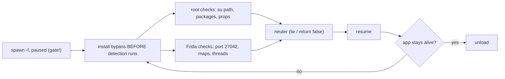

# Playbook: Android root + Frida detection bypass

> **Authorization:** only instrument software you're authorized to analyze.

**Goal:** keep a root/Frida-aware app alive long enough to hook its logic.

这张图回答："app 一启动就检测 root/Frida 并退出，怎么在检测运行前就让它失效？"



## Preconditions

- Root + matching `frida-server` (version = host, right ABI) — you need the
  **frozen-spawn** capability, so plain `attach` is out
  ([../troubleshooting/version-skew.md](../troubleshooting/version-skew.md)).
- Confirm detection is the problem: spawn under `frida -U -f pkg -l empty.js`
  — exits with no output ⇒ anti-Frida (`adb shell su -c 'id'` works ⇒ root).
- Stable trigger: the app reaches its main screen on a clean rooted device —
  if it crashes even then, you have a different bug.

## Steps

1. **Spawn-gate first** — detection often runs in `Application.onCreate`, so
   you must hook before resume. See [../android/spawn-gating.md](../android/spawn-gating.md).
2. **Root checks:** neuter su-path/package/prop/mount reads —
   [../android/root-detection.md](../android/root-detection.md).
3. **Frida checks:** run server on a non-default port or use gadget; hook
   maps/thread scans — [../android/frida-detection.md](../android/frida-detection.md).
4. **Resume + verify:** the app reaches its main screen instead of exiting.
5. **Clean up:** unload reverts hooks; relaunch — it must detect again (sanity).

## Agent script

Save as `bypass-detect.js` — Java root probes, Java Frida-port probes, and a
native `/proc/self/maps` scrubber.

```js
// bypass-detect.js — root + Frida detection evasion (Java and native layers).
if (Java.available) {
  Java.perform(function () {
    // --- root: lie about su-related file existence ---
    const File = Java.use('java.io.File');
    const badPath = ['su', 'magisk', 'supersu', 'busybox'];
    File.exists.implementation = function () {
      const path = this.getAbsolutePath();
      if (badPath.some(b => path.toLowerCase().includes(b))) {
        console.log('[root] hide ' + path);
        return false;
      }
      return this.exists();
    };

    // --- root: Runtime.exec("su") / "which su" → throw ---
    const Runtime = Java.use('java.lang.Runtime');
    Runtime.exec.overload('java.lang.String').implementation = function (cmd) {
      if (cmd.includes('su') || cmd.includes('which')) {
        throw Java.use('java.io.IOException').$new('nope');
      }
      return this.exec(cmd);
    };

    // --- root: hide root-manager packages from package queries ---
    const PM = Java.use('android.app.ApplicationPackageManager');
    PM.getPackageInfo.overload('java.lang.String', 'int').implementation = function (pkg, flags) {
      if (pkg.includes('magisk') || pkg.includes('supersu')) {
        throw Java.use('android.content.pm.PackageManager$NameNotFoundException').$new(pkg);
      }
      return this.getPackageInfo(pkg, flags);
    };

    // --- frida: kill Java-level port scans of the default 27042 ---
    const Socket = Java.use('java.net.Socket');
    Socket.$init.overload('java.lang.String', 'int').implementation = function (host, port) {
      if (port === 27042) throw Java.use('java.io.IOException').$new('refused');
      return this.$init(host, port);
    };

    console.log('[+] Java detection blocks installed');
  });
} else {
  console.log('[-] Java runtime not available');
}

// --- native: scrub frida/gum strings from /proc/self/maps and friends ---
try {
  const libc = Process.getModuleByName('libc.so');
  Interceptor.attach(libc.getExportByName('open'), {
    onEnter(args) {
      const p = args[0].readUtf8String();
      this.watch = p && (p.includes('/maps') || p.includes('/task'));
    },
  });
  Interceptor.attach(libc.getExportByName('read'), {
    onEnter(args) { this.buf = args[1]; },
    onLeave(retval) {
      const n = retval.toInt32();
      if (n <= 0 || !this.buf) return;
      let s;
      try { s = this.buf.readUtf8String(n); } catch (e) { return; }
      if (s && /frida|gum-js|gmain|linjector/i.test(s)) {
        this.buf.writeUtf8String(
          s.replace(/frida|gum-js-loop|gmain|linjector/gi, 'systemxx'));
      }
    },
  });
  console.log('[+] native /proc scrubber installed');
} catch (e) {
  console.log('[i] native scrubber failed: ' + e);
}

console.log('[*] bypass-detect.js fully loaded');
```

This is the *common* set. Find stragglers with
`frida-trace -U -f pkg -j '*!*isRooted*' -i '*access*'` and extend the script
([../android/root-detection.md](../android/root-detection.md)); shrink the
detectable surface too — non-default port `-l 0.0.0.0:47000` or gadget
([../android/frida-detection.md](../android/frida-detection.md)).

## Driver

Host-side hardening first, then the REPL over the renamed server:

```sh
adb shell "/data/local/tmp/fs-renamed -l 0.0.0.0:47000 &"   # non-default port
frida -H 127.0.0.1:47000 -f com.example.app -l bypass-detect.js
```

Python driver (same order, explicit resume):

```python
import frida, sys

device = frida.get_usb_device()
pid = device.spawn(["com.example.app"])          # suspended — detection hasn't run
session = device.attach(pid)
session.on("detached", lambda reason, *a: print("detached:", reason))
script = session.create_script(open("bypass-detect.js", encoding="utf-8").read())
script.on("message", lambda msg, data: print(msg))
script.load()                                    # hooks land before onCreate
device.resume(pid)                               # now the checks run neutered
sys.stdin.read()
```

**Expected output** on load + the app actually starting:

```
[+] Java detection blocks installed
[+] native /proc scrubber installed
[*] bypass-detect.js fully loaded
[root] hide /system/xbin/su          ← printed if/when a check fires
[root] hide /sbin/su
```

## Verify

- **Main screen reached** and stays alive for minutes (not a delayed self-kill).
- **Hooks fired:** `[root] hide …` lines prove checks ran and were neutered;
  none = checks elsewhere — find them with `frida-trace` ([../android/root-detection.md](../android/root-detection.md)).
- **Negative test:** unload and relaunch — it must exit again (the bypass, not the environment, keeps it alive).
- **Canaries:** append `[canary] onCreate reached` logs; the last one before the
  exit names the killing check ([../android/frida-detection.md](../android/frida-detection.md)).

## Troubleshooting

- **Zero log lines, or root fixed but Frida still detected** — the check ran
  before your hooks (spawn with `-f`, confirm load before resume,
  [../android/spawn-gating.md](../android/spawn-gating.md)); or port 27042/maps
  scans — use a non-default port + renamed server, or gadget
  ([../concepts/frida-server.md](../concepts/frida-server.md)).
- **Detection in *another process*** — a forked watchdog child checks the parent;
  hook the child too ([../guides/error-handling.md](../guides/error-handling.md)).
- **Hook fires but the app dies anyway** — wrong type returned/thrown; match the
  exact exception the caller expects
  ([../android/root-detection.md](../android/root-detection.md)).
- **Never stable enough to verify** — add canaries and bisect the block.

## Cleanup

- `.exit` / `script.unload()` reverts all hooks — **including the scrubber**
  (real `/proc` reads restored).
- Restart the app uninstrumented for the negative test (it must detect again).
- Killed renamed server: `adb shell su -c 'pkill fs-renamed'` and delete the
  binary to leave the device clean.