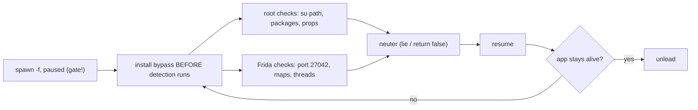

# Playbook: Android root + Frida detection bypass

> **Authorization:** only instrument software you're authorized to analyze.

**Goal:** keep a root/Frida-aware app alive long enough to hook its logic.

这张图回答："app 一启动就检测 root/Frida 并退出，怎么在检测运行前就让它失效？"

## Steps

1. **Spawn-gate first** — detection often runs in `Application.onCreate`, so
   you must hook before resume. See [../android/spawn-gating.md](../android/spawn-gating.md).
2. **Root checks:** neuter su-path/package/prop/mount reads —
   [../android/root-detection.md](../android/root-detection.md).
3. **Frida checks:** run server on a non-default port or use gadget; hook
   maps/thread scans — [../android/frida-detection.md](../android/frida-detection.md).
4. **Resume + verify:** the app should reach its main screen instead of exiting.
5. **Clean up:** unload reverts hooks; restart the app to confirm it still
   detects without you (sanity).

## Pitfalls

- Some checks run **native** (not Java) — also hook `fopen`/`strstr` on
  `/proc/self/maps`; see [../android/frida-detection.md](../android/frida-detection.md).
- A check you missed → silent exit, no stack. Add a canary `send` at the end of
  each bypass to see how far the app got.
