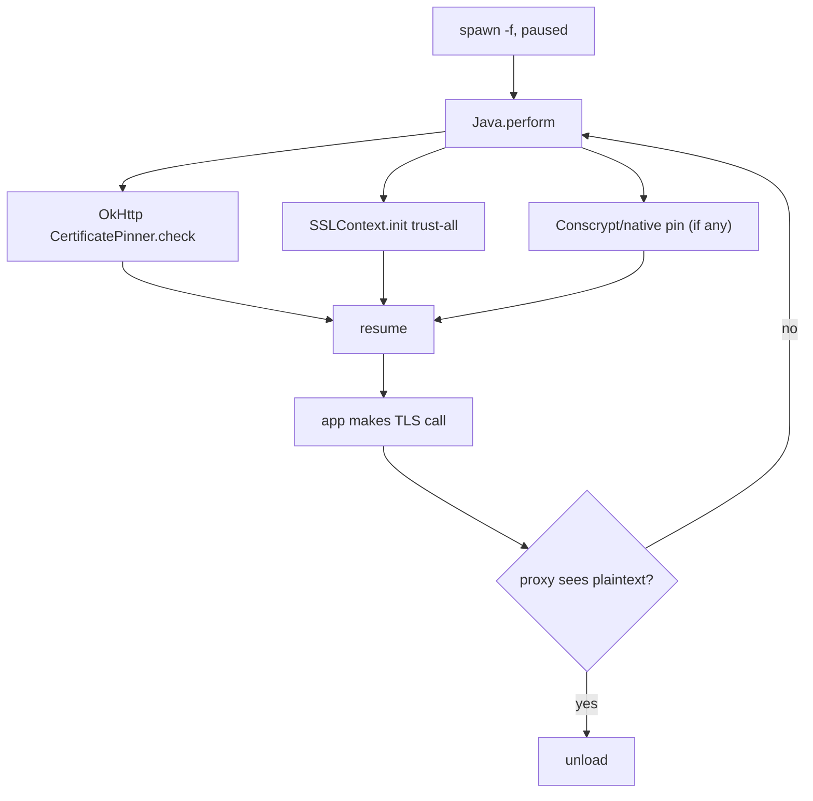

# Playbook: Android SSL pinning bypass

> **Authorization:** Frida is for software you're authorized to analyze — your
> own apps, permissioned engagements, CTFs, research. Confirm authority before
> defeating a pinning protection.

**Goal:** make a pinned Android app accept a TLS intercepting proxy so you can
inspect its traffic.

这张图回答："Android pinning 有几条路径、要逐一打掉哪些？"



## Preconditions

- Proxy ready and reachable: `mitmproxy -p 8080` or Burp on an IP the
  emulator/phone can reach, and its CA **installed as a user CA on the device**
  — Frida bypasses pinning, not basic trust of an unknown CA
  ([../android/ssl-pinning-trustmanager.md](../android/ssl-pinning-trustmanager.md)).
- Device proxy pointed at it: `adb shell settings put global http_proxy
  192.168.x.y:8080` (or a per-app proxy if the app ignores it).
- Root + matching `frida-server` (version = host `frida`, right ABI)
  ([../troubleshooting/version-skew.md](../troubleshooting/version-skew.md),
  [../troubleshooting/no-device-no-server.md](../troubleshooting/no-device-no-server.md)).
- Baseline first: with the proxy set but **no bypass**, the app's HTTPS requests
  must fail visibly in the proxy (CONNECT refused / handshake error) — if they
  succeed, you don't need this playbook.

## Steps

1. **Spawn-gate:** `frida -U -f com.example.app -l bypass.js` —
   [../android/spawn-gating.md](../android/spawn-gating.md). Pinning is
   configured at startup in most apps; attach is too late.
2. **OkHttp path:** neuter `okhttp3.CertificatePinner.check` —
   [../android/ssl-pinning-okhttp.md](../android/ssl-pinning-okhttp.md).
3. **TrustManager path:** install a trust-all `X509TrustManager` —
   [../android/ssl-pinning-trustmanager.md](../android/ssl-pinning-trustmanager.md).
4. **Native/Conscrypt path (if 2&3 insufficient):** hook BoringSSL —
   [../android/ssl-pinning-native.md](../android/ssl-pinning-native.md).
5. **Resume + verify:** point the app at your proxy, trigger a request, confirm
   the proxy decrypts.
6. **Clean up:** `.exit` reverts all `implementation` rewrites.

## Agent script

Save as `bypass.js`. One script, three layers — Java OkHttp first, Java
trust-manager second, native BoringSSL last. Each block is independent; if a
module/class is absent, that block just logs and continues.

```js
// bypass.js — multi-path Android pinning bypass (OkHttp + TrustManager + native).
if (Java.available) {
  Java.perform(function () {
    // 1) OkHttp CertificatePinner — make the check a no-op.
    try {
      const Pinner = Java.use('okhttp3.CertificatePinner');
      Pinner.check.overload('java.lang.String', 'java.util.List').implementation = function () {
        console.log('[bypass] certificate pin skipped');
      };
      console.log('[+] okhttp CertificatePinner hooked');
    } catch (e) { console.log('[i] okhttp not present: ' + e); }

    // 2) Replace the trust decision — inject a trust-all X509TrustManager.
    try {
      const TrustAll = Java.registerClass({
        name: 'com.frida.TrustAllManager',
        implements: [Java.use('javax.net.ssl.X509TrustManager')],
        methods: {
          checkClientTrusted(chain, authType) {},
          checkServerTrusted(chain, authType) {},
          getAcceptedIssuers() { return []; },
        },
      });
      const SSLContext = Java.use('javax.net.ssl.SSLContext');
      const init = SSLContext.init.overload(
        '[Ljavax.net.ssl.KeyManager;', '[Ljavax.net.ssl.TrustManager;', 'java.security.SecureRandom');
      init.implementation = function (km, tm, sr) {
        init.call(this, km, [TrustAll.$new()], sr);
        console.log('[+] injected trust-all TrustManager');
      };
    } catch (e) { console.log('[i] SSLContext hook failed: ' + e); }
  });
} else {
  console.log('[-] Java runtime not available (Android only)');
}

// 3) Native BoringSSL — force SSL_get_verify_result to X509_V_OK (0).
//    Finds whatever module exports the symbol instead of hardcoding libssl.so.
function forceVerifyOk(sym, value) {
  const seen = [];
  Process.enumerateModules().forEach(m => {
    const p = m.findExportByName(sym);
    if (p) {
      seen.push(m.name);
      Interceptor.attach(p, {
        onLeave(retval) { retval.replace(ptr(value)); }
      });
    }
  });
  if (seen.length) console.log('[+] ' + sym + ' => ' + value + ' in: ' + seen.join(', '));
  else console.log('[i] ' + sym + ' not found (no native pinning)');
}
forceVerifyOk('SSL_get_verify_result', 0);      // 0 = X509_V_OK
forceVerifyOk('X509_verify_cert', 1);           // 1 = success
console.log('[*] bypass.js fully loaded');
```

For a custom `SSL_CTX_set_custom_verify` callback, swap the callback pointer for
one that always returns `ssl_verify_ok` — see
[../android/ssl-pinning-native.md](../android/ssl-pinning-native.md).

## Driver

REPL (spawn-gated, auto-resumes): [../android/spawn-gating.md](../android/spawn-gating.md)

```sh
frida -U -f com.example.app -l bypass.js
```

Python driver with an explicit resume and a `send()`-style message log:

```python
import frida, sys

device = frida.get_usb_device()
pid = device.spawn(["com.example.app"])          # suspended
session = device.attach(pid)
session.on("detached", lambda reason, *a: print("detached:", reason))
script = session.create_script(open("bypass.js", encoding="utf-8").read())
script.on("message", lambda msg, data: print(msg))
script.load()
device.resume(pid)                               # let the app run and make TLS calls
sys.stdin.read()
```

**Expected output** when the script loads:

```
[+] okhttp CertificatePinner hooked
[+] injected trust-all TrustManager
[+] SSL_get_verify_result => 0 in: libssl.so
[*] bypass.js fully loaded
```

## Verify

Pass = the proxy sees **plaintext HTTP** for the app's HTTPS requests:

1. Load the script, resume, trigger a request (refresh a feed, log in).
2. In the proxy, find the app's host with a decrypted request/response body —
   not just a `CONNECT` tunnel.
3. `curl --proxy http://192.168.x.y:8080 https://ifconfig.me` on the device is a
   clean comparison: mitmproxy can't decrypt *that* (CA untrusted for curl) while
   the app's traffic *is* decrypted — proving the bypass, not a misconfiguration.
4. Control: a run with only the Java blocks — requests must fail again in the
   proxy, confirming which layer the victim pins at.

## Troubleshooting

- **Flows appear as bare CONNECT / TLS handshake failed** — pinning below Java
  (BoringSSL/Conscrypt). The native block should print
  `[+] SSL_get_verify_result => 0 …`; if "not found", find the real module:
  [../android/ssl-pinning-native.md](../android/ssl-pinning-native.md).
- **No change after loading** — connections were already open; existing sockets
  reuse the old trust decision. Spawn, don't attach
  ([../troubleshooting/hooks-never-fire.md](../troubleshooting/hooks-never-fire.md)).
- **TLS works without the hook** — the proxy CA is already trusted or the app has
  no pinning; you're fighting the wrong problem.
- **App detects the proxy** (drops TLS or blocks) — some apps check proxy
  settings / certificate transparency; trace where the connection fails:
  [../guides/error-handling.md](../guides/error-handling.md).
- **App kills itself on attach** — combine with
  [../android/root-detection.md](../android/root-detection.md) and
  [../android/frida-detection.md](../android/frida-detection.md).

## Cleanup

- `.exit` in the REPL reverts all `implementation` writes and detaches.
- Remove the device proxy: `adb shell settings put global http_proxy :0`
  (or uncheck it in Wi-Fi settings).
- Uninstall the proxy CA only if you added it solely for this test; a lab device
  can keep it.
- `frida-kill -U <pid>` if you want the app gone too.
