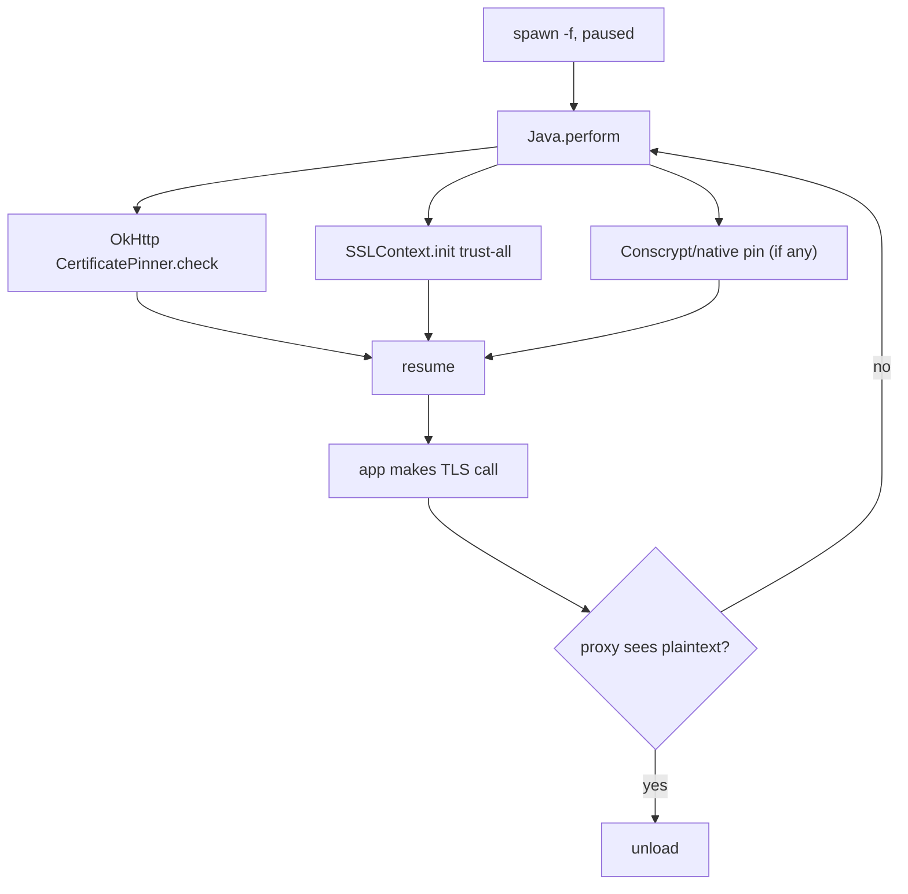

# Playbook: Android SSL pinning bypass

> **Authorization:** Frida is for software you're authorized to analyze — your
> own apps, permissioned engagements, CTFs, research. Confirm authority before
> defeating a pinning protection.

**Goal:** make a pinned Android app accept a TLS intercepting proxy so you can
inspect its traffic.

这张图回答："Android pinning 有几条路径、要逐一打掉哪些？"

## Steps

1. **Spawn-gate:** `frida -U -f com.example.app -l bypass.js` — see
   [../android/spawn-gating.md](../android/spawn-gating.md).
2. **OkHttp path:** neuter `okhttp3.CertificatePinner.check` —
   [../android/ssl-pinning-okhttp.md](../android/ssl-pinning-okhttp.md).
3. **TrustManager path:** install a trust-all `X509TrustManager` —
   [../android/ssl-pinning-trustmanager.md](../android/ssl-pinning-trustmanager.md).
4. **Native/Conscrypt path (if 2&3 insufficient):** hook BoringSSL —
   [../android/ssl-pinning-native.md](../android/ssl-pinning-native.md).
5. **Resume + verify:** point the app at your proxy, trigger a request, confirm
   the proxy decrypts.
6. **Clean up:** `.exit` reverts all `implementation` rewrites.

## Pitfalls

- Modern apps pin in **multiple** layers; missing one leaves TLS broken with no
  error — start a combined script from
  [../recipes/android-ssl-pinning.md](../recipes/android-ssl-pinning.md).
- Network security config pinning needs the trust-manager path, not OkHttp.
