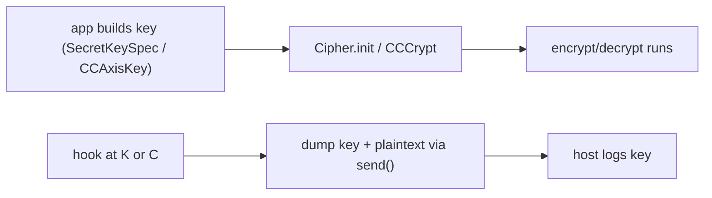

# Playbook: crypto key extraction

> **Authorization:** only instrument software you're authorized to analyze.

**Goal:** recover a symmetric key the app uses to encrypt traffic/storage, by
hooking where the key enters the cipher, not by breaking the cipher.

这张图回答："为什么不去破密码学，而是 hook '密钥进入算法' 这个瞬间？"

## Steps (Android)

1. **Spawn-gate** the app. 2. Hook `javax.crypto.spec.SecretKeySpec.$init` and
   `Cipher.doFinal` — the agent in
   [../recipes/android-crypto-capture.md](../recipes/android-crypto-capture.md).
   3. Resume, trigger an encrypt/decrypt, capture keyHex + plaintext. 4. Unload.

## Steps (iOS)

1. Spawn-gate. 2. Hook `CCCrypt`/`CCKeyDerivationPBKDF` —
   [../ios/crypto-capture-ios.md](../ios/crypto-capture-ios.md). 3. Resume,
   capture. 4. Unload.

## Why this works

You don't attack the algorithm; you read the key at the only moment it exists
in cleartext — when it's handed to the cipher. That's the design pressure point
no amount of strong crypto removes.

## Pitfalls

- Keys may be derived (PBKDF2) — hook the derivation, not just `SecretKeySpec`.
- Redact keys in logs unless you're in a private engagement — see
  [../guides/security-hardening.md](../guides/security-hardening.md).
