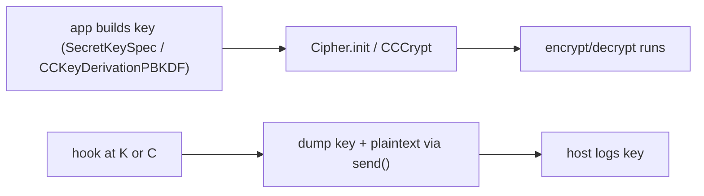

# Playbook: crypto key extraction

> **Authorization:** only instrument software you're authorized to analyze.

**Goal:** recover a symmetric key the app uses to encrypt traffic/storage, by
hooking where the key enters the cipher, not by breaking the cipher.

这张图回答："为什么不去破密码学，而是 hook '密钥进入算法' 这个瞬间？"



## Preconditions

- Android — root + `frida-server` (version = host, right ABI,
  [../troubleshooting/version-skew.md](../troubleshooting/version-skew.md));
  iOS — jailbreak server or re-signed gadget
  ([../ios/gadget-ios.md](../ios/gadget-ios.md)).
- Pick the platform below: the key-construction moment differs
  (`SecretKeySpec` on Android, CommonCrypto on iOS); hybrid apps may do *both*.
- **Caveat:** keys are sensitive data — redact them unless the engagement is
  permissioned ([../guides/security-hardening.md](../guides/security-hardening.md)).
- A UI path that triggers encrypt/decrypt (login, sync, save).

## Steps (Android)

1. **Spawn-gate** the app: `frida -U -f com.example.app -l capture.js`.
2. Hook `javax.crypto.spec.SecretKeySpec.$init` and `Cipher.doFinal` — the agent in
   [../recipes/android-crypto-capture.md](../recipes/android-crypto-capture.md).
3. Resume, trigger an encrypt/decrypt, capture keyHex + plaintext.
4. Unload.

## Steps (iOS)

1. Spawn-gate: `frida -U -f com.example.app -l capture.js`.
2. Hook `CCCrypt`/`CCKeyDerivationPBKDF` —
   [../ios/crypto-capture-ios.md](../ios/crypto-capture-ios.md).
3. Resume, capture the key and buffer hex.
4. Unload.

## Agent script

Two branches under one `PLATFORM` constant, mirroring the recipe above.

```js
// capture.js — dump symmetric keys + plaintext/ciphertext on Android or iOS.
const PLATFORM = 'android';          // 'android' | 'ios'

function toHex(bytes) {              // bytes = JS array of byte values
  return Array.from(bytes).map(b => ((b & 0xff).toString(16).padStart(2, '0'))).join('');
}

if (PLATFORM === 'android' && Java.available) {
  Java.perform(function () {
    const KeySpec = Java.use('javax.crypto.spec.SecretKeySpec');
    KeySpec.$init.overload('[B', 'java.lang.String').implementation = function (key, algo) {
      console.log('[key] algo=' + algo + ' bytes=' + toHex(key));
      return this.$init(key, algo);
    };

    const IvSpec = Java.use('javax.crypto.spec.IvParameterSpec');
    IvSpec.$init.overload('[B').implementation = function (iv) {
      console.log('[iv]  ' + toHex(iv));
      return this.$init(iv);
    };

    const Cipher = Java.use('javax.crypto.Cipher');
    Cipher.doFinal.overload('[B').implementation = function (input) {
      const output = this.doFinal(input);          // run the real transform
      console.log('[doFinal] in =' + toHex(input));
      console.log('[doFinal] out=' + toHex(output));
      return output;
    };
    console.log('[+] android crypto hooks installed');
  });
} else if (PLATFORM === 'ios' && ObjC.available) {
  const cc = Module.getGlobalExportByName('CCCrypt');   // one-shot encrypt/decrypt
  if (cc) {
    Interceptor.attach(cc, {
      onEnter(args) {
        const op = args[0].toInt32();                  // 0 = encrypt, 1 = decrypt
        const keyLen = args[4].toUInt32();
        const dataLen = args[7].toUInt32();
        console.log('[*] CCCrypt op=' + (op ? 'decrypt' : 'encrypt'));
        if (keyLen > 0) {
          console.log('    key:\n' + hexdump(args[3], { length: keyLen }));
        }
        if (!args[5].isNull()) console.log('    iv:\n' + hexdump(args[5], { length: 16 }));
        console.log('    in:\n' + hexdump(args[6], { length: Math.min(dataLen, 64) }));
        this.out = args[8];                            // dataOut buffer
        this.moved = args[10];                         // size_t* bytes written
      },
      onLeave() {
        if (this.out && !this.out.isNull() && !this.moved.isNull()) {
          const n = this.moved.readUInt();
          console.log('    out:\n' + hexdump(this.out, { length: Math.min(n, 64) }));
        }
      },
    });
  } else {
    console.log('[-] CCCrypt not exported — app may use its own crypto');
  }

  const pbkdf = Module.findGlobalExportByName('CCKeyDerivationPBKDF');
  if (pbkdf) {
    Interceptor.attach(pbkdf, {
      onEnter(args) {
        const pass = args[1];                          // const char* password
        const salt = args[3];                          // const uint8_t* salt
        const saltLen = args[4].toUInt32();
        console.log('[*] PBKDF2 password=' + (pass.isNull() ? '' : pass.readUtf8String()));
        console.log('    salt:\n' + hexdump(salt, { length: saltLen }));
      },
    });
  }
  console.log('[+] ios crypto hooks installed');
} else {
  console.log('[-] no matching runtime for PLATFORM=' + PLATFORM);
}
```

Streaming ciphers (`Cipher.update`, `CCCryptorCreate/Update`) need extra hooks —
see [../recipes/android-crypto-capture.md](../recipes/android-crypto-capture.md)
and [../ios/crypto-capture-ios.md](../ios/crypto-capture-ios.md).

## Driver

REPL, spawn-gated so the key never slips past before the hook:

```sh
frida -U -f com.example.app -l capture.js
```

Python driver:

```python
import frida, sys

device = frida.get_usb_device()
pid = device.spawn(["com.example.app"])          # suspended
session = device.attach(pid)
session.on("detached", lambda reason, *a: print("detached:", reason))
script = session.create_script(open("capture.js", encoding="utf-8").read())
script.on("message", lambda msg, data: print(msg))
script.load()
device.resume(pid)
sys.stdin.read()
```

**Expected output** (Android, after one encrypt/decrypt):

```
[+] android crypto hooks installed
[key] algo=AES bytes=5468697349734d794b657956616c756531
[iv]  000102030405060708090a0b0c0d0e0f
[doFinal] in =706c61696e74657874
[doFinal] out=3ad6acb95e0c9274fde6ffc7d9c4ae1e
```

## Verify

- **Key sanity:** `keyHex` decodes to 16/24/32 bytes (56 hex chars = wrong `[B`);
  `openssl enc -aes-256-cbc -K <keyHex> -iv <ivHex> -d out` must yield `in`.
- **Known-answer:** `in` must be your expected plaintext (login payload, known
  JSON); garbage = wrong overload
  ([../android/java-overloads.md](../android/java-overloads.md)).
- **iOS buffer sizes from args, not guesses** — `args[4]` key len, `args[7]` data len; over-reading is the #1 crash ([../ios/crypto-capture-ios.md](../ios/crypto-capture-ios.md)).
- **PBKDF2 path:** no one-shot line but the app encrypts — `password=` + `salt:` block prints the derived-key inputs.

## Troubleshooting

- **Key hook fires but no `doFinal`** — the app calls `Cipher.update` (streaming)
  or uses `AES/GCM` through a different path; hook `.update` too
  ([../recipes/android-crypto-capture.md](../recipes/android-crypto-capture.md)).
- **Hex too short / looks wrong** — wrong overload or truncated `[B`; print
  `key.length` first ([../android/java-cast-array.md](../android/java-cast-array.md)).
- **Nothing fires at all** — the app ships its own crypto (OpenSSL/BoringSSL,
  CryptoKit); hook `EVP_EncryptUpdate` ([../ios/crypto-capture-ios.md](../ios/crypto-capture-ios.md)).
- **Spawn-gated but still empty** — the key is built after a user gesture; drive
  the UI there ([../troubleshooting/hooks-never-fire.md](../troubleshooting/hooks-never-fire.md)).
- **Keystore/Keychain-backed keys** — scoped keys never reach
  `SecretKeySpec`/`CCCrypt`; recover plaintext instead
  ([../guides/security-hardening.md](../guides/security-hardening.md)).

## Cleanup

- `.exit` / `script.unload()` reverts all hooks.
- `frida-kill -U <pid>` or `adb shell am force-stop com.example.app` to end the app.
- **Log hygiene:** delete capture files containing raw keys unless part of a documented, permissioned engagement.
- No on-device files are modified by this playbook.