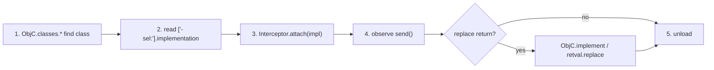

# Playbook: iOS Objective-C hooking

**Goal:** hook an ObjC method on iOS, log `self`/args, and optionally forge a
return value.

这张图回答："在 iOS 上定位一个 ObjC 方法并 hook 它的完整流程？"

## Steps

1. **Reachability:** jailbreak `frida-server` or re-signed gadget; `-U` —
   see [../ios/objc-classes.md](../ios/objc-classes.md) and
   [../concepts/frida-server.md](../concepts/frida-server.md).
2. **Find class + method:** `ObjC.classes.YourClass['- yourMethod:arg:']` —
   see [../ios/objc-method-hook.md](../ios/objc-method-hook.md).
3. **Attach:** `Interceptor.attach(impl, { onEnter, onLeave })`; read `args[2..]`
   as the selector args (`args[0]`=self, `args[1]`=_cmd). See
   [../ios/objc-args-types.md](../ios/objc-args-types.md).
4. **Verify:** trigger the method, watch `send`.
5. **Replace return (optional):** `ObjC.implement` or `retval.replace(...)` —
   [../ios/objc-replace-implement.md](../ios/objc-replace-implement.md).
6. **Clean up:** `.exit` reverts.

## Pitfalls

- Method key must include the full selector with `:` per arg.
- `ObjC.Object(ptr)` for reading NSString/NSData args — raw ptr isn't readable.
