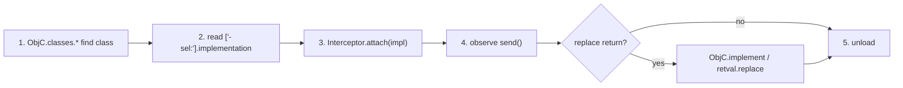

# Playbook: iOS Objective-C hooking

**Goal:** hook an ObjC method on iOS, log `self`/args, and optionally forge a
return value.

这张图回答："在 iOS 上定位一个 ObjC 方法并 hook 它的完整流程？"



## Preconditions

- Jailbroken device with `frida-server`, or a re-signed `frida-gadget` embedded
  in the app; connect with `-U` — see
  [../ios/objc-classes.md](../ios/objc-classes.md) and
  [../concepts/frida-server.md](../concepts/frida-server.md).
- Server version matches the host `frida` exactly
  ([../troubleshooting/version-skew.md](../troubleshooting/version-skew.md)).
- The class + method you want, or a keyword to find them. Swift-only classes
  aren't in `ObjC.classes` — see [../ios/swift-interop.md](../ios/swift-interop.md).
- If the method runs at launch, you must spawn-gate
  ([../ios/ios-spawn-gating.md](../ios/ios-spawn-gating.md)).

## Steps

1. **Reachability:** jailbreak `frida-server` or re-signed gadget; `-U` —
   see [../ios/objc-classes.md](../ios/objc-classes.md) and
   [../concepts/frida-server.md](../concepts/frida-server.md). Empty device list?
   [../troubleshooting/no-device-no-server.md](../troubleshooting/no-device-no-server.md).
2. **Find class + method:** `ObjC.classes.YourClass['- yourMethod:arg:']` —
   see [../ios/objc-method-hook.md](../ios/objc-method-hook.md).
3. **Attach:** `Interceptor.attach(impl, { onEnter, onLeave })`; read `args[2..]`
   as the selector args (`args[0]`=self, `args[1]`=_cmd). See
   [../ios/objc-args-types.md](../ios/objc-args-types.md).
4. **Verify:** trigger the method, watch `send`.
5. **Replace return (optional):** `ObjC.implement` or `retval.replace(...)` —
   [../ios/objc-replace-implement.md](../ios/objc-replace-implement.md).
6. **Clean up:** `.exit` reverts.

## Agent script

Save as `hook.js`. It locates the selector two ways (exact
key, then an `ApiResolver` fallback that prints matches), attaches to the
`implementation`, logs `self`'s class, the real args, and the return, and forces
the return only when a `FORCE_RETURN` flag is set.

```js
// hook.js — log calls to one ObjC selector; optionally force the return.
const CLASS_NAME = 'ComExampleAppAuthManager';  // change me
const SELECTOR   = '- loginWithUser:password:'; // exact key, colons included

if (ObjC.available) {
  // 1) resolve the method implementation.
  const cls = ObjC.classes[CLASS_NAME];
  let impl = null;
  if (cls) {
    impl = cls[SELECTOR] ? cls[SELECTOR].implementation : null;
  }
  if (!impl) {
    // fallback: search every class for the selector pattern
    const r = new ApiResolver('objc');
    for (const m of r.enumerateMatches('-[* ' + SELECTOR.replace(/^[-+]\s*/, '') + ']')) {
      console.log('[i] match: ' + m.name + ' @ ' + m.address);
    }
    console.log('[-] exact key not found — use one of the matches above');
  } else {
    console.log('[+] hooking ' + CLASS_NAME + ' ' + SELECTOR + ' @ ' + impl);
    Interceptor.attach(impl, {
      onEnter(args) {
        // args[0] = self, args[1] = _cmd, args[2..] = real arguments.
        const self = new ObjC.Object(args[0]);
        this.clsName = self.$className;
        this.user = new ObjC.Object(args[2]).toString();
        this.pass = new ObjC.Object(args[3]).toString();
        console.log('[*] ' + SELECTOR + ' self=' + this.clsName +
                    ' user=' + this.user + ' pass=' + this.pass);
      },
      onLeave(retval) {
        const ok = retval.toInt32();
        console.log('[*]   => ' + ok);
        // FORCE_RETURN=1 makes every login succeed regardless of the real result.
        if (typeof FORCE_RETURN !== 'undefined' && FORCE_RETURN) {
          retval.replace(ptr(1));        // BOOL YES
          console.log('[!] return forced to YES');
        }
      },
    });
  }
} else {
  console.log('[-] ObjC runtime not available');
}
```

To *replace* the whole body instead of wrapping it (skip the original work
entirely), assign `cls[SELECTOR].implementation = ObjC.implement(cls[SELECTOR],
fn)` — see [../ios/objc-replace-implement.md](../ios/objc-replace-implement.md).
For id-typed returns, return the object's `.handle`, not a JS string.

## Driver

REPL (spawn-gate if the method runs at launch; attach otherwise):

```sh
frida -U -f com.example.app -l hook.js     # spawn (early-run methods)
frida -U -n com.example.app -l hook.js     # attach (steady-state methods)
```

Python driver — spawn-gated, explicit resume:

```python
import frida, sys

device = frida.get_usb_device()
pid = device.spawn(["com.example.app"])
session = device.attach(pid)
session.on("detached", lambda reason, *a: print("detached:", reason))
script = session.create_script(open("hook.js", encoding="utf-8").read())
script.on("message", lambda msg, data: print(msg))
script.load()
device.resume(pid)
sys.stdin.read()
```

**Expected output** when you trigger a login from the UI:

```
[+] hooking ComExampleAppAuthManager - loginWithUser:password: @ 0x1c0d8f2c0
[*] - loginWithUser:password: self=ComExampleAppAuthManager user=alice pass=hunter2
[*]   => 1
```

## Verify

- **Args match reality:** the logged `user`/`pass` must equal what you typed —
  wrong values mean wrong arg index (remember `args[2..]`, not `args[0..]`).
- **Return forcing:** rerun with `FORCE_RETURN=1` defined (top of `hook.js`) and a
  *wrong* password — login must still succeed in the UI. That proves your
  `retval.replace` reached the caller.
- **`self` sanity:** log `self.$className` — if you see unrelated classes in
  every call, the selector's IMP is shared (common in framework methods); filter
  on the class name ([../ios/objc-method-hook.md](../ios/objc-method-hook.md)).
- **Control:** run the same session with `hook.js` replaced by an empty script —
  no output, normal app behavior. Proves the log lines are yours.

## Troubleshooting

- **`undefined` implementation / no match from ApiResolver** — the class or the
  exact selector key is wrong. Print `cls.$ownMethods` and copy the key verbatim
  (`-`/`+`, spaces, colons): [../ios/objc-classes.md](../ios/objc-classes.md).
- **Hook never fires** — attached too late (the method ran at startup) or the
  class loads lazily. Spawn-gate: [../ios/ios-spawn-gating.md](../ios/ios-spawn-gating.md),
  and [../troubleshooting/hooks-never-fire.md](../troubleshooting/hooks-never-fire.md).
- **Crash when reading an arg** — the arg is a non-object (int, struct) or a
  Swift type; check the selector's type encoding before wrapping in
  `ObjC.Object` ([../ios/objc-args-types.md](../ios/objc-args-types.md)).
- **Crash right after the hook fires** — you returned the wrong type from
  `onLeave`/`ObjC.implement`; match the method's declared type
  ([../ios/objc-replace-implement.md](../ios/objc-replace-implement.md)) and see
  [../troubleshooting/crash-after-hook.md](../troubleshooting/crash-after-hook.md).
- **Version skew / dead session** — host vs `frida-server` mismatch:
  [../troubleshooting/version-skew.md](../troubleshooting/version-skew.md).

## Cleanup

- REPL: `.exit` — unloads the script, reverts the `Interceptor.attach`, restores
  the original IMP.
- Python: `script.unload()` then `session.detach()`.
- If you re-signed the app with a gadget for testing, restore the original
  bundle afterwards — see [../ios/gadget-ios.md](../ios/gadget-ios.md).
- No on-device files were modified; the method's IMP is restored by the unload.
