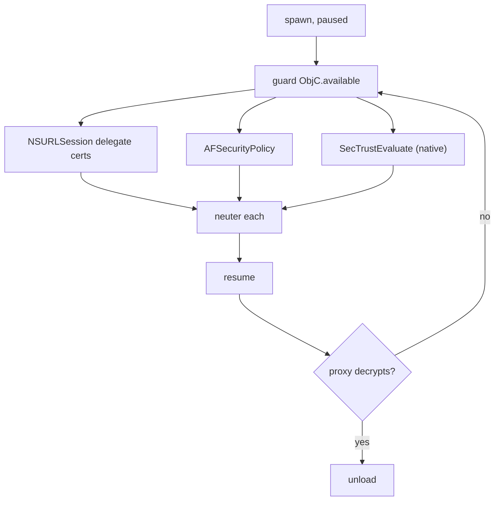

# Playbook: iOS SSL pinning bypass

> **Authorization:** only instrument software you're authorized to analyze.

**Goal:** let a pinned iOS app talk to your TLS proxy.

这张图回答："iOS pinning 通常落在哪几个 API 上？"



## Preconditions

- Proxy (mitmproxy/Burp) listening on a reachable IP, its CA **installed and
  trusted on the device** (Settings → General → About → Certificate Trust
  Settings). Frida defeats *pinning*, not basic trust of an unknown CA.
- Proxy set as the device HTTP proxy (Settings → Wi-Fi → HTTP Proxy → Manual).
- Jailbreak `frida-server` or re-signed gadget; `-U`; version = host `frida`
  ([../troubleshooting/version-skew.md](../troubleshooting/version-skew.md)).
- Baseline: without a bypass, the app's HTTPS requests fail visibly in the proxy
  (CONNECT refused / TLS alert). If they already succeed, no bypass needed.

## Steps

1. **Spawn-gate:** `frida -U -f bundle.id -l bypass.js` — see
   [../ios/ios-spawn-gating.md](../ios/ios-spawn-gating.md). Pinning is set up at
   launch in most apps; attach is too late.
2. **Install bypass:** the combined script in
   [../ios/ssl-pinning-ios.md](../ios/ssl-pinning-ios.md) covers NSURLSession,
   AFNetworking, and `SecTrustEvaluate`.
3. **Resume + verify:** point the app at the proxy, trigger a request, confirm
   plaintext in the proxy.
4. **Clean up:** unload reverts.

## Agent script

Save as `bypass.js`. Layer 1 is the ObjC delegate path, layer 2 is the low-level
Security framework catch-all — hook the newer `SecTrustEvaluateWithError` and
the older `SecTrustEvaluate` together.

```js
// bypass.js — iOS pinning bypass: NSURLSession delegate + SecTrust* force-trust.
if (ObjC.available) {
  // 1) NSURLSession delegate path — answer the TLS challenge ourselves.
  const sel = '- URLSession:didReceiveChallenge:completionHandler:';
  let found = false;
  for (const name in ObjC.classes) {
    const cls = ObjC.classes[name];
    if (cls.$ownMethods && cls.$ownMethods.indexOf(sel) !== -1) {
      found = true;
      Interceptor.attach(cls[sel].implementation, {
        onEnter(args) {
          const challenge = new ObjC.Object(args[3]);          // NSURLAuthenticationChallenge
          const completion = new ObjC.Block(args[4]);          // completion handler
          const trust = challenge.protectionSpace().serverTrust();
          const cred = ObjC.classes.NSURLCredential.credentialForTrust_(trust);
          completion.implementation(0, cred);                  // UseCredential = 0
          this.handled = true;
          console.log('[bypass] NSURLSession challenge accepted for ' +
            challenge.protectionSpace().host());
        },
        onLeave() {},
      });
    }
  }
  console.log(found ? '[+] NSURLSession delegate hooked'
                    : '[i] no class implements the URLSession challenge');
} else {
  console.log('[-] ObjC runtime not available');
}

// 2) Native catch-all: force success at the SecTrust layer.
function forceTrust(modName, sym) {
  const m = Process.findModuleByName(modName);
  if (!m) { console.log('[i] ' + modName + ' not loaded'); return; }
  const fn = m.findExportByName(sym);
  if (!fn) { console.log('[i] ' + sym + ' not exported'); return; }
  Interceptor.attach(fn, {
    onEnter(args) {
      if (sym === 'SecTrustEvaluate') {
        // (trust, result*) — write kSecTrustResultProceed (1) into *result.
        args[1].writeS32(1);
      }
    },
    onLeave(retval) { retval.replace(ptr(1)); }   // return true
  });
  console.log('[+] ' + modName + ' ' + sym + ' forced to trusted');
}
forceTrust('Security', 'SecTrustEvaluateWithError');
forceTrust('Security', 'SecTrustEvaluate');
console.log('[*] bypass.js fully loaded');
```

AFNetworking/Alamofire pin (and BoringSSL apps) need their own hooks — see
[../ios/ssl-pinning-ios.md](../ios/ssl-pinning-ios.md) for the full matrix.

## Driver

REPL (spawn-gated):

```sh
frida -U -f com.example.app -l bypass.js
```

Python driver:

```python
import frida, sys

device = frida.get_usb_device()
pid = device.spawn(["com.example.app"])          # suspended
session = device.attach(pid)
session.on("detached", lambda reason, *a: print("detached:", reason))
script = session.create_script(open("bypass.js", encoding="utf-8").read())
script.on("message", lambda msg, data: print(msg))
script.load()
device.resume(pid)
sys.stdin.read()
```

**Expected output** on load:

```
[+] NSURLSession delegate hooked
[+] Security SecTrustEvaluateWithError forced to trusted
[+] Security SecTrustEvaluate forced to trusted
[*] bypass.js fully loaded
```

Then drive the app to a screen that loads remote content; the proxy starts
seeing plaintext flows.

## Verify

Pass = proxy decrypts the app's HTTPS. Test order:

1. Load the script, resume, trigger a request (refresh, login, open a URL).
2. Proxy shows the app's host as a decrypted flow — method, path, and body
   readable — not just a CONNECT tunnel.
3. Compare with `curl --proxy http://ip:8080 https://ifconfig.me` on the device:
   mitmproxy *can't* decrypt that (CA untrusted for curl) while the app *is*
   decrypted — proving the bypass, not a proxy-wide misconfiguration.
4. Control run: `bypass.js` with only the SecTrust block commented out — the
   app's requests fail again; that tells you the pinning layer you actually hit.

## Troubleshooting

- **`SecTrustEvaluate` is native — the ObjC-only scripts miss it;** use the
  combined script that hooks at the C level too. If `Security` didn't print
  `[+] …`, the module name/export differs — enumerate exports of the `Security`
  framework ([../core-api/module.md](../core-api/module.md)).
- **Apps using `URLSession:didReceiveChallenge:` need the delegate path**, not the
  trust-eval path. If the challenge line never prints, the delegate is elsewhere
  (Swift `URLSessionDelegate`), or the method key is wrong — re-check with
  `$ownMethods` ([../ios/objc-classes.md](../ios/objc-classes.md)).
- **Handshake still fails** — pinning is in BoringSSL below Security
  (`SSL_CTX_set_custom_verify`/`SSL_get_verify_result`); trace the failing call
  with `frida-trace -i '*verify*'` and hook it
  ([../ios/ssl-pinning-ios.md](../ios/ssl-pinning-ios.md)).
- **Existing connections not affected** — sockets created before load keep the old
  trust path; spawn and trigger a *fresh* request
  ([../troubleshooting/hooks-never-fire.md](../troubleshooting/hooks-never-fire.md)).
- **Version skew / attach fails** — [../troubleshooting/version-skew.md](../troubleshooting/version-skew.md).

## Cleanup

- `.exit` / `script.unload()` reverts every hook and restores the delegate path.
- Remove the manual proxy from Settings (or set it back), and if you added a CA
  purely for this test, remove it from Certificate Trust Settings.
- Re-signed gadget? Restore the original bundle
  ([../ios/gadget-ios.md](../ios/gadget-ios.md)).
- App state is otherwise unchanged — no persistent on-device modifications.