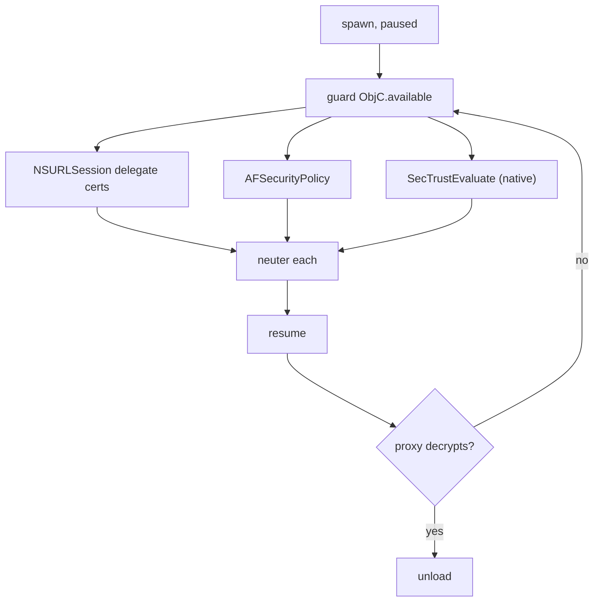

# Playbook: iOS SSL pinning bypass

> **Authorization:** only instrument software you're authorized to analyze.

**Goal:** let a pinned iOS app talk to your TLS proxy.

这张图回答："iOS pinning 通常落在哪几个 API 上？"

## Steps

1. **Spawn-gate:** `frida -U -f bundle.id -l bypass.js`.
2. **Install bypass:** the combined script in
   [../ios/ssl-pinning-ios.md](../ios/ssl-pinning-ios.md) covers NSURLSession,
   AFNetworking, and `SecTrustEvaluate`.
3. **Resume + verify:** point the app at the proxy, trigger a request, confirm
   plaintext in the proxy.
4. **Clean up:** unload reverts.

## Pitfalls

- `SecTrustEvaluate` is native — the ObjC-only scripts miss it; use the
  combined script that hooks at the C level too.
- Apps using `URLSession:didReceiveChallenge:` need the delegate path, not the
  trust-eval path.
