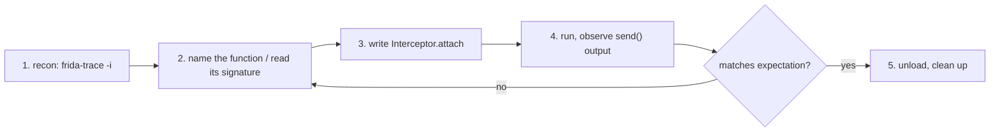

# Playbook: native recon → hook

**Goal:** on a Linux binary, find a native function, hook it, log its args and
return value.

这张图回答："从零到一条有效 native hook 的完整路径？"

## Steps

1. **Reachability:** `frida-ls-devices`; for a local binary just `frida -n <name>`.
2. **Recon:** `frida-trace -n <name> -i "*open*"` to see what's called; read
   the `__handlers__` stubs to confirm the symbol. See
   [../cli/frida-trace.md](../cli/frida-trace.md).
3. **Name + signature:** confirm the export with
   `Process.getModuleByName('libc.so.6').getExportByName('open')` and look up
   the C signature (`man 2 open`). See [../core-api/module.md](../core-api/module.md).
4. **Write hook:** the recipe in
   [../recipes/trace-native-call.md](../recipes/trace-native-call.md) is the
   starting point — adjust the export name and arg reads.
5. **Verify:** run `frida -n <name> -l hook.js`, trigger the function, check
   the `send` payload matches the real call. See
   [../guides/error-handling.md](../guides/error-handling.md) for failure modes.
6. **Clean up:** `.exit` the REPL (unloads the script and reverts hooks); or
   `script.unload()` from a driver.

## Pitfalls

- Attached after init → hooks miss early calls; spawn with `-f` instead.
- Wrong arg index → cross-check with the C signature, not guessing.
