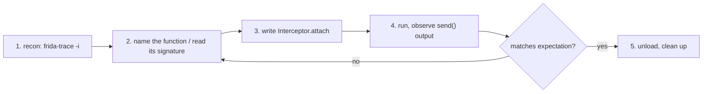

# Playbook: native recon → hook

**Goal:** on a Linux binary, find a native function, hook it, log its args and
return value.

这张图回答："从零到一条有效 native hook 的完整路径？"



## Preconditions

- The binary is on the **host** (no device needed): `frida -n <name>` attaches by
  process name. For a device/remote binary use `-U`/`-H` instead
  ([../concepts/frida-server.md](../concepts/frida-server.md)).
- The target process is **running** (or you'll spawn it with `-f`). Some init-time
  calls happen before you can attach — plan to spawn if your function runs early.
- The library is loaded before the call you care about. If it loads lazily (via
  `dlopen`), gate on `Process.findModuleByName` — see
  [../core-api/module.md](../core-api/module.md).
- For syscalls/libc, know the C signature (`man 2 open`) so arg indices and the
  return type are right, not guessed.

## Steps

1. **Reachability:** `frida-ls-devices`; for a local binary just `frida -n <name>`
   ([../concepts/frida-server.md](../concepts/frida-server.md)).
2. **Recon:** `frida-trace -n <name> -i "*open*"` to see what's called; read
   the `__handlers__` stubs to confirm the symbol. See
   [../cli/frida-trace.md](../cli/frida-trace.md).
3. **Name + signature:** confirm the export with
   `Process.getModuleByName('libc.so.6').getExportByName('open')` and look up
   the C signature (`man 2 open`). See [../core-api/module.md](../core-api/module.md).
4. **Write hook:** the recipe in
   [../recipes/trace-native-call.md](../recipes/trace-native-call.md) is the
   starting point — adjust the export name and arg reads.
5. **Verify:** run `frida -n <name> -l hook.js`, trigger the function, check
   the `send` payload matches the real call. See
   [../guides/error-handling.md](../guides/error-handling.md) for failure modes.
6. **Clean up:** `.exit` the REPL (unloads the script and reverts hooks); or
   `script.unload()` from a driver.

## Agent script

Save as `hook.js`. It resolves the export through the module (Frida 17 style),
traces `open` with a backtrace on failure, and dumps the return. Works on Linux
and Android (`libc.so`); on macOS use `libSystem.B.dylib`.

```js
// hook.js — trace open(2): path + flags in, fd out, caller backtrace on error.
const LIBC = Process.platform === 'darwin' ? 'libSystem.B.dylib' : 'libc.so';
const libc = Process.getModuleByName(LIBC);          // throws if absent
const openPtr = libc.getExportByName('open');

Interceptor.attach(openPtr, {
  onEnter(args) {
    // args[i] are NativePointers. arg0 = char* path, arg1 = int flags.
    this.path = args[0].readUtf8String();
    this.flags = args[1].toInt32();
  },
  onLeave(retval) {
    const fd = retval.toInt32();
    console.log(`open("${this.path}", 0x${this.flags.toString(16)}) = ${fd}`);
    if (fd < 0) {
      console.log('  backtrace:\n  ' +
        Thread.backtrace(this.context, Backtracer.ACCURATE)
          .map(DebugSymbol.fromAddress).join('\n  '));
    }
  },
});
console.log('[+] hooked ' + LIBC + ' open @ ' + openPtr);
```

Non-exported functions: resolve by pattern with
`new ApiResolver('module').enumerateMatches('exports:mylib.so!*crypt*')`
([../core-api/apiresolver.md](../core-api/apiresolver.md)). Buffer args instead
of strings: [../recipes/dump-buffer.md](../recipes/dump-buffer.md).

## Driver

Run the binary, then attach by name:

```sh
./target_binary &
frida -n target_binary -l hook.js
```

Spawn instead (init-time calls are hit):

```sh
frida -f /abs/path/target_binary -l hook.js
```

Python driver — attach to a running process, same order:

```python
import frida, sys

device = frida.get_local_device()
pid = device.get_process("target_binary").pid    # or device.spawn(["./target_binary"])
session = device.attach(pid)
session.on("detached", lambda reason, *a: print("detached:", reason))
script = session.create_script(open("hook.js", encoding="utf-8").read())
script.on("message", lambda msg, data: print(msg))
script.load()
sys.stdin.read()
```

**Expected output** when the app opens a file:

```
[+] hooked libc.so.6 open @ 0x7f2a1c4cfe10
open("/etc/passwd", 0x0) = 3
open("/nonexistent", 0x0) = -1
  backtrace:
  0x55c0f1d2f3c4 /abs/path/target_binary!0x2f3c4
  0x7f3b02a1b8d0 /lib/x86_64-linux-gnu/libc.so.6!__open_nocancel+0x2d
```

## Verify

- **Exact values:** the printed `path` must be the file the program actually
  opens, `fd` matches the kernel's next fd, and a failed open prints `-1` **plus a
  backtrace**. Backtrace present = your `this.context` snapshot is correct.
- **Cross-check with strace:** `strace -e trace=open ./target_binary 2>&1 | head`
  should show the same opens in the same order — independent confirmation the
  hook sees every call.
- **Counter sanity:** if the program opens 10 files, you count 10 `open("…")`
  lines. Half that → some calls happen before attach; re-run with `-f`.
- **No output on a file-less run** (e.g. `--help` path that reads no files) proves
  the hook is genuinely tied to `open`, not a stray log.

## Troubleshooting

- **Attached after init → hooks miss early calls; spawn with `-f` instead** —
  see [../troubleshooting/hooks-never-fire.md](../troubleshooting/hooks-never-fire.md).
- **Wrong arg index → cross-check with the C signature, not guessing** — reading
  `args[0]` as a string when it's an int gives garbage or a crash; `man 2` the
  function ([../recipes/trace-native-call.md](../recipes/trace-native-call.md)).
- **`getExportByName` throws** — symbol name wrong or the module isn't loaded yet;
  use `findExportByName` (null-safe) and list exports to confirm
  ([../core-api/module.md](../core-api/module.md)).
- **`readUtf8String` garbage / crash** — the arg isn't a valid C string or the
  pointer is stale; wrap in try/catch or hexdump first
  ([../core-api/nativepointer-read.md](../core-api/nativepointer-read.md)).
- **Wrong return type mapping** — `open` returns `int` (→ `.toInt32()`), but a
  `size_t` return needs `.toUInt32()`; mixing them corrupts your numbers
  ([../troubleshooting/nativefunction-return.md](../troubleshooting/nativefunction-return.md)).

## Cleanup

- REPL: `.exit` — unloads the script, reverts the `Interceptor.attach`.
- Python: `script.unload()` then `session.detach()`.
- Kill the target if you spawned it (`frida-kill -n target_binary` or kill the
  `&` job from your shell).
- No files or system state are changed by the hook itself; the target binary is
  untouched on disk.
