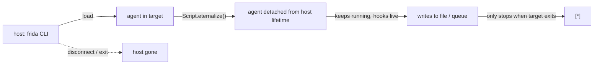

# Eternalize — survive host disconnect

**When:** you want to drop an agent and leave it logging into a file/queue
without holding the host open. See
[../concepts/agent-lifecycle-deepdive.md](../concepts/agent-lifecycle-deepdive.md)
for the state transition.

这张图回答："eternalize 把 agent 从哪个约束里解放出来？"



```javascript
// agent.js — install hook, then live forever writing to a file
const f = new File('/data/local/tmp/watch.log', 'w');
Interceptor.attach(Process.getModuleByName('libc.so.6').getExportByName('open'), {
  onEnter(args) { this.path = args[0].readUtf8String(); },
  onLeave(retval) {
    f.write(new Date().toISOString() + ' open ' + this.path + '\n');
    f.flush();
  }
});
// detach from host — keep running after `frida` exits
Script.eternalize();
```

```sh
frida -U -f com.example.app -l agent.js   # spawn, load, eternalize, then quit
```

**Tweak:** `eternalize` is irreversible for that script — you can't get
messages back over the transport afterward, so write to a file/queue, not
`send`. The agent dies when the target process dies.
